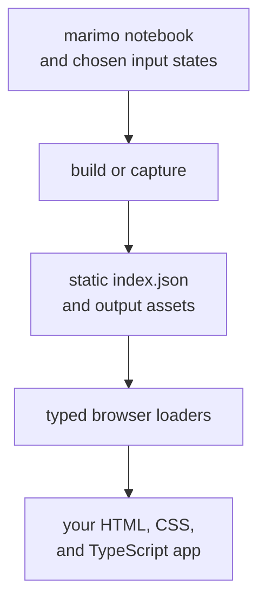

# marimo-export

Publish interactive, zero-Python web apps from marimo notebook outputs.

marimo-export runs the notebook states you choose while Python is available,
stores their outputs in a static publication, and lets a TypeScript app load
them later. Deploy the app and publication to any static host. Notebook
execution finishes before deployment.



Use it to:

- run expensive queries, model inference, or data preparation during
  publication so each visitor receives static files
- precompute the input combinations that an app should expose
- publish tables, arrays, charts, images, AnyWidgets, and scalar values
- build the client with vanilla TypeScript or the web framework your app
  already uses
- deploy the finished app to object storage, a CDN, or a static site host

> [!NOTE]
> marimo-export is a development preview. Its Python and TypeScript packages are
> currently versioned `0.0.0`, so the quickstart runs from a repository
> checkout.

## If you know Papermill

[Papermill](https://github.com/nteract/papermill) gives Jupyter users a
familiar workflow: supply parameters, execute a notebook, and save the executed
notebook. marimo-export applies that workflow shape to a finite matrix of
marimo definition values. marimo executes each named state through its reactive
graph and cache, and marimo-export collects selected definitions into a static
publication for a browser app.

The analogy is closest to `build`, which owns notebook startup, execution, and
shutdown. `capture` applies the same ExportSpec to an already-running kernel.

[Map Papermill concepts to ExportSpec](docs/export-spec.md#for-papermill-users).

## Publish your first notebook

Clone the repository and install the locked workspace:

```bash
git clone https://github.com/marimo-team/marimo-export.git
cd marimo-export
make bootstrap
```

Create `notebook.py` with one input and one derived output:

```python
import marimo

app = marimo.App()


@app.cell
def _():
    greeting = "Hello"
    return (greeting,)


@app.cell
def _(greeting):
    message = f"{greeting}, browser!"
    return (message,)


if __name__ == "__main__":
    app.run()
```

Create `notebook.export.yaml` to choose the states and output that the app can
load:

```yaml
schema: marimo-export.spec.v1
inputs:
  - greeting
states:
  hello: {}
  welcome:
    greeting: Welcome
outputs:
  message:
    source: message
```

Build and verify the static publication:

```bash
uv run marimo-export build notebook.py \
  --spec notebook.export.yaml \
  --output dist/greeting

uv run marimo-export verify dist/greeting
```

The commands report the published states and verification result:

```text
Published 2 states and 1 outputs to .../dist/greeting
Assets: 0 files, 0 B
...
Verified 0 assets and 0 B for 2 states
```

The `message` scalar lives directly in `dist/greeting/index.json`. Tables,
arrays, images, charts, and widgets add content-addressed files beside the
index.

Serve `dist/greeting` at `/publications/greeting/`. A Vite app in this workspace
can then load the publication from browser code:

```ts
import { openPublication, scalarLoader } from "@marimo-team/marimo-export";

const publication = await openPublication("/publications/greeting/");
const message = await publication.state("hello").output("message").load(scalarLoader());

document.querySelector("#app")!.textContent = String(message);
```

The page renders `Hello, browser!` from static files. Switch to the `welcome`
state to load `Welcome, browser!`.

See the [finance demo](apps/finance-demo) for a vanilla Vite and TypeScript app
that loads scalar, NumPy, Arrow, Parquet, PNG, Vega-Lite, and AnyWidget outputs.

## Choose what users can interact with

An ExportSpec connects notebook definitions to the states and outputs exposed by
the app:

- `inputs` names notebook definitions that the publication can vary.
- `states` lists sparse overrides such as a symbol selection, date range, or
  chart width.
- `outputs` gives public names to notebook definitions that the client can load.

marimo-export reads the current notebook values as the baseline, completes each
sparse state, and executes every state through normal marimo execution. Matching
cells can restore from marimo's cache on later publication runs.

At runtime, the browser selects one of these published states and runs the
loaded output's browser behavior. Vega-Lite interactions, AnyWidget controls,
DOM events, and custom JavaScript continue in the page. Add a state and
republish when an interaction requires a new Python result.

[Read the ExportSpec guide](docs/export-spec.md) for JSON, YAML, and
programmatic construction.

## Publish rich notebook outputs

Authored Exporter functions turn Python objects into browser representations
inside ordinary marimo cells:

```python
from marimo_export.exporters.altair import png, vegalite
from marimo_export.exporters.anywidget import bundle
from marimo_export.exporters.parquet import table

chart_spec = vegalite(chart)
chart_image = png(chart, scale=2)
prices_file = table(prices, filename="prices.parquet")
dashboard = bundle(widget)
```

Choose the representation that fits the client:

| Notebook result    | Published representation | Browser import                                |
| ------------------ | ------------------------ | --------------------------------------------- |
| Scalar value       | marimo scalar            | `@marimo-team/marimo-export`                  |
| NumPy array        | NPY                      | `@marimo-team/marimo-export/loader/numpy`     |
| Arrow table        | Arrow IPC file           | `@marimo-team/marimo-export/loader/arrow`     |
| DataFrame or table | Parquet                  | `@marimo-team/marimo-export/loader/parquet`   |
| Altair chart       | Vega-Lite spec           | `@marimo-team/marimo-export/loader/vegalite`  |
| Altair chart       | PNG                      | `@marimo-team/marimo-export`                  |
| AnyWidget          | AnyWidget bundle         | `@marimo-team/marimo-export/loader/anywidget` |

Exporter calls participate in marimo execution and caching like other notebook
code. Custom exporters can publish another media type through
`BlobAsset`, and a matching browser loader can decode or mount it.

[Read the representations guide](docs/representations.md) for loader peer
dependencies, media types, and the custom loader contract.

## Build from a file or capture a live session

Use `build` when marimo-export should start the notebook, publish every state,
and clean up the temporary server:

```bash
marimo-export build notebook.py \
  --spec notebook.export.yaml \
  --output dist/notebook
```

Use `capture` when a running notebook already contains credentials, files, or
expensive results:

```bash
marimo-export capture http://127.0.0.1:2718 \
  --session SESSION_ID \
  --spec notebook.export.yaml \
  --output dist/notebook
```

The live kernel and the calling environment must import the same
marimo-export version. Pass credentials with `MARIMO_EXPORT_ACCESS_TOKEN` and
`MARIMO_EXPORT_SERVER_TOKEN` to keep them out of command history.

[Read the CLI guide](docs/cli.md) for session discovery, machine-readable
output, replacement behavior, and exit categories.

## Ship the publication

A publication is a static directory containing one canonical `index.json` and
the output files referenced by it. Serve the directory unchanged over HTTPS or
localhost, then give `openPublication()` the URL that contains `index.json`.

The browser client verifies each file's declared length and SHA-256 digest
before its loader receives the content. Interactive loaders can execute
published JavaScript with page authority, so review notebook-authored widgets
and custom representations before deployment.

[Read the trust guide](docs/trust.md) for producer, publication, loader, and
hosting boundaries.

## Learn and contribute

- [Getting started](docs/getting-started.md)
- [Python API](docs/python-api.md)
- [Browser API](docs/browser-api.md)
- [ExportSpec](docs/export-spec.md)
- [Representations and loaders](docs/representations.md)
- [Command-line interface](docs/cli.md)
- [Trust and integrity](docs/trust.md)
- [Contributor guide](development_docs/README.md)

marimo-export is licensed under the [Apache License 2.0](LICENSE).
