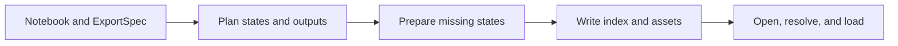

<p align="center">
  <a href="https://marimo-team.github.io/marimo-export/">
    <picture>
      <source media="(prefers-color-scheme: dark)" srcset="apps/docs/public/brand/marimo-export-lockup-stacked-dark.svg">
      
    </picture>
  </a>
</p>

<p align="center">
  <strong>Prepare notebook results. Share them anywhere.</strong>
</p>

<p align="center">
  <a href="https://marimo-team.github.io/marimo-export/"><strong>Documentation</strong></a> ·
  <a href="docs/guide/getting-started.md"><strong>Getting started</strong></a> ·
  <a href="examples/vite-vanilla"><strong>Browser example</strong></a> ·
  <a href="docs/reference/index.md"><strong>Reference</strong></a>
</p>

<p align="center">
  <a href="https://github.com/marimo-team/marimo-export/actions/workflows/ci.yml"></a>
  <a href="https://pypi.org/project/marimo-export/"></a>
  <a href="https://www.npmjs.com/package/@marimo-team/marimo-export"></a>
  <a href="packages/python/pyproject.toml"></a>
  <a href="LICENSE"></a>
</p>

Select the states and outputs to publish from a [marimo](https://marimo.io/)
notebook. marimo-export writes a portable, verified **notebook export** that
browser applications and agents read without a Python runtime or a copy of the
notebook source.

## Build the quickstart

From a repository checkout, run the CLI in the workspace environment:

```bash
mkdir -p dist
uv run marimo-export build examples/quickstart/report.py \
  --spec examples/quickstart/report.export.yaml \
  --output dist/quickstart
uv run marimo-export verify dist/quickstart
```

`dist/quickstart/index.json` describes two exported states and two named outputs.
Two report assets sit under `dist/quickstart/assets`. Read the monthly JSON state:

```bash
uv run python - <<'PY'
from marimo_export import open_export

export = open_export("dist/quickstart")
summary = export.state("monthly").output("summary").json()
print(dict(summary))
PY
```

Expected output:

```text
{'days': 30, 'label': 'Last 30 days'}
```

Install the Python package in another project with `uv add marimo-export`. The
[getting-started guide](docs/guide/getting-started.md) creates the same notebook
and export from an empty directory.

## How notebook exports work



An `ExportSpec` contains sparse state rows and named outputs. Planning completes
each row from the captured baseline. Every exported state has the same
output-name set. A representation identifies how one output is stored and
decoded.

[Overview](docs/overview.md) follows the quickstart from notebook
states to the files consumers read. [When to use
marimo-export](docs/why.md) compares notebook exports with live Python services
and browser Python execution.

## Documentation

| Task                                        | Documentation                                              |
| ------------------------------------------- | ---------------------------------------------------------- |
| Select states and output representations    | [Choose states and outputs](docs/guide/choose-states.md)   |
| Build from a file or capture a live session | [Build and capture](docs/guide/build-and-capture.md)       |
| Read from Python, a browser, or an agent    | [Read an export](docs/guide/consume-an-export.md)          |
| Build state transitions in a browser        | [Browser applications](docs/guide/browser-applications.md) |
| Publish and deploy immutable exports        | [Deployment](docs/guide/deploy.md)                         |
| Look up an exact contract                   | [Reference](docs/reference/index.md)                       |

## Compatibility and trust

The Python package supports Python 3.10 through 3.14 and installs the marimo
release pinned by its package metadata.
Browser applications install `@marimo-team/marimo-export` and any dependencies
required by their selected output loaders. See
[Compatibility](docs/reference/compatibility.md) for the complete matrix.

Preparing an export executes notebook code with the producer environment's
file, credential, network, and package access. Opening validates canonical
`index.json`. Loading verifies the selected asset. Mounting an interactive
representation grants its code the browser page's authority. See [Integrity and
trust](docs/concepts/integrity-and-trust.md) before publishing executable output.

Contributor architecture, validation, and release mechanics live in the
[contributor guide](development_docs/README.md). See [Contributing](CONTRIBUTING.md)
for the pull request path and [Security](SECURITY.md) for private vulnerability
reporting.

Licensed under Apache-2.0.
