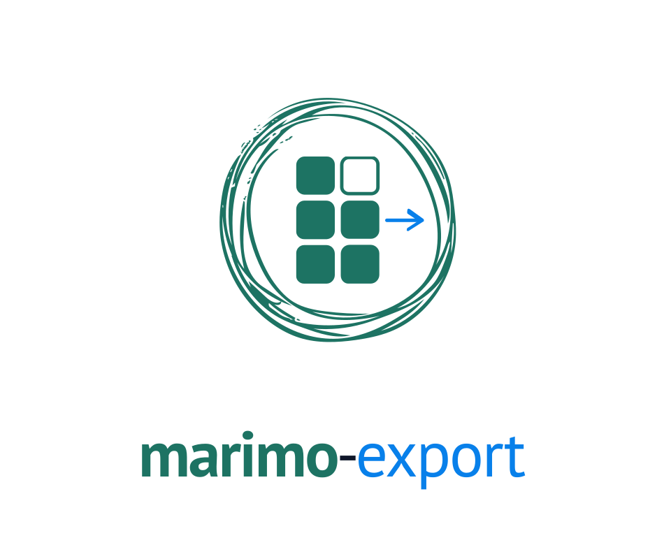

<p align="center">
  <a href="https://marimo-team.github.io/marimo-export/">
    <picture>
      <source media="(prefers-color-scheme: dark)" srcset="apps/docs/public/brand/marimo-export-lockup-stacked-dark.svg">
      
    </picture>
  </a>
</p>

<p align="center">
  <em>Prepare selected notebook states once, then read the same verified results from Python, browsers, agents, and custom applications.</em>
</p>

<p align="center">
  <a href="https://marimo-team.github.io/marimo-export/"><strong>Documentation</strong></a> ·
  <a href="docs/guide/getting-started.md"><strong>Getting started</strong></a> ·
  <a href="examples/vite-vanilla"><strong>Example application</strong></a> ·
  <a href="docs/reference/python-api.md"><strong>Python API</strong></a> ·
  <a href="docs/reference/browser-api.md"><strong>Browser API</strong></a>
</p>

<p align="center">
  <a href="https://pypi.org/project/marimo-export/"></a>
  <a href="https://www.npmjs.com/package/@marimo-team/marimo-export"></a>
  <a href="packages/python/pyproject.toml"></a>
  <a href="LICENSE"></a>
</p>

marimo-export runs selected states of a [marimo](https://marimo.io/) notebook
and writes a verified **notebook export** that Python, browser applications,
agents, and custom clients can read without a live Python kernel.

## Create your first notebook export

From a repository checkout, install the locked Python and TypeScript workspaces:

```bash
make bootstrap
```

Build and verify the deterministic quickstart:

```bash
mkdir -p dist
uv run marimo-export build examples/quickstart/report.py \
  --spec examples/quickstart/report.export.yaml \
  --output dist/quickstart
uv run marimo-export verify dist/quickstart
```

`dist/quickstart/index.json` now describes the complete export. Read the
`monthly` state from Python:

```python
from marimo_export import open_export

export = open_export("dist/quickstart")
summary = export.state("monthly").output("summary").json()
print(dict(summary))
```

```
{'days': 30, 'label': 'Last 30 days'}
```

Install the Python package in your own project with `uv add marimo-export`.
The [getting-started guide](docs/guide/getting-started.md) explains the tools used
by the repository quickstart and develops the same workflow step by step.

## Understand the export

```
notebook + ExportSpec
  -> plan
  -> prepare from a file or capture from a live session
  -> notebook export
  -> Python, browser, agent, or custom consumer
```

- An **ExportSpec** names a default state, state rows, outputs, and their stored
  representations.
- A **state** is one complete assignment for the notebook inputs inferred by
  planning. Sparse authored rows inherit omitted values from the notebook
  baseline.
- An **output** is one published name and representation available in every
  state.
- A **notebook export** is an immutable directory rooted at canonical
  `index.json`, with any content-addressed assets declared for stored output data.

`plan` reports normalized states and reusable work. `build` prepares missing
states from a notebook file, writes the export, and verifies every declared
asset. `capture` prepares the same contract from a named session that is already
running.

## Choose your workflow

| Goal                                        | Start here                                                              |
| ------------------------------------------- | ----------------------------------------------------------------------- |
| Select states, outputs, and representations | [Choose states and outputs](docs/guide/choose-states.md)                |
| Build from a file or capture a live session | [Build or capture](docs/guide/build-and-capture.md)                     |
| Open an export from Python or a browser     | [Consume a notebook export](docs/guide/consume-an-export.md)            |
| Build state transitions in a frontend       | [Build a browser application](docs/guide/browser-applications.md)       |
| Ground agent work in export data            | [Use notebook exports with agents](docs/guide/agents-and-automation.md) |
| Verify and serve the static directory       | [Deploy a notebook export](docs/guide/deploy.md)                        |
| Implement another consumer                  | [Export format reference](docs/reference/export-format.md)              |

## See the browser product

The [market dashboard](examples/vite-vanilla) prepares five states and five
outputs from a [Yahoo Finance](https://finance.yahoo.com/) notebook. Its TypeScript application
verifies the export, switches between states, loads table and summary data, and
mounts saved [Vega-Lite](https://vega.github.io/vega-lite/), image, and
[AnyWidget](https://anywidget.dev/) representations.

```bash
cd examples/vite-vanilla
pnpm run export
pnpm run verify:export
pnpm run dev
```

The preparation step requests historical market data from Yahoo Finance. Open
the URL printed by the development server after the export completes.

## Execution and trust boundaries

Preparing an export executes notebook code with the notebook environment's file,
credential, network, and package access. Matching later work can reuse prepared
states and entries from marimo's
[content-addressed computation cache](https://docs.marimo.io/api/caching/). The
[SciPy 2026 caching article](https://dmadisetti.github.io/scipy_proceedings_2026/)
develops the reactive cache-key, lazy restoration, and cached WebAssembly export
model that marimo-export uses during producer execution.

Opening an export validates `index.json`. Loading an output verifies the selected
asset. Complete verification reads every declared asset.

HTML loaders return an inert string. Mounting AnyWidget, Vega-Lite, or custom
interactive output grants that code the browser page's authority. Apply
the application's rendering policy, [Content Security Policy](https://developer.mozilla.org/en-US/docs/Web/HTTP/CSP),
and origin rules before mounting executable output.

The Python package supports Python 3.10 and newer. Browser consumers install
`@marimo-team/marimo-export` and the peer runtime required by each specialized
loader. See [output representations](docs/reference/representations.md) for the
current exporter and loader contracts.

## Reference and development

- [ExportSpec reference](docs/reference/export-spec.md)
- [CLI reference](docs/reference/cli.md)
- [Python API reference](docs/reference/python-api.md)
- [Browser API reference](docs/reference/browser-api.md)
- [Output representations](docs/reference/representations.md)
- [Contributor guide](development_docs/README.md)

Licensed under Apache-2.0.
