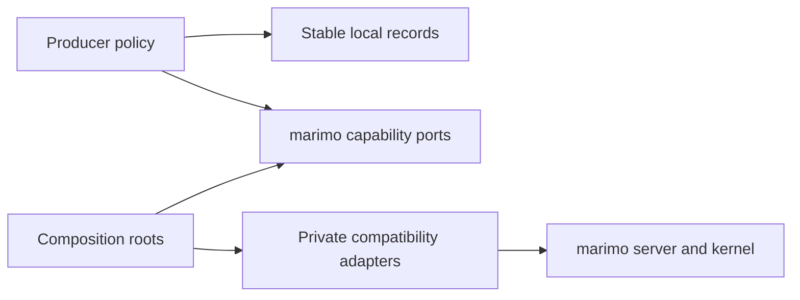

# Architecture

marimo-export publishes selected marimo notebook results for human-facing
applications, agents, Python automation, browser clients, and custom consumers.
It stores a finite relation of prepared states and outputs in one verified
directory.

```text
notebook + ExportSpec
  -> complete input states
  -> marimo execution and native cache receipts
  -> index.json + content-addressed assets
  -> Python, agent, browser, and custom consumers
```

## Product boundary

| Product decision                              | User capability                                                 | Complexity accepted by marimo-export                          |
| --------------------------------------------- | --------------------------------------------------------------- | ------------------------------------------------------------- |
| Execute every state through marimo            | Notebook authors retain reactive and cache semantics            | State-local child runtimes and transient cells                |
| Normalize sparse rows against one baseline    | Every consumer resolves the same complete prepared vectors      | Definition ownership, UI state, coercion checks, fingerprints |
| Make output representations explicit          | People, agents, Python, and frontends receive decodable results | Python exporter and consumer representation contracts         |
| Commit one canonical export directory         | Static hosts, agents, and readers receive one verified result   | Canonical JSON, content identity, staging, atomic replacement |
| Support owned and borrowed notebook execution | Jobs build files while prepared kernels can be captured         | Separate process and session ownership roots                  |
| Give interactive mounts explicit owners       | Rapid state changes preserve the last complete application view | Loading, staging, commit, cancellation, and disposal          |

marimo owns notebook parsing, execution, dependency traversal, controls,
cache keys, restoration, serialization, and persistence. marimo-export owns
state selection, representation, transfer, the export format, and typed Python
and browser consumption.

## Ports and adapters contain marimo details



Stable policy imports local records and capability protocols. Composition
roots select concrete adapters. Private `marimo._*` imports stay under
`_marimo/compat`. A marimo upgrade should replace or shrink one adapter while
the producer policy, export format, and consumers retain their local
contracts.

Browser packages follow the same direction. Browser core owns parsing,
integrity, readers, and loader contracts. Each loader package owns one optional
representation runtime and returns application-owned data or a disposable
mount.

## Detailed maps

| Area                                     | Detailed map                                                             | Question answered                                      |
| ---------------------------------------- | ------------------------------------------------------------------------ | ------------------------------------------------------ |
| Product records and durable files        | [Product model and export format](architecture/product-and-export.md)    | What is normalized, stored, and verified?              |
| marimo processes, graph, cache, transfer | [marimo integration](architecture/marimo-integration.md)                 | Which host behavior is requested and who releases it?  |
| Browser readers, loaders, and mounts     | [Browser loaders and mounts](architecture/browser-loaders-and-mounts.md) | How does static data become interactive browser state? |
| Agents, CLI, example, docs, and packages | [Agents and delivery](architecture/agents-and-delivery.md)               | How do consumers inspect, prove, and ship the product? |

[Development](development.md) contains focused package workflows.
[Validation](validation.md) selects evidence for each boundary.

## Ownership zones

| Zone                         | Owns                                                                      |
| ---------------------------- | ------------------------------------------------------------------------- |
| `spec.py`                    | Authored ExportSpec and OutputSpec                                        |
| `_execution`                 | Baseline records, complete states, transient cells, and export plan       |
| `_marimo/capabilities.py`    | Kernel and transfer records and protocols                                 |
| `_marimo` composition roots  | Adapter construction, focused native bindings, and process entry points   |
| `_marimo/compat`             | Private marimo translation, exporter identity, execution, cache, transfer |
| `_remote`                    | HTTP, authentication, scratchpad transport, events, managed process tree  |
| `export.py` and `result.py`  | Durable export records and run-local diagnostics                          |
| `reader.py` and `_writer.py` | Verified local reads, staging, and atomic commit                          |
| `packages/browser`           | Browser parsing, integrity, immutable readers, and loader contracts       |
| `packages/loader-*`          | One representation decoder, runtime dependency, cancellation, disposal    |

## Mutable state and release boundaries

| State                             | Owner                             | Released when                                  |
| --------------------------------- | --------------------------------- | ---------------------------------------------- |
| Managed marimo process groups     | `ManagedServer`                   | Build completes or startup fails               |
| Borrowed server and session       | Caller                            | Caller closes them                             |
| State child runtime               | Execution adapter                 | One state succeeds, fails, or cancels          |
| Exporter module overlay           | Exporter adapter context          | Exporter preparation and all state runs finish |
| Transfer ticket and virtual files | Transfer registry                 | Client release or lease expiry                 |
| Staged export directory           | Writer                            | Commit succeeds or the operation fails         |
| Browser load generation           | Application transition controller | Newer state request or page teardown           |
| Committed interactive mounts      | Application mount owner           | Replacement commit or page teardown            |

## Reason about a change

1. State the producer or consumer behavior and the identity that must survive.
2. Find the owner in the detailed maps.
3. Cross a package or process boundary through a stable record, capability, or
   disposable handle.
4. Test the nearest public boundary and add live evidence when the contract
   crosses processes or mounted documents.
5. Finish with `make check` and rendered browser proof for visible behavior.
