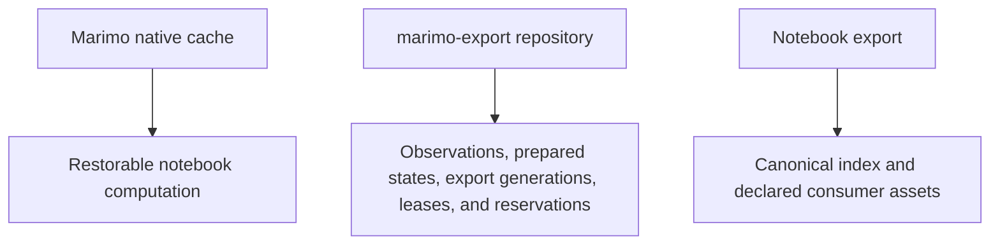
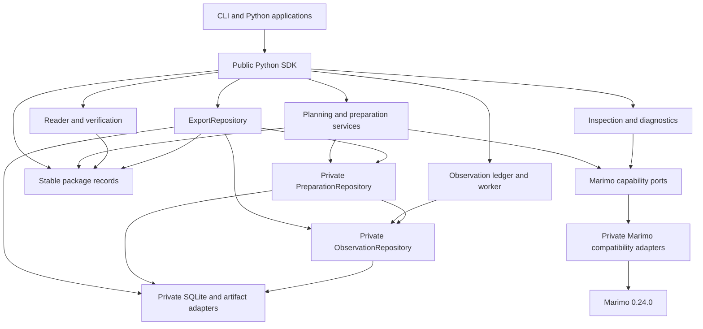
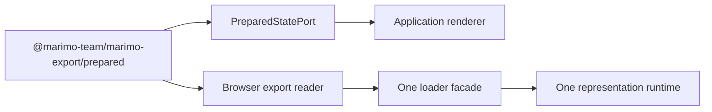

# Architecture

marimo-export prepares a finite state-output relation from a notebook,
retains reusable results, and writes one verified notebook export for Python,
browsers, agents, and custom applications.


## Responsibility boundary

| Owner         | Responsibilities                                                                                                                                      |
| ------------- | ----------------------------------------------------------------------------------------------------------------------------------------------------- |
| marimo        | Notebook parsing, reactive graph, execution, controls, cache keys, cache stores, restoration, native serialization                                    |
| marimo-export | StateSpace, ExportSpec, observations, planning, preparation, prepared-state reuse, repository coordination, export format, Python and browser readers |
| application   | Authored presentation, selected spec relation, view bindings, renderer, runtime UX, deployment assembly                                               |

Applications compose these capabilities through the public Python SDK and the
browser `prepared` subpath. They own presentation documents, host bindings,
authentication, route policy, visible commit, and deployment.

The published marimo 0.24.0 package remains the execution dependency. Private
integration code stays under `marimo_export._marimo.compat` behind
package-owned records and protocols.

## Three persisted layers



Marimo owns computation-cache identity, persistence, signing, codecs, and
validity. marimo-export stores prepared-state artifacts after they cross the
native cache receipt boundary. Exact repository reuse can skip notebook startup.
Native cache reuse can reduce computation when a missing prepared state runs.

The upstream mechanism is documented in marimo's
[caching API](https://docs.marimo.io/api/caching/) and the SciPy 2026 article
[Content-Addressed Caching for Reactive
Notebooks](https://dmadisetti.github.io/scipy_proceedings_2026/). The article
also demonstrates cached WebAssembly publication, where browser Python restores
native cache artifacts. marimo-export uses the same producer-side cache and
publishes selected results through its own language-neutral export format.

Read [Execution and caching](architecture/execution-and-caching.md) and
[Export repository](architecture/repository.md) before changing this boundary.

## Dependency direction



The package root exposes common records and operations. `_services` owns
producer planning, preparation, capture, artifact assembly, and durable write
policy. Reader, repository, inspection, and diagnostic operations use their
focused modules. `_repository/preparation.py` contains the private preparation
capability used by producer services. `_repository/observations.py` contains the
private raw observation capability used by the ledger and preparation.
`_marimo/capabilities.py` contains package-owned execution records and
protocols.

The browser dependency direction is:



Read [Ports and composition](architecture/ports.md) for the public modules,
internal capabilities, composition roots, and enforced import rules.

## Preparation lifecycle

An ExportSpec declares sparse named states, one explicit default alias, and
named outputs. Planning infers input names, fills sparse rows from the baseline,
deduplicates equal complete vectors, and resolves repository reuse.

Preparation first checks for an exact verified generation. A hit returns a
leased `PreparedExport` before starting a notebook. A miss claims a fenced
reservation, rechecks repository state, opens or borrows one Marimo session,
captures missing state fingerprints, assembles the relation, and commits one
generation.

`PreparedExport` can be opened, served through file-scoped access backed by
independently owned generation leases, described by a prepared manifest, or
written to a caller destination.

Read [Planning and preparation](architecture/preparation.md) for identities,
file and session sources, progress, cancellation, and incremental reuse.

## Durable product model

The durable notebook export stores:

```text
states x outputs -> descriptor
```

`index.json` names the explicit default state fingerprint, aliases, complete
state vectors, output descriptors, control bindings, producer provenance, and
asset closure. A consumer opens the index before loading representation assets.

Read [Product model and export format](architecture/product-and-export.md) for
the exact records, codecs, writer transaction, and reader invariants.

## Browser lifecycle

The browser core opens and verifies immutable notebook exports. Loader subpaths
decode one representation. The `prepared` subpath adds:

- strict `marimo-export.prepared.v1` parsing
- immutable publication opening
- exact state selection
- sparse input, query, and control updates
- transition cancellation and generation ordering
- manifest refresh
- selection rules across publication refresh
- settlement and disposal

An application implements `PreparedStatePort` to load every required output and
publish one complete visible state.

Read [Browser loaders and mounts](architecture/browser-loaders-and-mounts.md)
for integrity, staging, mounts, and disposal.

## Ownership zones

| Zone                               | Owns                                                              |
| ---------------------------------- | ----------------------------------------------------------------- |
| `spec.py`                          | Authored StateSpace, ExportSpec, and OutputSpec                   |
| `planning.py`, `_execution`        | Public plan records, baseline, normalization, transient cells     |
| `_services`                        | Plan, prepare, capture, artifact assembly, durable write          |
| `_build.py`                        | Destination preflight and prepare-write composition               |
| `observations.py`, `_observations` | Public observation records, queue, worker, source binding         |
| `repository.py`                    | Public repository facade, status, pruning, lifecycle              |
| `_repository/preparation.py`       | Private service-facing repository capability                      |
| `_repository/observations.py`      | Private raw observation persistence for ledger and preparation    |
| `_repository/sqlite`               | SQL schema, connections, transactions, retention queries          |
| `_repository` artifact modules     | Immutable files, staging, leases, fencing, recovery               |
| `_marimo/capabilities.py`          | Package-owned execution records and protocols                     |
| `_marimo` composition roots        | Concrete adapter construction and managed entry points            |
| `_marimo/compat`                   | Private Marimo inspection, execution, cache, projection, transfer |
| `_remote`                          | HTTP, authentication, scratchpad transport, managed process tree  |
| `client.py`, `producer.py`         | Borrowed-session client and owned-notebook lifecycle              |
| `descriptors.py`, `index.py`       | Durable output and export records                                 |
| `reader.py`, `_writer.py`          | Verified consumer reads and caller destination commit             |
| `_secure_io.py`                    | Bounded platform-safe reads of export indexes and assets          |
| `manifest.py`, `publication.py`    | Prepared manifest serialization and last-good route coordination  |
| `_publication.py`                  | Mutable Python publication state machine                          |
| `delivery.py`, `_directory*`       | Complete application staging, verification, commit, and rollback  |
| `_delivery_validation.py`          | Nested export and outer staging-tree validation                   |
| `packages/portable-json`           | Cross-language JSON types, parsing, conversion, Zod adapter       |
| `packages/browser`                 | Browser reader, prepared controller, built-in loaders             |
| `packages/loader-*`                | One specialized decoder and optional runtime                      |

## Secure local reads

`_secure_io.py` is the filesystem trust boundary for local export readers. On
POSIX it traverses from an opened root descriptor and refuses symbolic links. On
Windows it rejects reparse points and rechecks containment and file identity.
Both paths accept the fixed `index.json` name or one portable `assets/<name>`
path, require a regular file, enforce byte limits, and detect size changes during
the read. The Windows path also rechecks file identity during open. Asset digest
verification detects same-size content changes after the secure read.
`reader.py` translates those failures into public format and availability
errors.

## Trust boundaries

| Boundary                        | Authority and guarantee                                                                                                                                                                     |
| ------------------------------- | ------------------------------------------------------------------------------------------------------------------------------------------------------------------------------------------- |
| Notebook and exporter execution | Runs with the producer process's files, credentials, packages, and network access                                                                                                           |
| Export repository               | Uses local ownership and permissions for producer cache data. It is not a deployment tree or publisher-authentication mechanism                                                             |
| Live transport                  | HTTPS protects non-loopback transport. The access token authorizes the client, and the server token satisfies Marimo server checks. The selected kernel retains its full producer authority |
| Notebook export verification    | Proves canonical index, declared closure, framing, sizes, and digests agree with the loaded integrity root                                                                                  |
| Prepared manifest route         | Selects one export identity and state. The application authenticates the route and constrains allowed origins                                                                               |
| Browser mount                   | Grants the loaded chart, widget, or custom module the page's DOM, network, and global JavaScript authority                                                                                  |

Keep these guarantees separate in adapters and diagnostics. Repository recovery
can quarantine local data. Export verification cannot establish who published
the index. Mount disposal releases owned resources while page-global module
effects may remain.

## Lifecycle owners

| Resource                           | Owner                           | Release boundary                                      |
| ---------------------------------- | ------------------------------- | ----------------------------------------------------- |
| Observation worker                 | `ObservationLedger`             | `close()` joins and reports persistence status        |
| Preparation reservation            | preparation context             | exact generation returns, failure, or cancellation    |
| Prepared-state staging             | `StagedPreparedState`           | state commit or close                                 |
| Export staging                     | `StagedExport`                  | generation commit or close                            |
| Repository artifact lease          | prepared state or export handle | handle close or lease failure                         |
| Detached response generation lease | `PreparedAsset`                 | response completion and close                         |
| Managed notebook source copy       | `OwnedNotebook`                 | producer context close                                |
| Managed server and process tree    | `OwnedNotebook`                 | producer context close                                |
| Borrowed server and session        | application                     | application close                                     |
| State child graph                  | marimo execution adapter        | state completion, failure, or cancellation            |
| Transfer ticket and virtual files  | transfer registry               | client release or lease expiry                        |
| Browser state transition           | `PreparedStateController`       | commit, transition cancellation, failure, or disposal |
| Mounted representation             | application renderer            | replacement commit or page teardown                   |

## Contributor maps

| Question                                                 | Map                                                                                          |
| -------------------------------------------------------- | -------------------------------------------------------------------------------------------- |
| What is stored in a notebook export?                     | [Product model and export format](architecture/product-and-export.md)                        |
| How are states planned and prepared?                     | [Planning and preparation](architecture/preparation.md)                                      |
| What does SQLite own?                                    | [Export repository](architecture/repository.md)                                              |
| Which dependencies are ports or adapters?                | [Ports and composition](architecture/ports.md)                                               |
| How is Marimo caching reused?                            | [Execution and caching](architecture/execution-and-caching.md)                               |
| How are notebook outputs captured?                       | [marimo integration](architecture/marimo-integration.md)                                     |
| How does browser state become visible UI?                | [Browser loaders and mounts](architecture/browser-loaders-and-mounts.md)                     |
| How are live sessions authenticated and owned?           | [Live transport and processes](architecture/live-transport-and-processes.md)                 |
| How are prepared routes and application trees committed? | [Application publication and delivery](architecture/application-publication-and-delivery.md) |
| Which hash and schema identifies each boundary?          | [Identities and protocols](architecture/identities-and-protocols.md)                         |
| Which JSON values cross Python and TypeScript?           | [Portable JSON](architecture/portable-json.md)                                               |
| Where does Python run for each application profile?      | [Runtime profiles](architecture/runtime-profiles.md)                                         |
| How are packages, agents, and docs shipped?              | [Product surfaces and distribution](architecture/agents-and-delivery.md)                     |
| Which owner controls failure and concurrency?            | [Failure and concurrency](architecture/failure-and-concurrency.md)                           |

[Development](development.md) contains focused workflows. [Validation](validation.md)
maps each changed boundary to required evidence.

Future upstream APIs and external integrations live under
[Proposals](proposals/README.md). They do not define current ownership until their
acceptance conditions pass.
