# Architecture

marimo-export turns a finite set of notebook inputs into verified static
outputs while leaving graph execution and cache identity with marimo.

```mermaid
flowchart LR
    Spec[ExportSpec] --> Baseline[baseline inspection]
    Baseline --> Matrix[complete state matrix]
    Matrix --> Leaves[synthetic child leaves]
    Leaves --> Execution[marimo child execution]
    Execution --> Receipts[native cache receipts]
    Receipts --> Publication[canonical publication]
    Publication --> Loaders[explicit browser loaders]
```



## Package boundaries

| Path                                               | Responsibility                                                                           |
| -------------------------------------------------- | ---------------------------------------------------------------------------------------- |
| `packages/python`                                  | ExportSpec, exporter descriptors and runtimes, build, capture, publication I/O, CLI      |
| `packages/python/src/marimo_export/_execution`     | Baseline, normalized states, projection code, matrix records                             |
| `packages/python/src/marimo_export/_marimo/compat` | Every private marimo import and capability probe                                         |
| `packages/python/src/marimo_export/_remote`        | HTTP, SSE, credentials, bridge invocation, managed server lifecycle                      |
| `packages/browser`                                 | Published npm entry points, index parsing, immutable states, integrity, loader contracts |
| `packages/loader-*`                                | Private workspace implementations for one representation dependency family each          |
| `examples/vite-vanilla`                            | Live market notebook, ExportSpec, and vanilla TypeScript dashboard                       |

Stable domain modules depend on stable types. Adapters depend on the domain
contract. The Python public roots are `build`, `capture`, `Client`, and
`open_publication`. The browser public root is `openPublication`.

## ExportSpec and baseline

An ExportSpec declares definition names under `inputs`, sparse rows under
`states`, and source definitions with optional exporter descriptors under
`outputs`.

The selected live session supplies the baseline. Inspection records:

- one defining cell per definition
- every sibling returned by that cell
- ordinary or UI kind
- Python type
- portable baseline or frontend value
- UI domain and sensitivity

Normalization fills every sparse row into a complete input vector. Ordinary
siblings travel as one override packet. UI overrides remain child-local.
Setup definitions receive their override through the compatibility adapter.

## Synthetic output leaves

Each state child receives one deterministic state-token cell and one
deterministic leaf per output. The token starts with the first normalized state
fingerprint. Each child overrides it with the current fingerprint and prunes
the token's defining cell.

A native leaf references the token before returning its source definition. An
exporter leaf also imports the resolved function and invokes it with the source
plus normalized keyword options. The token makes every projection cache key
state-specific, including when the selected source or result is a `BlobAsset`.
Exporter preflight fingerprints the resolved module, function code, statically
reachable Python modules, owning distribution versions, and built-in runtime
dependencies. A private local in the leaf places that digest in marimo's cell
hash.

The compatibility layer appends these cells directly to the in-memory
`NotebookSerializationV1` used to construct the child. They never enter the
parent document, editor, or source file. Child teardown owns their complete
lifecycle.

The parent document digest and public UI values are checked around capture.
Borrowed sessions remain active. Managed build uses an operation-local sibling
copy and checks the original source digest before and after execution.

Document identity covers ordered authored code, normalized authored cell names,
and complete cell configuration. Runtime cell IDs and terminal whitespace are
excluded so a saved notebook and its reloaded session keep the same identity.

## Native execution and caching

Every state runs through marimo's `AppKernelRunner` with cache execution
enabled. Managed build also enables native caching for the parent session's
initial autorun. Capture flushes pending parent writes before constructing the
first state child. marimo owns:

- dependency pruning
- cell hashing
- lazy cache lookup
- cache writes
- serializer choice
- cache hit or miss status

The compatibility layer reads the projection cell's native cache attempt and
maps exactly four return families into publication descriptors:

```text
marimo.scalar.v1
numpy.npy.v1
apache.arrow.file.v1
marimo.blob-asset.msgpack.v1
```

marimo-export records cache keys and return references as provenance. It copies
verified native bytes into content-addressed publication paths.

`PublicationResult` keeps three run-local views separate:

- projection cache dispositions for the state and output relation
- upstream cache activity for non-projection cells in fresh children
- managed, capture, publication, total, and fresh-child phase timings

Cache counts describe native lookup activity. A lookup hit can still execute
live when restoration fails or when a cell defines session-local UI elements.
Fresh-child construction covers notebook serialization, IR loading, runner
creation, configuration, and dependency pruning. UI application includes the
reactive closure marimo executes after a child-local UI update.

## Capture and build

`capture` selects an existing edit session, invokes the kernel bridge, downloads
temporary virtual files, writes the publication, and releases the transfer
ticket.

`build` starts an authenticated server bound to `127.0.0.1` through the current
Python interpreter. It activates exactly one session and delegates to the same
capture engine. Owned server processes, sockets, notebook copies, and secrets
remain operation-local.

Shutdown marks the session stream as closing, stops the owned process, then
joins and closes the SSE reader. Process termination releases a blocked SSE
read before the client waits for its reader thread.

## Publication protocol

One canonical `index.json` contains:

- schema version
- notebook filename and document SHA-256
- producer versions
- sorted input and output names
- complete state vectors and fingerprints
- one descriptor per state and output

Asset paths derive from codec and SHA-256. Equal native bytes share one asset.
The writer stages a complete verified directory and commits `index.json` as the
publication point.

Python local reads defend the filesystem boundary. Browser reads resolve paths
relative to the publication base URL. Both validate length, digest, native
framing, and descriptor agreement.

## OutputLoader

Browser core decodes the stable codec envelope. An application supplies one
`OutputLoader` for the expected codec and media type.

Each specialized loader remains a private workspace package with its own
dependencies, tests, and result contract. The browser package maps
`#loaders/*` to those sources and publishes them as
`@marimo-team/marimo-export/loader/*`. Specialized runtimes remain external
optional peers, so each application installs the peers for the subpaths it
imports.

Interactive loaders return a value with `mount()`. Each mount returns a
disposable view that owns DOM, listeners, object URLs, module state, and
renderer finalizers.

## Extension path

Built-in exporter IDs resolve through one closed catalog. A custom
`module:function` reference resolves a top-level function already available in
the kernel environment. Preflight confirms the symbol is a top-level function
with no mutable or closure-owned state before state execution, then computes
its cache identity. Portable options become explicit keyword arguments.

A custom exporter can return any value supported by the native cache codecs. A
custom `BlobAsset` representation uses a versioned media type. Its paired
`BlobAssetLoader` validates the inner bytes and returns the application value.
This path keeps the stable cache codec closed while media representations
remain extensible.
