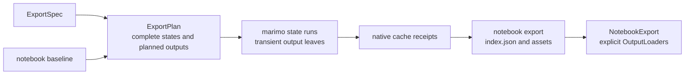

# Architecture

marimo-export creates verified notebook exports while leaving graph execution,
cache identity, serialization, and persistence with marimo.



## Package boundaries

| Path                                               | Responsibility                                                                  |
| -------------------------------------------------- | ------------------------------------------------------------------------------- |
| `packages/python`                                  | ExportSpec, exporter descriptors and runtimes, build, capture, export I/O, CLI  |
| `packages/python/src/marimo_export/_execution`     | baseline records, normalized states, output-cell code, ExportPlan               |
| `packages/python/src/marimo_export/_marimo/compat` | private marimo imports and capability probes                                    |
| `packages/python/src/marimo_export/_remote`        | HTTP, SSE, credentials, bridge invocation, managed server lifecycle             |
| `packages/browser`                                 | npm entry points, index parsing, immutable readers, integrity, loader contracts |
| `packages/loader-*`                                | private implementations for one representation dependency family                |
| `examples/vite-vanilla`                            | live market notebook, ExportSpec, and vanilla TypeScript dashboard              |

Stable domain modules depend on stable local types. marimo compatibility code
adapts those types to private runtime seams. The Python composition roots are
`build`, `capture`, `Client`, and `open_export`. The browser composition root is
`openExport`.

## Baseline and export plan

An ExportSpec declares:

- definition names under `inputs`
- sparse named rows under `states`
- source definitions and optional exporter descriptors under `outputs`

The selected live session supplies one baseline. Inspection records:

- defining cell ID for each definition
- sibling definitions returned by the same cell
- ordinary or UI kind
- Python type
- portable ordinary value or UI frontend value
- UI domain and sensitivity
- notebook document identity

`create_export_plan()` validates every referenced definition and fills each
sparse row into a complete input vector. It separates ordinary assignments
from UI frontend updates and maps ordinary inputs back to their authored cells.

An ordinary assignment is appended to a transient copy of its defining cell.
The copied cell continues to create sibling functions, classes, and UI
elements. UI updates are applied through marimo's UI command path inside the
state runtime.

## Transient output cells

Each state runtime receives:

1. the authored cells with ordinary assignments appended where needed
2. one deterministic state-token cell
3. one deterministic leaf per output

The token cell contains the first state fingerprint. The state runtime
overrides that definition with the current fingerprint and prunes the token's
defining cell.

A native output leaf references the state token, then returns the selected
source definition. An exporter leaf also imports the resolved callable and
invokes it with the source plus normalized keyword options. The token makes
the output cache identity state-specific.

Exporter preflight fingerprints:

- resolved module and callable implementation
- statically reachable local Python modules
- owning distribution versions when available
- declared built-in runtime dependencies

The exporter identity is placed in transient leaf code so marimo includes it
in the cell hash.

The compatibility adapter appends these cells to the in-memory
`NotebookSerializationV1` used to construct the state runtime. State teardown
owns their lifecycle.

## Document identity

Document identity covers:

- ordered authored code
- normalized authored cell names
- complete cell configuration

Runtime cell IDs and terminal whitespace are excluded. A saved notebook and
its reloaded session therefore keep the same identity.

Capture checks document identity and declared UI values around execution. Build
uses an operation-local sibling file and checks the original source digest
before and after execution.

## Native execution and caching

Every state runs through marimo's `AppKernelRunner` with cell caching enabled.
Build also enables native caching for the managed parent session's initial
autorun. Capture flushes pending parent cache writes before the first state
run.

marimo owns:

- dependency pruning
- cell hashing
- lazy cache lookup
- restoration and cache writes
- serializer choice
- persistent storage
- hit or miss status

marimo-export observes cache attempts for two purposes:

- output cells produce one receipt for every state and output
- notebook dependency cells contribute run-local notebook-cache activity

The compatibility adapter maps native returns into four export descriptors:

```text
marimo.scalar.v1
numpy.npy.v1
apache.arrow.file.v1
marimo.blob-asset.msgpack.v1
```

Cache keys and return references enter producer provenance. Verified native
bytes are copied into content-addressed export paths.

`ExportResult` keeps run-local diagnostics separate from the static export:

- `output_cache`
- `notebook_cache`
- managed server and create-phase timings
- aggregated `state_runs` timings

A cache hit records a matching native entry. marimo may still execute a cell
when restoration fails or the cell creates session-local UI state.

State-run setup includes notebook serialization, IR loading, runner creation,
configuration, and dependency pruning. Output materialization includes
reactive work required by UI updates and execution of the output cells.

## Build and capture

`capture`:

1. selects an existing edit session
2. invokes the kernel bridge
3. executes every state
4. downloads temporary virtual files
5. writes and verifies the export
6. releases the transfer ticket

The borrowed server and session remain active.

`build`:

1. creates an operation-local notebook copy
2. starts an authenticated server on `127.0.0.1`
3. activates one notebook session
4. delegates state execution and transfer to the capture engine
5. stops the process group and SSE connection
6. writes and verifies the export
7. removes the notebook copy

Shutdown marks the session stream as closing, stops the owned process, then
joins and closes the SSE reader. Process termination releases a blocked read
before the client waits for its reader thread.

## Export wire format

One canonical `index.json` contains:

- schema version
- notebook filename and document SHA-256
- producer versions
- ordered input and output names
- complete state vectors and fingerprints
- one descriptor per state and output

Asset paths derive from codec and SHA-256. Equal native bytes share one asset.
The writer stages a complete directory, opens and verifies it, then commits the
directory atomically.

Python local reads defend the filesystem boundary. Browser reads resolve paths
relative to the export base URL. Both validate length, digest, native framing,
and descriptor agreement.

## Browser loader boundary

Browser core decodes the stable codec envelope. An application supplies one
`OutputLoader` for the expected codec and media type.

Each specialized loader remains a private workspace package with its own
dependencies, tests, and result contract. The browser package maps
`#loaders/*` to those sources and exposes them as
`@marimo-team/marimo-export/loader/*`. Specialized runtimes are optional peer
dependencies.

Interactive loaders return a value with `mount()`. Each mount returns a
disposable view that owns DOM, listeners, object URLs, module state, and
renderer finalizers.

## Extension path

Built-in exporter IDs resolve through one closed catalog. A custom
`module:symbol` reference resolves a callable already available in the kernel
environment. Portable options become explicit keyword arguments.

A custom exporter can return any value supported by the native cache codecs. A
custom `BlobAsset` representation uses a versioned media type. Its paired
`BlobAssetLoader` validates the inner bytes and returns the application value.

The stable cache codec set remains closed while media representations stay
extensible.
