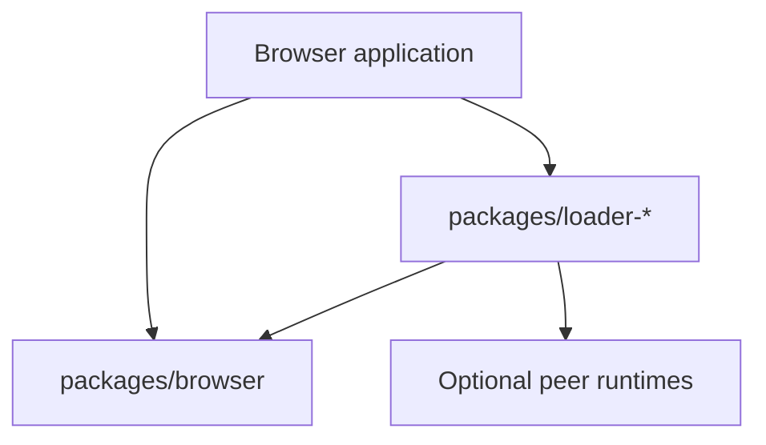
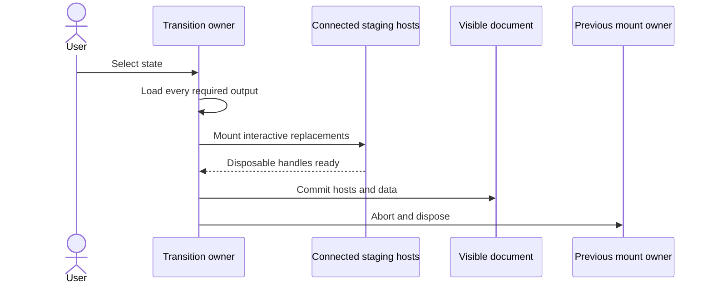

# Browser loaders and mounts

The browser package opens one notebook export, resolves exact prepared states,
loads verified representations, and mounts interactive values into an
application-owned document.

## Package direction



`packages/browser` owns canonical parsing, immutable reader values, asset
transport, integrity, native BlobAsset decoding, and `OutputLoader` contracts.
Each loader workspace owns one representation decoder, result type, runtime
dependency, cancellation behavior, and mount disposal.

The public npm package exposes loader facades through
`@marimo-team/marimo-export/loader/*`. Vite+ prevents browser core from
importing specialized runtimes and prevents loader packages from importing one
another.

## Opening and resolution are immutable

`openExport(base)` fetches and validates `index.json`, then returns an immutable
`NotebookExport`. Assets remain lazy.

```ts
const notebookExport = await openExport("./export/");
const leaders = notebookExport.state("leaders");
const cloud = leaders.resolve({
  symbols_selector: ["MSFT", "GOOGL", "AMZN"],
});
```

`state(name)` selects an authored name. `resolve(completeInputs)` selects one
exact vector. `state.resolve(patch)` completes a sparse transition from the
current vector, then resolves the matching fingerprint.

The detached base URL cannot be mutated to redirect later asset requests.

## Loading crosses the integrity boundary

`ExportOutput.load(loader, options)` requires one explicit loader whose codec
and media-type predicate accept the output descriptor.

Before invoking a representation runtime, browser core checks:

- same-origin relative asset path
- declared and caller byte limits
- response body availability and exact length
- SHA-256 digest
- codec framing
- BlobAsset envelope and descriptor agreement

The loader then validates representation shape, allocation bounds, and the
abort signal.

| Loader                | Application result                      | Runtime dependency               |
| --------------------- | --------------------------------------- | -------------------------------- |
| `scalarLoader()`      | JSON-compatible scalar                  | None                             |
| `imageLoader()`       | Mountable image                         | Browser Blob and object URL APIs |
| `numpyLoader()`       | Shape, dtype, order, numeric buffer     | None                             |
| `arrowTableLoader()`  | Flechette table                         | `@uwdata/flechette`, `lz4js`     |
| `parquetRowsLoader()` | Readonly row objects                    | `hyparquet`                      |
| `vegaLiteLoader()`    | Immutable specification and mount       | `vega-embed`                     |
| `anyWidgetLoader()`   | Saved model graph, model API, and mount | `@anywidget/types`               |

## A mount owns its resources

A mount receives an application element and returns an idempotent disposable
view. The handle owns its nodes, listeners, object URLs, renderer finalizers,
models, module URLs, styles, child views, and cleanup callbacks.

Opening, resolution, loading, and verification execute no notebook-authored
browser module. Mounting an interactive representation grants that code page
authority.

## State replacement is a transaction

A transition uses two owners:

1. The load generation owns fetch and decode work until a newer request aborts
   it.
2. The committed mount owner remains active until a complete replacement
   commits.



Staging hosts stay connected, measurable, offscreen, and free of committed DOM
IDs. A late generation bails out before commit. Failed staging disposes the new
handles and leaves the committed application hosts visible.

Mounted code can affect page-global modules and styles before commit. Those
effects follow the loader's disposal contract.

## AnyWidget interaction stays in the browser

Loading validates the saved model graph and restores buffers without importing
its frontend modules. Mounting imports modules and creates a browser-local
model registry. Model changes, listeners, nested resolution, and
`save_changes()` use that registry.

Disposal cancels initialization and rendering, runs late cleanup, removes
styles, and revokes module URLs. The exported widget has no connection to its
former Python kernel.

Read [Agents and delivery](agents-and-delivery.md) for the example, packaging,
and browser evidence that exercise this lifecycle.
