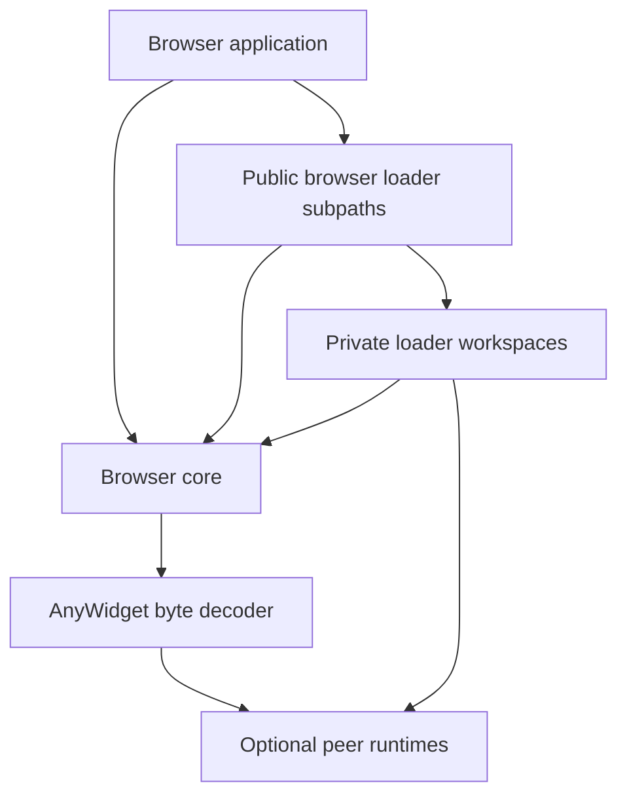
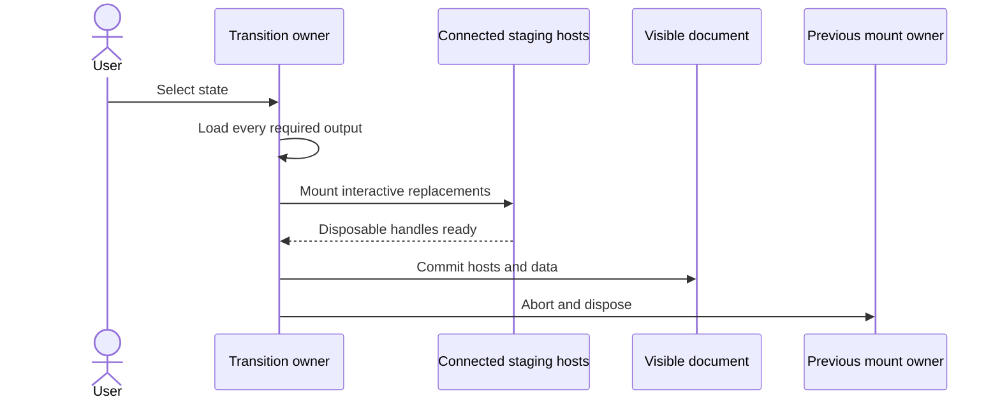

# Browser loaders and mounts

The browser package opens one notebook export, resolves exact exported states,
loads verified representations, and mounts interactive values into an
application-owned document.

## Package direction



`packages/browser` owns canonical parsing, immutable reader values, asset
transport, integrity, native BlobAsset decoding, built-in loaders, and
`OutputLoader` contracts. Each loader workspace owns one specialized decoder,
result type, runtime dependency, cancellation behavior, and mount disposal.

Most loader workspaces implement `OutputLoader` against browser contracts. The
AnyWidget workspace accepts verified bytes and returns a loaded mount value. Its
public browser facade owns media matching and `BlobAssetLoader` construction, so
the package dependency remains one-way from browser to the AnyWidget decoder.

The public npm package exposes loader facades through
`@marimo-team/marimo-export/loader/*`. Vite+ prevents browser core from
importing specialized runtimes and prevents loader packages from importing one
another.

Applications import those public subpaths. They do not import the private
`@marimo-export/internal-loader-*` workspaces.

## Opening and resolution are immutable

`openExport(base)` fetches and validates `index.json`, then returns an immutable
`NotebookExport`. Its `identity` is the SHA-256 of the fetched canonical index
bytes. Assets remain lazy.

`state(name)` selects an authored name. `resolve(completeInputs)` selects one
exact vector. `state.resolve(patch)` completes a sparse transition from the
current vector, then resolves the matching fingerprint.

The public [browser reader reference](../../docs/reference/browser/reader.md)
owns signatures, examples, and caller options.

The detached base URL cannot be mutated to redirect later asset requests. A
fixed base query is copied to the index and every asset URL. Derived object
paths cannot replace that query.

## Related output loads share one lifetime

`loadOutputs(state, loaders, options)` resolves every requested output name,
starts the selected loaders, and returns a readonly record keyed by those names.
It forwards the existing load options and uses one linked abort signal for the
set. A failed load cancels sibling requests and preserves the primary error
while their public promises settle.

Loader implementations remain responsible for their asynchronous work.
Applications own the visible commit after the selected values have loaded.
Both export examples and Studio's presentation adapter compose this operation.

## The prepared subpath owns mutable selection

`@marimo-team/marimo-export/prepared` connects one mutable manifest route to
immutable notebook export instances. The strict prepared manifest is:

```json
{
  "schema": "marimo-export.prepared.v1",
  "instance": "<export identity>",
  "export_url": "./<instance>/",
  "inputs": {},
  "state_fingerprint": "<state fingerprint>",
  "refresh_interval_ms": 1000
}
```

Manifest parsing rejects unknown fields and bounds the export URL and refresh
interval. `openPreparedPublication()` opens the notebook export.
`resolvePreparedPublication()` checks its identity and base URL, resolves the
complete input vector, and verifies the selected fingerprint.

`PreparedStateController` owns pending input intent, sparse input updates,
patchable control updates, query-string selection, transition cancellation,
generation ordering, publication replacement, settlement, and disposal. A
control binding with an `element` path stays application-owned and
`updateControl()` returns `false`. An application supplies one
`PreparedStatePort`:

```ts
interface PreparedStatePort {
  apply(change: PreparedStateChange, signal: AbortSignal): Promise<void>;
  restore?(publication: PreparedPublication): void | Promise<void>;
  dispose?(): void | Promise<void>;
}
```

`apply()` loads every required output before publishing the complete state.
`restore()` returns application controls to the last committed publication after
a rejected transition.

Each transition owns an `AbortController`. A newer transition aborts the active
one before it enters the serialized application queue. A caller-supplied
`AbortSignal` is linked to that transition. `cancel()` marks superseded work,
`settle()` waits for the queued transition, and `dispose()` aborts the controller
lifecycle before calling the application port's optional disposer.

`isPreparedAbort()` recognizes a browser `AbortError` and a
`NotebookExportError` with code `abort`. Cancellation remains separate from
manifest, query, and state-selection failures.

`PreparedPublicationRefresh` fetches the manifest with `cache: "no-store"`.
When the export identity and base URL remain equal, it reuses the opened export.
When a new instance appears, it opens and validates that export before replacing
the publication. A local selection survives replacement when the input names
match and the replacement export resolves the complete current vector. The
controller adopts the manifest state when that vector is unavailable.

`fetchPreparedManifestDocument()` owns the bounded HTTP and portable JSON read
for both export manifests and application envelopes. Applications validate their
own envelope fields before supplying a prepared manifest to the controller.

## Loading crosses the integrity boundary

`ExportOutput.load(loader, options)` requires one explicit loader whose codec
and media-type predicate accept the output descriptor.

Before invoking a representation runtime, browser core checks:

- codec-derived asset path under the selected export base
- declared and caller byte limits
- response body availability and exact length
- SHA-256 digest
- codec framing
- BlobAsset envelope and descriptor agreement

The loader then validates representation shape, allocation bounds, and the
abort signal.

BlobAsset envelopes use a strict MessagePack scanner. It limits nesting to 256
levels and values to 100,000, rejects duplicate string map keys and trailing
bytes, requires minimal-width canonical tokens, and accepts finite float64 values.

Browser core brands `NotebookExportError` with a versioned global symbol.
The constructor freezes each instance. The error class is an immutable direct
value. `isNotebookExportError()` checks the shared brand, public error name,
string message, known code set, and optional portable details. This preserves a
compatible error object across realms and separately bundled package copies.

The prepared subpath has its own frozen `PreparedExportError`. Its codes are
`manifest_invalid`, `manifest_read_failed`, `query_ambiguous`, and `query_miss`.
`isPreparedExportError()` recognizes the versioned brand across realms. Loading,
integrity, state, and output failures continue to use `NotebookExportError`.

Core loaders decode scalar, JSON, text, HTML, image, and marimo snapshot values.
Private loader workspaces own NumPy, Arrow, Parquet, Vega-Lite, and AnyWidget
implementations that appear through public browser subpaths. The public
[output loader reference](../../docs/reference/browser/loaders.md) owns the exact
loader catalog, result types, and peer dependency requirements.

The Marimo output and cell loaders validate canonical replay records. They
return data that an application can adapt to its own renderer. The records
carry closed file resources, the reachable model lifecycle closure, and a
function map keyed by every projected UI object ID. `uiValues` carries the
accepted frontend value for each registry-owned UI object after state updates.
Model and UI object IDs are scoped by planned output so applications can merge
several projection records before committing one presentation state.

`mergeMarimoReplayResources()` validates and combines those records. Shared
models must have equal complete lifecycle sequences. Ordering constraints from
every snapshot preserve dependencies between models and repeated messages.
Conflicting resources or replay order fail before the application stages DOM.

Native Marimo rendering remains an application adapter. The host owns the pinned
frontend graph, stores, custom-element definitions, styles, and registries used
by its live and Prepared presentation. Export's reader and resource composition
return records for that adapter. The
[Studio integration record](../proposals/studio-prepared-runtime.md) links one
consumer's native frontend ownership.

## A mount owns its resources

A mount receives an application element and returns an idempotent disposable
view. The handle owns its nodes, listeners, object URLs, renderer finalizers,
models, styles, child views, and cleanup callbacks. AnyWidget module definitions
and successful imports belong to the page-global cache and browser module
registry. Temporary Blob URLs are revoked when their imports settle.

Opening, resolution, loading, and verification execute no notebook-authored
browser module. Mounting an interactive representation grants that code page
authority.

The shared mount signal has representation-specific lifetime:

| Mount     | Signal after `mount()` resolves                       | Portable owner action                                                  |
| --------- | ----------------------------------------------------- | ---------------------------------------------------------------------- |
| Image     | Aborting disposes the mounted image                   | Dispose explicitly during replacement or teardown                      |
| AnyWidget | Aborting starts full registry disposal                | Dispose explicitly and await teardown                                  |
| Vega-Lite | The listener is removed after import and embed settle | Dispose the returned view to finalize the chart                        |
| Custom    | Defined by the loader implementation                  | Document pending and settled behavior, then expose idempotent disposal |

Explicit `dispose()` is the common ownership rule across representations.

## The application commits visible state

The controller keeps the current publication until `PreparedStatePort.apply()`
succeeds. It aborts superseded work and asks the port to restore the last
committed publication after a non-cancellation failure. Superseded, cancelled,
and stale-generation work skips restoration. The application port owns output
loading, DOM staging, visible commit, and mount disposal.

A DOM application can implement that port with two owners:

1. The load generation owns fetch and decode work until a newer request aborts
   it.
2. The committed mount owner remains active until a complete replacement
   commits.



In this application pattern, staging hosts stay connected, measurable,
offscreen, and free of committed DOM IDs. A late generation bails out before
commit. Failed staging disposes the new handles and leaves the committed
application hosts visible.

The disposable releases resources owned by the mount. Module side effects and
other page-global mutations may persist after failed staging or disposal.

## AnyWidget interaction stays in the browser

Loading validates the saved model graph and restores buffers without importing
its frontend modules. Mounting imports modules and creates a browser-local
model registry. Model changes, listeners, nested resolution, and
`save_changes()` use that registry.

The page caches at most 1,024 module definitions by declared ESM hash and
canonical source identity. A versioned `Symbol.for` record on `globalThis`
gives independently bundled loader copies the same map and admission limit.
Successful imports remain cached for the page lifetime, which matches the
browser ESM registry. A failed cache promise is evicted. Embedded definitions
then retry through a fresh blob URL. Retry for direct data and HTTP URLs follows
the browser's native module-map behavior. Temporary embedded module URLs are
revoked when their import settles.

Each mount creates its own models, bindings, views, styles, and abort lifecycle.
Disposal releases those resources while a shared pending module import continues
for other mounts. The exported widget has no connection to its former Python
kernel.

## Native presentation hosts

The native Marimo snapshot loaders return captured records and replay resources.
Applications adapt them to their frontend registries and visible hosts. A host
owns its model checkpoints, notification replay, UI values, and remount policy.
The standalone AnyWidget loader owns the registry created for each of its mounts.

Read the public [output loader reference](../../docs/reference/browser/loaders.md)
for decoder and mount contracts, and [Product surfaces and distribution](agents-and-delivery.md)
for packaging and browser evidence.
