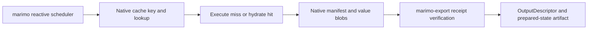

# Execution and caching

marimo-export executes missing normalized states through marimo, commits their
portable prepared-state artifacts, and reuses marimo's native lazy cache. The
package adds export policy around that cache through a contained compatibility
adapter.

## Ownership boundary

| Behavior                                      | Owner                 |
| --------------------------------------------- | --------------------- |
| Reactive graph and topological execution      | marimo                |
| Cell hash and cache key                       | marimo                |
| Cache store selection and persistence         | marimo                |
| Lazy value serialization and restoration      | marimo                |
| Cache signing and verification                | marimo                |
| State relation and missing-state selection    | marimo-export         |
| Transient output leaves                       | marimo-export         |
| Native cache activity reporting               | marimo-export adapter |
| Verified native return to output descriptor   | marimo-export adapter |
| Portable prepared-state and export repository | marimo-export         |

## Upstream caching foundation

marimo's [caching API](https://docs.marimo.io/api/caching/) defines the
author-facing `mo.cache`, `mo.lru_cache`, and `mo.persistent_cache` APIs plus the
notebook-wide automatic cell cache. marimo-export integrates with the automatic
cell-cache path. Managed parents and state-child graphs set `cache_cells`, while
borrowed parent sessions retain their application-owned policy.

The SciPy 2026 article [Content-Addressed Caching for Reactive
Notebooks](https://dmadisetti.github.io/scipy_proceedings_2026/) supplies the
design rationale for graph-derived keys, typed cache blobs, and cached
WebAssembly delivery:

- Cache keys combine compiled cell behavior with content-addressed references.
- A reference that cannot be addressed directly contributes its producing
  parent cell's hash, forming a Merkle dependency graph.
- Per-definition manifests and typed blobs separate cache identity from stored
  values.
- Cached WebAssembly exports carry native manifests and blobs so browser Python
  can derive the same keys and restore values.

The pinned marimo 0.24.0 loader verifies the manifest and loads every resolvable
referenced definition and return value before skipping the cell body. Values
whose required module is unavailable can remain as stubs and cause live
recomputation when a consumer needs them.

marimo-export preserves those upstream decisions. It adds graph-scoped execution
policy needed to prepare an explicit state-output relation, flushes pending
native writes, verifies the selected return receipt, and translates supported
returns into package-owned output descriptors. Marimo remains authoritative for
the cache key, store, manifest, blob, codec, signature, and restoration behavior.



The export repository stores prepared-state artifacts after Marimo has executed
or restored the notebook cells that produce them. Marimo's native store remains
the computation cache.

## Exact supported adapter

The Python package pins `marimo==0.24.0`. `_marimo/compat/release.json` records:

- Marimo version 0.24.0
- release commit `854f7f2910b4bb4b6aebe650efc1f83ad40d9bef`
- source SHA-256 digests for the private cache functions adapted by the package

`_marimo/compat/cache/probe.py` checks the installed distribution version,
required cryptography support, private function sources, lazy-loader registry,
restored UI check, Polars stub loaders, tensor encoder, and active runtime store
shape before adapter construction. A mismatch raises `CompatibilityError` with
code `marimo_incompatible`.

This architecture targets the published Marimo 0.24.0 package as-is. Marimo
integration changes remain inside marimo-export until a matching public Marimo
capability is available.

Applications can inspect the boundary before loading a notebook:

```python
from marimo_export.diagnostics import marimo_compatibility

check = marimo_compatibility()
print(check.status, check.details)
```

## Stable cache port

`_marimo/capabilities.py` exposes package-owned records and protocols.
`CachedStateExecutor.execute_state()` accepts a normalized state, execution
plan, prepared exporters, and producer identities. It returns `StateExecution`
with:

- native receipts for every output
- scoped control bindings
- authored and projection cache activity
- state-run timings

`NativeCacheReturn` represents a verified scalar, NumPy array, Arrow table, or
BlobAsset return. It carries no Marimo loader, store, schema, graph, stub, or
cache-key object.

The execution adapter translates these records into export descriptors before
repository, CLI, and browser consumers see them. Private Marimo objects remain
under `_marimo/compat`.

## Private cache adapter

`_marimo/compat/cache` separates each private responsibility:

| Module         | Responsibility                                                  |
| -------------- | --------------------------------------------------------------- |
| `probe.py`     | Validate the exact supported private contract                   |
| `patch.py`     | Own one reversible lease over process-global Marimo cache hooks |
| `loader.py`    | Run native lazy deserialization on the kernel thread            |
| `lifecycle.py` | Recreate unavailable values and session-bound Marimo state      |
| `attempts.py`  | Scope live-only cells and cache activity to one exact graph     |
| `barrier.py`   | Flush pending native cache writes at execution boundaries       |
| `receipts.py`  | Verify and decode one persisted native return                   |
| `host.py`      | Keep UI, Polars, and tensor cache restore compatible in hosts   |

`_marimo/composition.py` runs the cache probe before constructing
`PrivateKernelRuntime`. Code outside `_marimo/compat` and named composition
roots imports neither cache modules nor private Marimo modules.

## Reversible process-global patch

Marimo 0.24.0 exposes the required cache seams through process globals. The
adapter temporarily owns:

- `PERSISTENT_LOADERS["lazy"]`
- `CachedLifecycle`
- `cache_attempt_from_hash`

`_CachePatchCoordinator` snapshots the native values on the first lease.
Equivalent overlapping managed leases share one installation. The last close
restores each global still owned by the adapter. A foreign replacement during
the lease raises `marimo_cache_patch_conflict` after releasing adapter
bookkeeping and restoring the globals it still owns.

Borrowed child runs serialize through one async-aware lock while their patch
lease is active. Managed kernels retain the same patch for their lifespan.
One coordinator owns every global mutation.

## Graph-scoped policy

The installed attempt wrapper checks the exact graph identity before applying
export behavior. An unmatched graph receives the native Marimo cache attempt
unchanged.

For an owned export graph, the adapter can:

- record the effective hit or miss for authored and projection cells
- run complete-cell owners and selected exporter leaves live when their output
  contract includes uncached side effects or session-bound resources
- turn a hit containing an unavailable UI or unhashable stub into a live run
- recreate cells that define `mo.state` so getters and setters belong to the
  current session
- retain the verified attempt required for output receipt extraction

Graph scopes are registered and removed through context managers. Forced cells
exist only inside one active scope.

## Cache activity counts executed child work

`CacheActivity` records effective marimo cache decisions for cells that entered
a missing-state child run:

- `authored_hits` and `authored_misses` count non-projection cell attempts.
- `projection_hits` and `projection_misses` count transient output and snapshot
  leaf attempts.
- A forced live run counts as an effective miss even when marimo initially found
  a stored entry.

Exact prepared-export reuse and prepared-state reuse execute no child work and
therefore add no cache activity. Zero counts can mean repository reuse. They do
not prove that the notebook contains no cacheable cells.

## Sequential lazy loader

`SequentialLazyLoader` subclasses Marimo's native `LazyLoader`. It moves blob
deserialization onto the kernel thread for runtimes that cannot enter safely
from cache workers.

The adapter keeps Marimo's store, manifest, blob hash, signing, missing-data,
and unreadable-data behavior. Signature failures remain authoritative. Missing
or unreadable blobs follow native incomplete-cache behavior.

## Write barriers and receipt extraction

Marimo may serialize lazy-cache values in background workers. The adapter adds
one early post-execution hook to managed kernels and calls
`flush_active_caches()` at receipt boundaries. A dependent state therefore sees
the completed native write.

Receipt extraction:

1. flushes native writes
2. snapshots reads from the active loader store
3. decodes the native manifest through Marimo's schema
4. checks the expected native hash
5. resolves Marimo's effective verification mode and signer
6. verifies the selected return blob
7. compares an inline scalar with the live value and Python type
8. returns a package-owned `NativeCacheReturn`

The registered live loader remains unchanged during extraction. Descriptor
translation occurs after the cache adapter returns its package record.

## Interactive host compatibility

`marimo_export.integration.keep_cached_cells_compatible()` installs the cache
repairs required by an interactive host process. The host retains the returned
release callback for its kernel lifecycle. Private host repair imports and
mutations remain in `marimo_export._marimo.compat.cache.host`.

The host lease owns three pinned Marimo seams:

- restored UI-definition detection for cached composite values
- Polars lazy-stub loader selection
- contiguous tensor bytes for Polars values

`cache/host.py` reference-counts equivalent leases and coordinates mutation with
the main cache patch owner. The last close restores the native UI check, Polars
loader entries, and tensor encoder values still owned by marimo-export. Foreign
mutation raises `marimo_cache_patch_conflict`.

## Child execution

Each complete state runs in an in-memory Marimo child graph containing:

- one copied set of authored notebook cells, with selected ordinary assignments
  rewritten in their owning cells
- one complete state fingerprint cell
- registry update commands for selected UI inputs
- transient snapshot-token cells when an output needs one
- one deterministic leaf per requested output

The child runs the dependency closure in topological phases. UI-defining cells
receive accepted upstream inputs before dependent controls are constructed. A
final phase runs the remaining available authored cells, preserving notebook
failure semantics beyond the projected cells.

Projection leaves carry notebook, producer, implementation, output-plan, and
snapshot identity in their deterministic source. A changed identity changes the
Marimo cell hash and native cache key through Marimo's own hashing path.

State children enable native cell caching locally so every output can produce a
verified receipt. Marimo decides authored-cell validity from cell code,
content-addressed references, dependency hashes, registered side effects, and
the configured native store. Complete-cell owners run live because their
contract includes console messages, which Marimo documents as uncached side
effects. Cells that create UI elements or `mo.state` also run live so their
session identity remains current.

Notebook code must register external file dependencies through
`mo.watch.file`. Other external systems need an author-owned Marimo cache key or
side-effect boundary. marimo-export does not inspect files, network responses,
or mutable modules to replace Marimo's invalidation decision.

Read [marimo integration](marimo-integration.md) for transient assignments,
output recording, replay closure, exporter preparation, transfer tickets, and
process ownership.

## Validation

Changes to this boundary require:

- exact release and source-drift probe tests
- reversible patch and overlapping lease tests
- unrelated graph isolation tests
- signed, missing, corrupt, and unavailable-value cache tests
- cache write-barrier and cleanup tests
- warm owned build and borrowed capture
- producer identity and mid-capture source-drift tests

Run `marimo-export doctor` before a live reproduction when the adapter fails to
load.
