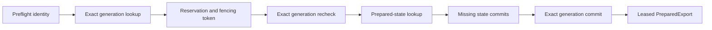

# Failure and concurrency

marimo-export coordinates six concurrency scopes. Each scope owns a commit
decision and a cancellation or cleanup boundary. Their work can overlap, while
their commit authority remains scoped to the current owner.

## Concurrency domains

| Scope                    | Coordination unit                                        | Commit authority                                                | Release boundary                                         |
| ------------------------ | -------------------------------------------------------- | --------------------------------------------------------------- | -------------------------------------------------------- |
| Exact preparation        | One repository identity                                  | Reservation owner with the current fencing token                | Exact reuse, generation commit, failure, or cancellation |
| Prepared artifact commit | One prepared state or export generation                  | `PreparationRepository` through artifact services               | Staging or artifact handle close                         |
| Repository maintenance   | One catalog transaction or maintenance filesystem change | `ArtifactRepository` under the maintenance lock                 | Prune or recovery operation completes                    |
| Marimo cache patch       | Process-global private cache seams                       | `_CachePatchCoordinator` and the active graph scope             | Last equivalent lease closes                             |
| Python publication       | One supersession group and application key               | Latest desired-work token. Preparation callbacks can overlap    | Replacement, `release()`, or controller close            |
| Browser transition       | One transition generation                                | Latest non-aborted generation after `PreparedStatePort.apply()` | Commit, failure, cancellation, or controller disposal    |
| Directory delivery       | One destination identity                                 | Staged writer after preflight identity comparison               | Installation, rollback, or staged handle close           |

## Preparation ordering

Preparation uses a process-local lock and a cross-process reservation for one
repository identity. A waiting caller uses its public `timeout` as the
reservation-acquisition deadline. After acquisition, the lease manager renews
the reservation while bounded repository operations continue.

A winner can commit while another caller waits. The waiter then rechecks and can
reuse the winner's exact generation. A reclaimed or expired reservation loses
commit authority. Final state and generation commits recheck the owner, fence,
expiry, and observed current pointer.

Read [Planning and preparation](preparation.md) for producer sequencing and
[Export repository](repository.md) for artifact commit.

## Last durable state by failure boundary

| Failure boundary                               | Durable state after failure                                                                                                                   |
| ---------------------------------------------- | --------------------------------------------------------------------------------------------------------------------------------------------- |
| Exact lookup or reservation acquisition        | Temporary availability and acquisition failures leave the current generation unchanged. Confirmed corruption retires the affected generation  |
| One state execution                            | Earlier successfully committed prepared states can remain reusable. The exact generation is unchanged                                         |
| Generation assembly before final commit        | Prepared states can remain reusable. The current generation is unchanged                                                                      |
| Lost fence or changed current pointer          | The stale candidate cannot replace the current generation                                                                                     |
| Managed teardown after generation commit       | The committed generation remains in the repository. The caller receives the teardown failure and the new handle closes                        |
| Export or delivery staging before installation | The destination is unchanged                                                                                                                  |
| Rollback replacement failure                   | A recovery sibling can retain the previous or interrupted tree. Its path is currently carried in the exception message                        |
| Parent-directory sync after installation       | The new destination is visible. The result contains `export_parent_sync_failed`                                                               |
| Retired-directory cleanup after installation   | The new destination is visible. The result contains `retired_destination_cleanup_failed` and the retained path                                |
| Python publication refresh                     | The last-good publication remains current. The background task currently exposes no error callback or status channel                          |
| Browser state application                      | The last committed browser publication remains current. The controller invokes the port's optional restoration hook after an ordinary failure |

## Lease granularity

`PreparedExport` owns one export-generation lease. `PreparedAsset` gives a
response owner an independent handle to one declared file, but its detached
lease still pins the complete export generation. A slow response can therefore
retain all bytes in that generation after its parent `PreparedExport` closes.

Python route grace also retains complete export generations. High replacement
frequency, long grace, and slow detached responses can keep several generations
leased and contribute to `repository_limit_exceeded`.

`PreparedExport.renew()` performs an immediate liveness and index-integrity
check. The lease heartbeat owns SQLite expiry extension. Calling `renew()` is not
a synchronous catalog heartbeat.

## Cache patch ownership

The Marimo 0.24.0 adapter temporarily replaces process-global loader, lifecycle,
and cache-attempt hooks. Equivalent leases share one installation. Borrowed child
runs serialize while their patch lease is active. The final close restores each
global still owned by marimo-export.

A foreign replacement during the lease raises `marimo_cache_patch_conflict`.
Hosts that install other cache adapters must coordinate construction and close in
reverse order. The graph scope limits export policy to the exact child graph. It
does not make the process-global mutation graph-local.

Read [Execution and caching](execution-and-caching.md) for the patched seams and
receipt path.

## Publication and browser ordering

`PreparedPublicationController` runs a synchronous preparation callback in a
worker thread. The callback must poll the supplied cancellation predicate. A
newer request records a desired-work token before starting work. Its callback
can overlap the older callback until that older work observes cancellation. A
stale candidate closes instead of replacing the current Python prepared
publication.

`PreparedStateController` gives each browser transition an `AbortController` and
monotonic transition generation. A newer transition aborts active work before
its port application enters the serialized queue. Only the latest generation can
commit current state.

Python supersession groups and browser transition generations are different
concepts. Use **supersession group** for Python publication keys. Use
**transition cancellation** and **transition generation** for browser state work.

## Failure precedence

An active execution, source, transport, or cancellation error remains primary.
Cleanup attempts continue in ownership order, and bounded cleanup diagnostics
attach to the primary error. When no primary error exists, the first cleanup
failure is raised after the remaining phases have been attempted.

Post-commit synchronization and retired-directory cleanup failures are warnings
because the new destination is already visible. Treat warnings as part of the
result contract and retain any reported recovery path for operator cleanup.

## Validation

Changes to these boundaries need focused evidence for:

- same-identity preparation serialization and winner reuse
- reservation expiry, fencing, and current-pointer change
- artifact heartbeat and detached generation leases
- overlapping cache leases, foreign replacement, and unrelated graph isolation
- Python publication cancellation, last-good preservation, and route-grace expiry
- browser rapid transitions, restoration, stale commit suppression, and disposal
- directory destination races, rollback, recovery siblings, and post-commit warnings

[Validation](../validation.md) maps each boundary to its focused commands.
