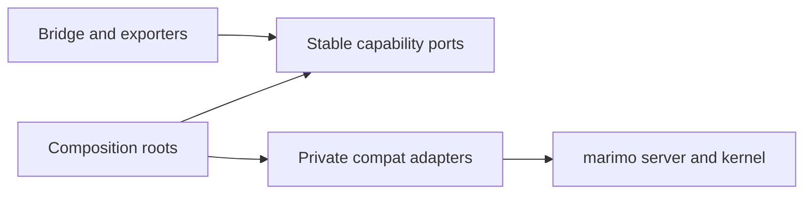
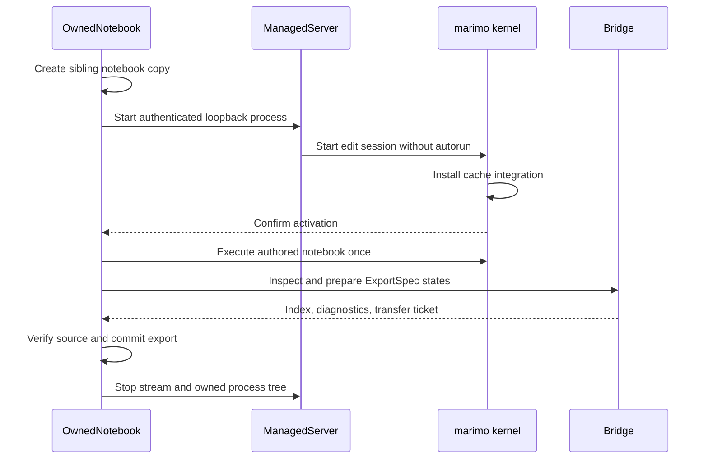

# marimo integration

marimo owns notebook parsing, reactive execution, sessions, UI updates, cell
hashing, cache restoration, serialization, and persistence. marimo-export asks
for bounded capabilities and converts their results into stable local records.
Read [Execution and caching](execution-and-caching.md) for the exact supported
release, cache ownership, patch lifecycle, and native receipt path.

## Boundary shape

| Boundary                   | Stable contract                                         | Adapter owner                      |
| -------------------------- | ------------------------------------------------------- | ---------------------------------- |
| Saved inspection           | Canonical notebook document digest                      | `compat/inspection.py`             |
| Kernel inspection          | `MarimoCapabilities`, `Baseline`, definition records    | `compat/inspection.py`             |
| Exporter preparation       | Importable callables and deterministic identities       | `compat/exporters.py`              |
| Exporter source identity   | Frozen loaded modules and restart-required drift        | `compat/exporter_identity.py`      |
| State orchestration        | `NormalizedState`, `ExecutionPlan`, `StateExecution`    | `compat/execution.py`              |
| Child-run lifecycle        | Cache activity, execution, cleanup, and error status    | `compat/child_run.py`              |
| Native receipt decoding    | Stable cache bytes and export descriptors               | `compat/receipts.py`               |
| Cache codec adaptation     | Native loader, lifecycle, attempt, barrier, and receipt | `compat/cache/`                    |
| Interactive host cache     | UI, Polars, and tensor restore capability               | `compat/cache/host.py`             |
| Projection materialization | Recording, formatting, and canonical snapshot bytes     | `compat/projections.py`            |
| Replay resource closure    | Model, function, file, and UI replay resources          | `compat/replay.py`                 |
| Structured output data     | Identifier rewriting and portable output values         | `compat/output_data.py`            |
| Snapshot file closure      | Virtual and notebook public file inlining               | `compat/file_closure.py`           |
| AnyWidget capture          | One live widget graph as canonical bytes                | `compat/anywidget.py`              |
| Transfer                   | Temporary virtual files described by verified receipts  | `compat/transfer.py`               |
| Managed process            | Server configuration and kernel lifespan                | managed server and kernel adapters |

`_marimo/capabilities.py` owns cross-kernel records and protocols.
`_marimo/composition.py` constructs execution adapters.
`_marimo/anywidget.py` and `_marimo/blob.py` own narrow representation
bindings. `_marimo/entrypoints.py` selects the managed kernel lifespan.

## Inspection and control roots

Kernel inspection returns `DefinitionDescription`, `CellDescription`, and
`SessionDescription` records before planning mutates any state. Definitions
carry input mode, portable frontend value availability, UI domain hints,
dependency names, control paths, and sensitivity.

`select_control_roots()` chooses the smallest canonical UI root set for supported
control candidates reached from selected outputs or explicit UI state keys.
Ordinary definition keys enter through the separate explicit-input path. A
password control makes its containing root sensitive. Sensitive roots never
enter exported states. Composed controls retain typed index, key, and element
path steps so browser updates can route back to one root input. Inspection
rejects duplicate authored cell names. Runtime IDs select unnamed cells or an
exact live cell instance.

`document_sha256()` reads one revision-stable byte snapshot and passes it to the
adapter with the authored path as its logical filename. The compatibility
adapter parses those bytes and passes ordered cell IDs, code, names, and config
through the same canonical record hasher used by live inspection. The caller
rechecks the source hash and file revision after parsing. It starts no session
and executes no cell.

## OwnedNotebook owns the process tree

The lifespan consumes its private activation environment before notebook
execution. The server rejects marimo extension policy that excludes the
required lifespan. It records process groups before and after notebook
execution so cleanup retains known descendants even when shutdown begins to
fail.

On POSIX, the managed server also watches the producer PID. An abrupt producer
exit triggers Marimo's parent poller, which terminates the server process group
and lets each kernel poller terminate its own group. On Windows, the server
starts suspended, joins a kill-on-close Job Object, and resumes after assignment.
Descendants inherit that job. Normal cleanup terminates the job and waits for
its members to release inherited file handles. An abrupt producer exit closes
the job handle through the operating system and terminates remaining members,
including descendants whose server root has already exited.

Process arguments select Marimo's token-password stdin mode. The parent writes
the access token once through the child pipe, then closes stdin immediately.
Logs and diagnostics redact the token value.

After initial autorun, activation calls the internal `validate_baseline`
bridge operation. The validator reads bounded cell statuses and rejects
exception, interruption, and cancellation outcomes before inspection or
capture. A marimo stop outcome remains valid when it does not invalidate a
requested output closure. The validator does not traverse definition values or
ordinary globals.

`marimo_export.integration.is_owned_session()` exposes the managed-kernel
lifecycle to host integrations. The marker is set in the child environment
passed to `ManagedServer` and remains absent from its parent process.

`marimo_export.integration.observe_kernel_inputs(kernel)` is the host boundary
for live state ledgers. It accepts a kernel-shaped object with `graph` and
`globals`, then returns immutable portable root values and typed live control
bindings. The compat inspector owns UI traversal, AnyWidget frontend values,
input dependencies, canonical root ownership, and sensitive-tree exclusion.
Ordinary globals are outside this finish-hook path.

The caller's startup path remains intact. A project `sitecustomize` retains its
normal behavior.

## Capture preserves the borrowed session

`capture` invokes the bridge through marimo's scratchpad route. The bridge
checks request schema, package version, installed source identity, operation,
and parameters before constructing adapters.

Capture records the parent document and selected UI values before state
execution. It verifies them after the state loop. The caller continues to own
the server and session.

## State execution uses child graphs

For each complete state, the execution adapter builds an in-memory notebook
with authored cells, one state fingerprint cell, and one leaf per output.
marimo loads it into an `AppKernelRunner` and installs an isolated recording
stream before execution. The stream feeds Marimo's `SessionView` through the
native output, console, and run-status hooks.

`compat/execution.py` sequences state application and output materialization.
It delegates child cache activity and cleanup to `compat/child_run.py`, then
passes each persisted output cell to `compat/receipts.py` for descriptor
decoding.

The child computes the authored ancestor closure for every value,
rendered-output, and complete-cell owner before execution. A state with UI
inputs visits their defining cells in topological order. Before each defining
cell, it runs the required ancestor cells that have not reached the current
state, then applies that cell's requested UI values. A dependent control tree
therefore sees accepted upstream inputs when it is constructed.

The final
phase runs every remaining available authored cell plus initialization cells
marked stale by callbacks such as `mo.state` updates. UI input owners stay
intact so the patch remains applied. A state with no UI inputs runs every
available authored cell once. This full state run preserves notebook failure
atomicity even when a failing reactive cell is not projected.

Within each child phase, authored cells follow Marimo's native cache decision.
The adapter requests live execution for complete-cell owners because console
messages are outside Marimo's cache contract. Cells that define UI elements or
`mo.state` recreate their session-bound objects before dependent cache keys are
evaluated. Each phase uses one topological run. Snapshot tokens and synthetic
output leaves materialize after the final phase. Custom exporter leaves run
live when their callable or widget contract requires current process resources.

For each rendered-output and complete-cell output, the adapter materializes
canonical snapshot bytes once after the source reaches its final state. It
assigns those bytes to a graph-defined transient token that the output leaf
reads. Marimo therefore hashes the exact formatted output, console, and replay
resources before reusing the leaf's native cache entry.

Ordinary assignments preserve sibling definitions from the authored cell. The
transient assignment is inserted before one authored final expression so the
cell output observes the selected value and evaluates once. A final expression
that assigns the same input with `:=` makes that input ineligible because the
authored assignment and selected state cannot both be authoritative. UI updates
remain local to the child. Ordinary values, UI frontend values, and AnyWidget
state share the portable JSON number boundary, including the JavaScript
safe-integer range. AnyWidget inputs apply sparse trait patches and compare the
requested and accepted complete JSON values with type-aware equality.

Binary widget state is not a portable ExportSpec input. The live AnyWidget
capture adapter extracts buffers for output representations.

Rendered-output and complete-cell projections close referenced virtual and
notebook `public/` files in resource-bearing HTML attributes, `srcset`, CSS
URLs, mime bundles, and nested component HTML. Each referenced file is bounded
to 10 MiB. Public files must retain one filesystem revision across the bounded
read. Any known local file in an unrecognized attribute fails capture.
AnyWidget replay resources begin at model IDs referenced by structured widget
fields, then follow serializer-owned child references.

Each replay graph uses IDs of the form
`projection-<planned-output-digest>-model-<index>`. The namespace remains
stable for one output across states and separates independently mounted
outputs.

UI object and random IDs begin with the snapshot owner cell ID, followed by the
projection namespace and a projection-root structural path. Common controls
retain their scoped IDs when a conditional tree adds or removes siblings.
Structured output attributes, function namespaces, replay values, and nested
UI references share one mapping. The export's `control_bindings` contains
scoped input-control IDs with their root ExportSpec input and typed semantic
path. Repeated projections may use distinct scoped IDs with the same binding.

Static replay function namespaces are empty. A form registration named
`validate` is removed when its component declares `should-validate=false`.
Any active validation or other Python function fails projection capture.
Inspection reports the same typed paths for live editor object IDs. Direct UI
definition dependencies identify composed roots whose defining cells reference
other UI definitions.
Embedded AnyWidget modules retain the model notification's trusted relative
`./@file/` URL and use Marimo's slash-prefixed `/@file/` key in the static file
table.
Function resources contain every projected UI object ID, including namespaces
whose function-name list is empty. UI replay values come from the child
registry after state updates. Sensitive control trees fail projection before
their frontend values are serialized.

`compat/projections.py` owns the recording and materializer entrypoints used by
transient leaves. Replay closure lives in `compat/replay.py`. Structured value
rewriting lives in `compat/output_data.py`, which delegates media closure to
`compat/file_closure.py`.

Recording teardown attempts console flush, recording-context reset, kernel and
context stream restoration, and stream shutdown in order. A primary execution
error remains primary while cleanup failures are attached as bounded
diagnostics.

## Child runs consume the cache adapter

[Execution and caching](execution-and-caching.md) owns the loader, graph scope,
receipt, patch, and interactive-host contracts. State-child cleanup closes
output recording, flushes native writes through the cache port, then releases
the child context. Marimo's WASM cache manifest callback remains owned by
Marimo's deployment commands.

The owned parent and every state child use the same notebook-relative Marimo
cache store. Authored cache entries therefore remain reusable across states,
output plans, Studio views, and later producer processes. Complete-cell targets
run in the child so console records come from the snapshot run. Marimo remains
the authority for all other authored-cell hits and misses.

## Implementation identity enters every output-cell source

Every transient output leaf embeds the capture's frozen
`implementation_identity()` as an internal literal. The digest covers the
installed marimo-export Python sources. The producer computes it from a stable
source manifest at the operation boundary and verifies it again after capture.
A source change produces different compiled cell code and a different native
cache key even when the package version stays constant. Mid-capture source
drift fails the operation.

Output leaves also embed the canonical notebook document digest and exact
Marimo producer version. Complete-cell leaves combine those identities with
the materialized snapshot token.

Exporter preparation reuses module objects already loaded in the kernel and
imports missing callable or dependency modules. It records disk source
provenance for the callable's module and each dependency declared by the
ExporterSpec. Edits made after module import and before first preparation require
a kernel restart to take effect. Later disk source drift fails with
`exporter_source_changed`. Managed builds begin in a fresh process.

Custom exporter leaves embed the marimo-export implementation identity and
exporter provenance. Preparation binds the resolved callable in a
capture-scoped context registry, and the leaf invokes it through a deterministic
token. The registry is cleared when capture exits. Custom leaves enter native
lookup as misses for every state run. `anywidget.bundle` does the same because
its live model state is captured anew. Other built-in exporter leaves retain
native cache reuse.

## Transfer tickets own temporary files

Non-scalar receipts become deduplicated marimo virtual files. A transfer ticket
contains bounded relative URLs, sizes, codecs, and digests. Assets use the
64 MiB export limit, and one ticket uses the 512 MiB export closure limit. A
process retains at most 64 active tickets and 1 GiB across their files. The
client verifies each payload before writing, then releases the ticket. Lease
expiry retries cleanup for an abandoned transfer. Recovery leases count toward
the same process limits until every file is removed.

The client applies the package capture bounds and records ticket ownership
before validating the response shape and export index. It counts canonical
index bytes and unique declared asset sizes, releases a rejected ticket, then
begins downloads for an accepted transfer.

Registration and release attempt every virtual-file removal during
cancellation. Files that remain registered return to a short recovery lease,
and cleanup diagnostics attach to the primary cancellation.

Credentials, cache paths, server internals, and operation URLs stay outside the
notebook export.

## Upstream one contained capability

[Marimo upstream candidates](marimo-upstream-candidates.md) maps each private
seam to the package-owned port and tests that remain stable when a supported
Marimo capability replaces it.
