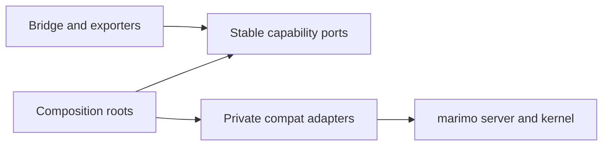
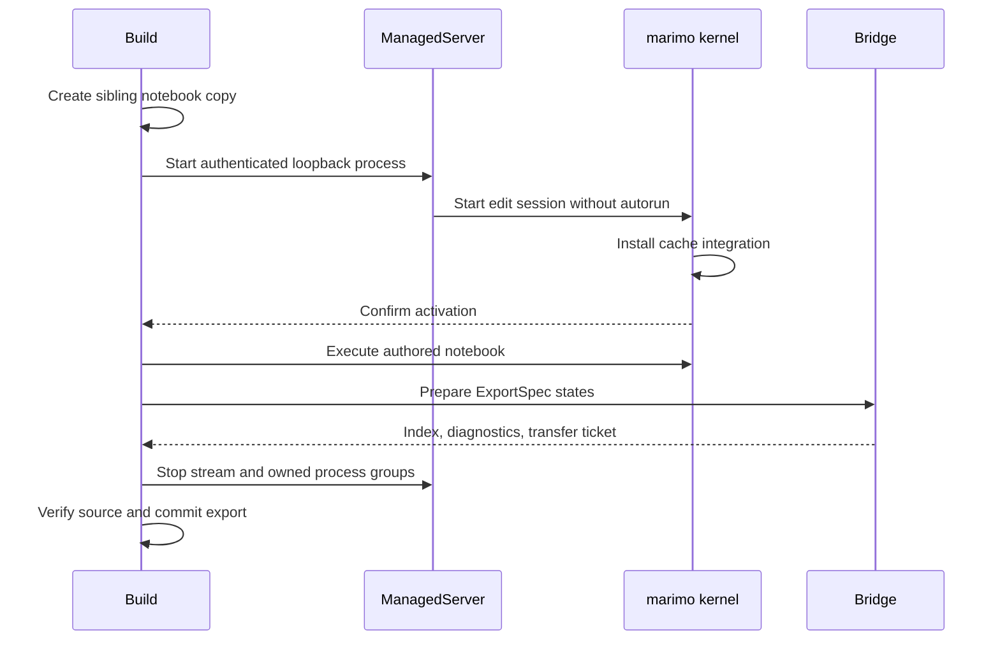

# marimo integration

marimo owns notebook parsing, reactive execution, sessions, UI updates, cell
hashing, cache restoration, serialization, and persistence. marimo-export asks
for bounded capabilities and converts their results into stable local records.

## Boundary shape

| Boundary             | Stable contract                                        | Adapter owner                      |
| -------------------- | ------------------------------------------------------ | ---------------------------------- |
| Kernel inspection    | `MarimoCapabilities`, `Baseline`, definition records   | `compat/inspection.py`             |
| Exporter preparation | Importable callables and deterministic identities      | `compat/exporters.py`              |
| State execution      | `NormalizedState`, `ExportPlan`, `StateExecution`      | `compat/execution.py`              |
| Cache behavior       | Native loader and lifecycle behavior                   | `compat/cache.py`                  |
| AnyWidget capture    | One live widget graph as canonical bytes               | `compat/anywidget.py`              |
| Transfer             | Temporary virtual files described by verified receipts | `compat/transfer.py`               |
| Managed process      | Server configuration and kernel lifespan               | managed server and kernel adapters |

`_marimo/capabilities.py` owns cross-kernel records and protocols.
`_marimo/composition.py` constructs execution adapters.
`_marimo/anywidget.py` and `_marimo/blob.py` own narrow representation
bindings. `_marimo/entrypoints.py` selects the managed kernel lifespan.

## Managed build owns the process tree

The lifespan consumes its private activation environment before notebook
execution. The server rejects marimo extension policy that excludes the
required lifespan. It records process groups before and after notebook
execution so cleanup retains known descendants even when shutdown begins to
fail.

The caller's startup path remains intact. A project `sitecustomize` retains its
normal behavior.

## Capture preserves the borrowed session

`capture` invokes the bridge through marimo's scratchpad route. The bridge
checks request schema, package version, installed source identity, operation,
and parameters before constructing adapters.

Capture records the parent document and selected UI values before state
execution. It verifies them after the state loop. The caller continues to own
the server and session.

## State execution uses child graphs

For each complete state, the execution adapter builds an in-memory notebook
with authored cells, one state fingerprint cell, and one leaf per output.
marimo loads it into an `AppKernelRunner`, prunes overridden definitions,
executes dependencies, applies UI updates, materializes outputs, and persists
native cache receipts.

Ordinary assignments preserve sibling definitions from the authored cell. UI
updates remain local to the child. AnyWidget inputs apply sparse trait patches
and compare the requested and accepted complete JSON values with type-aware
equality.

Binary widget state is not a portable ExportSpec input. The live AnyWidget
capture adapter extracts buffers for output representations.

## Cache adaptation preserves marimo formats

`SequentialLazyLoader` moves native deserialization onto the kernel thread for
runtime libraries that cannot enter safely from marimo's cache workers. It
retains manifest, signing, missing-data, and unreadable-data behavior.

`CompleteCachedLifecycle` reruns a cache hit when marimo restored an
`UnhashableStub`. The state cache tracker reports that retry as a miss. A write
barrier drains background serialization before another cell hashes the same
live value.

Borrowed state runs own a process-wide lock while replacing marimo's loader and
lifecycle registries. Managed kernels install the same behavior for their
lifespan. Both paths restore the prior registry state they borrowed.

## Exporter identity enters output-cell source

Exporter preparation fingerprints callable code and defaults, reachable local
modules, source files, package versions, and built-in runtime dependencies.
Custom modules run inside a capture-scoped module overlay that restores the
original module graph after success, failure, or cancellation.

The identity is written into the transient output cell. marimo therefore owns
conversion cache invalidation together with notebook execution.

## Transfer tickets own temporary files

Non-scalar receipts become deduplicated marimo virtual files. A transfer ticket
contains bounded relative URLs, sizes, codecs, and digests. The client verifies
each payload before writing, then releases the ticket. Lease expiry retries
cleanup for an abandoned transfer.

Credentials, cache paths, server internals, and operation URLs stay outside the
notebook export.

## Upstream a capability at one seam

1. State the behavior in the focused local protocol.
2. Protect it through adapter and live consumer tests.
3. Add the marimo extension point with lifecycle and error semantics.
4. Replace the corresponding compatibility adapter at its composition root.
5. Run the same consumer tests and remove the private probe the extension
   replaced.

The product boundary remains stable when the bridge, export plan, client, and
durable format need no change.
