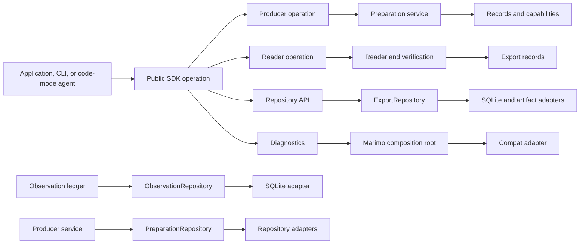

# Ports and composition

marimo-export exposes immutable product records and a small Python SDK. Internal
services implement planning and preparation against focused repository and
Marimo capabilities. Composition roots select the private implementations that
satisfy those boundaries.



## Public Python surface

The package root contains these public symbols:

```python
from marimo_export import (
    ExportPlan,
    ExportRepository,
    ExportResult,
    ExportSpec,
    NotebookExport,
    OutputSpec,
    PreparedExport,
    ProgressEvent,
    StateSpace,
    VerificationResult,
    build,
    capture,
    open_export,
    plan,
    prepare,
    verify_export,
)
```

Focused modules carry capabilities needed by applications with longer
lifecycles:

| Module                       | Contract                                                                    |
| ---------------------------- | --------------------------------------------------------------------------- |
| `marimo_export.agent`        | Discover code-mode help and version-matched skill resources                 |
| `marimo_export.sessions`     | Connect to a server and borrow a live `Session`                             |
| `marimo_export.client`       | Provide the concrete `Client`, `Session`, and capture wrapper               |
| `marimo_export.producer`     | Expose the single-use `OwnedNotebook` inspection context                    |
| `marimo_export.inspection`   | Inspect definitions, cells, input roots, and capabilities                   |
| `marimo_export.prepared`     | Hold a prepared export or file access backed by a detached generation lease |
| `marimo_export.publication`  | Retain last-good prepared exports for application keys                      |
| `marimo_export.manifest`     | Encode a bounded canonical prepared manifest                                |
| `marimo_export.delivery`     | Stage and commit an application directory                                   |
| `marimo_export.observations` | Record successful input vectors through a bounded ledger                    |
| `marimo_export.outputs`      | Return a package-owned `BlobAsset` from a custom exporter                   |
| `marimo_export.diagnostics`  | Validate the installed Marimo adapter                                       |
| `marimo_export.integration`  | Install host capabilities and expose integration records                    |
| `marimo_export.exporters`    | Define built-in and importable output exporters                             |
| `marimo_export.limits`       | Configure capture byte limits                                               |
| `marimo_export.errors`       | Handle typed Python failures                                                |
| `marimo_export.cli`          | Provide the console entry point and process exit constants                  |
| `marimo_export.reader`       | Use detailed reader, state, output, and provenance records                  |
| `marimo_export.repository`   | Configure retention and inspect repository records                          |
| `marimo_export.spec`         | Construct StateSpace, ExportSpec, and OutputSpec                            |
| `marimo_export.planning`     | Inspect planned states and repository identity helpers                      |
| `marimo_export.progress`     | Consume progress event and cache activity records                           |
| `marimo_export.result`       | Inspect write results, timings, and post-commit warnings                    |
| `marimo_export.index`        | Inspect durable export index and control-binding records                    |
| `marimo_export.descriptors`  | Inspect low-level output descriptors                                        |
| `marimo_export.verification` | Verify a notebook export                                                    |
| `marimo_export.wire`         | Use canonical portable JSON and fingerprint operations                      |

Application documentation uses `marimo_export.sessions` as the canonical import
for `Client`, `Session`, and `connect`. `marimo_export.client` remains a supported
module because it defines those concrete types and exposes the capture wrapper.
`marimo_export.producer` is the supported narrow path for `OwnedNotebook` and
`open_notebook()`.

The CLI and code-mode guidance lead to the same SDK operations. Human output,
JSON output, JSON Lines progress, and exit categories belong to `_cli`.
Capability discovery and packaged skill lookup belong to `agent.py`. Planning
and preparation services contain no terminal behavior.

## Stable records

Public planning and result records are frozen package values. They contain
strings, numbers, portable JSON, paths, and other marimo-export records.
`PreparedExport` is a lifecycle handle over immutable export data.

| Record               | Owner         | Meaning                                                   |
| -------------------- | ------------- | --------------------------------------------------------- |
| `StateSpace`         | `spec.py`     | Reusable states and explicit default alias                |
| `ExportSpec`         | `spec.py`     | State space combined with output declarations             |
| `ExportPlan`         | `planning.py` | Resolved states, identities, and reusable work            |
| `ProgressEvent`      | `progress.py` | Ordered preparation or write progress                     |
| `PreparedExport`     | `prepared.py` | Leased immutable export ready to open, serve, or write    |
| `ExportResult`       | `result.py`   | Durable write result and producer diagnostics             |
| `NotebookExport`     | `reader.py`   | Immutable verified local reader                           |
| `VerificationResult` | `reader.py`   | Verified state, state-output pair, asset, and byte counts |

SQLite rows, Marimo graphs, kernel contexts, cache loaders, HTTP responses, and
process handles remain private adapter values.

## Service layer

`_services` owns use-case policy:

| Service module           | Responsibility                                             |
| ------------------------ | ---------------------------------------------------------- |
| `plan_export.py`         | Resolve producer, spec, observations, and repository reuse |
| `prepare_export.py`      | Prepare missing file-backed states and commit one export   |
| `capture_export.py`      | Prepare missing states through a borrowed live session     |
| `state_preparation.py`   | Execute missing states and commit the exact generation     |
| `export_artifacts.py`    | Convert captured state results into repository artifacts   |
| `preparation_support.py` | Share cancellation, progress, cleanup, and reuse helpers   |
| `write_export.py`        | Copy and verify a prepared export at a caller destination  |
| `identity.py`            | Compute source, environment, and implementation identity   |
| `plan_wire.py`           | Decode the bounded kernel planning response                |

Services may import the private `PreparationRepository` capability. Observation
workers may import the private `ObservationRepository` capability. These
callers import neither SQLite modules, repository tables, filesystem artifact
internals, nor private Marimo modules.

## Repository capabilities

`ExportRepository` is the public application facade. Its observation and exact
prepared methods are plan-shaped:

| Method                             | Contract                                                        |
| ---------------------------------- | --------------------------------------------------------------- |
| `record_observation(plan, inputs)` | Validate the complete plan inputs and return `ObservedState`    |
| `observation_revision(plan)`       | Return the producer's monotonic observation revision            |
| `observations(plan)`               | Return vectors for the plan producer and inferred input names   |
| `clear_observations(plan)`         | Clear observations for the plan producer and return their count |
| `prepared(plan)`                   | Return the exact leased `PreparedExport` or `None`              |

The facade also owns `default_path()`, status, pruning, close, and construction
of the default repository. `status()` reports current catalog rows, accounted
artifact bytes, and active artifact leases. `prune()` applies the configured
retention policy. Applications pass `ExportPlan`. Producer digests and raw
repository keys remain private.

Preparation uses the concrete private facade in `_repository/preparation.py`.
That capability owns:

- exact-generation lookup
- prepared-state lookup
- preparation reservations
- state and generation staging
- guarded commit
- observation snapshots

`ObservationLedger` and preparation use the concrete private facade in
`_repository/observations.py`. `ObservationRepository` owns raw producer-keyed
writes, revisions, projection queries, latest-vector lookup, and snapshots.
Those operations stay private because the ledger resolves a producer from a
validated saved notebook revision before an `ExportPlan` exists.

`_repository/capabilities.py` defines `LeaseCatalog`, the persistence protocol
used by the lease manager. `_repository/sqlite` implements that port and owns
every SQL statement. Repository services outside that directory operate on
package-owned rows and handles.

`PreparationRepository` and `ObservationRepository` are contained private
facades. Public applications compose at `ExportRepository` and
`PreparedExport`.

## Marimo capabilities

`_marimo/capabilities.py` defines the records and protocols that cross the
kernel boundary:

| Capability            | Package-owned result                                           |
| --------------------- | -------------------------------------------------------------- |
| `CachedStateExecutor` | `StateExecution` with receipts, bindings, and cache activity   |
| `KernelRuntime`       | Baseline inspection, exporter preparation, and state execution |
| `TransferRuntime`     | Temporary virtual files for verified asset transfer            |
| `NativeCacheReturn`   | Verified scalar, NumPy, Arrow, or BlobAsset return             |

`_marimo/composition.py` validates and constructs the concrete runtime.
`_marimo/anywidget.py`, `_marimo/blob.py`, `_marimo/managed_server.py`, and
`_marimo/entrypoints.py` are focused composition roots for representations and
managed processes.

Private Marimo types enter under `_marimo/compat` and normally leave as
package-owned records. `TransferRuntime` is the contained exception: its adapter
returns opaque runtime context and virtual-file objects that
`_marimo/transfer.py` consumes before control leaves the Marimo integration
layer. Strict native-cache verification can also rethrow Marimo's
`CacheSignatureError` across the adapter boundary. Services, repository modules,
CLI handlers, and applications otherwise receive package-owned values.

Transient output-cell source generated by `_execution/plan.py` embeds runtime
imports of `_marimo.compat.projections` and `_marimo.compat.exporters`. Those
strings execute inside the child kernel as part of the concrete adapter. Stable
policy modules still import package-owned records and capabilities.

## Browser capabilities

The npm package exposes three layers:

```text
@marimo-team/marimo-export
  immutable export reader and loader contracts

@marimo-team/marimo-export/prepared
  prepared manifest, refresh, state controller, and state port

@marimo-team/marimo-export/loader/*
  one representation loader per public subpath
```

All three layers consume the value rules owned by
[Portable JSON](portable-json.md). Read
[Identities and protocols](identities-and-protocols.md) before changing a schema,
codec, fingerprint, or manifest field.

The prepared controller receives a `PreparedStatePort`. An application owns
how complete loaded output state is applied to its document. The controller
owns state selection, transition cancellation, generation ordering, publication
replacement, query updates, control updates, settlement, and disposal.

## Composition roots

| Root                       | Concrete choices                                               |
| -------------------------- | -------------------------------------------------------------- |
| `_build.py`                | Destination preflight, preparation, write, and handle lifetime |
| `ExportRepository.open()`  | Repository path, SQLite catalog, artifact files, lease manager |
| `_marimo/composition.py`   | Pinned private kernel and transfer adapters                    |
| `producer.open_notebook()` | Owned source copy, managed server, client, and session         |
| `sessions.connect()`       | Authenticated HTTP transport for borrowed sessions             |
| CLI command dispatcher     | SDK operation, output mode, progress rendering, exit category  |

Construct concrete dependencies at these roots. Domain records and services
must remain importable before optional runtimes or private Marimo modules load.

## Boundary enforcement

`packages/python/tests/test_boundaries.py` enforces the dependency direction:

- domain records import no runtime adapter
- public records import no private repository implementation
- services reach repository internals through the preparation capability
- private Marimo imports stay under `_marimo/compat`
- compat adapters are selected through named composition roots
- importing the public package defers private and optional runtimes

Browser package configuration enforces the equivalent direction for prepared
control, browser core, and loader implementations. Run the boundary tests after
moving a record, port, adapter, or composition root.
