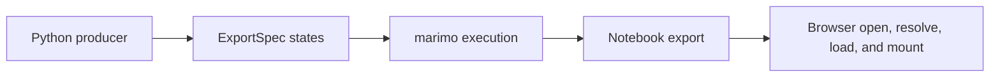

# Runtime profiles

The prepared runtime is the profile owned by marimo-export. Applications can
also offer a live server or browser WebAssembly runtime, but those runtimes remain
outside this package.

| Profile             | Python execution                     | State surface                                   | Primary owner                                   |
| ------------------- | ------------------------------------ | ----------------------------------------------- | ----------------------------------------------- |
| Live server         | Application server and kernel        | Inputs accepted by the running notebook         | marimo server and host application              |
| Browser WebAssembly | Browser Python runtime               | Inputs accepted by the browser notebook runtime | marimo WebAssembly runtime and host application |
| Prepared            | Producer environment before delivery | Finite states in a notebook export              | marimo-export producer and consumer APIs        |

The public [runtime comparison](../../docs/why.md) owns the user decision. This
page records the implementation boundary for contributors.

## Prepared runtime boundary

The producer uses marimo's computation cache while preparing missing states. It
then crosses into the language-neutral notebook export. A deployed browser
resolves a state already present in that export. It opens no Python kernel or
notebook WebSocket for that transition.

A representation can continue browser-local interaction after load. Vega-Lite
charts and AnyWidget model graphs are examples. Their mount code owns browser
resources and runs with page authority.

## Ownership

marimo-export owns:

- ExportSpec planning and preparation
- repository reuse and prepared publication coordination
- notebook export format and verification
- immutable browser reading and prepared publication transitions
- representation loader and mount contracts

The host application owns:

- runtime selection and user-facing runtime names
- live server or WebAssembly lifecycle
- presentation documents, routes, and host bindings
- fallback when a requested vector is absent
- deployment, origin policy, authentication, and Content Security Policy

## Runtime invariants

1. A prepared browser transition selects an exported state. It executes no
   notebook Python.
2. A request for an absent vector needs another producer run or a live Python
   runtime.
3. Manifest refresh can reveal a new immutable export instance. It does not
   compute notebook Python.
4. Browser opening and verification import no notebook-authored module.
5. Mounting an interactive representation grants that module page authority.

## Validation

A prepared-runtime browser test should confirm that manifest, index, asset, and
state requests use the application origin and that transitions open no kernel,
WebSocket, or WebAssembly runtime. Runtime selector tests belong to the host
application.

External runtime integrations remain proposals until their owner repositories
pass a recorded cross-repository acceptance gate. See
[Proposals](../proposals/README.md).
