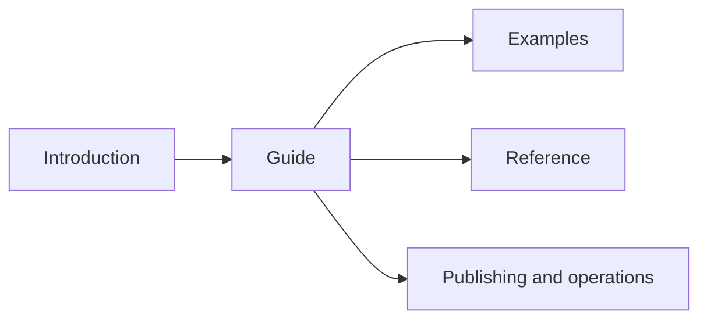

# Documentation system

The public docset maps a reader's current state to one observable product
result. Contributor documentation records ownership, lifecycle, compatibility,
validation, and release mechanics needed to keep that public contract true.

## Source ownership

| Surface                    | Reader job                                                          | Owner                                                               |
| -------------------------- | ------------------------------------------------------------------- | ------------------------------------------------------------------- |
| Root README                | Evaluate the project and reach one result                           | `README.md`                                                         |
| Registry README            | Adopt one published package                                         | Package `README.md`                                                 |
| Introduction               | Understand the product, decide when to use it, and build one export | `docs/overview.md`, `docs/why.md`, `docs/guide/getting-started.md`  |
| Guide                      | Understand concepts and complete producer or consumer tasks         | `docs/concepts/`, `docs/guide/`                                     |
| Examples                   | Inspect a complete multi-output browser application                 | `docs/guide/market-dashboard.md`                                    |
| Reference                  | Look up exact public contracts                                      | `docs/reference/`                                                   |
| Contributor entry          | Choose the code and validation owner                                | `development_docs/README.md`                                        |
| Architecture               | Change an ownership or lifecycle boundary                           | `development_docs/architecture/`                                    |
| Proposals                  | Review an unimplemented cross-repository or upstream design         | `development_docs/proposals/`                                       |
| Development and validation | Run the workspace and prove a change                                | `development_docs/development.md`, `development_docs/validation.md` |
| Release                    | Publish coordinated Python and npm packages                         | `development_docs/releasing.md`                                     |

Public docs define a term at first meaningful use and repeat one canonical noun.
The [terminology reference](../docs/reference/terminology.md) is the lookup owner.
[Identities and protocols](architecture/identities-and-protocols.md) owns the
more precise internal hash and schema vocabulary.

## VitePress runtime

`apps/docs` pins VitePress 2.0.0-alpha.19 through the pnpm catalog and lockfile.
`.vitepress/config.ts` owns site configuration. `navigation.ts` is the typed
route manifest. The directly executed TypeScript checks stay within Node's
erasable syntax and run on the workspace's declared Node runtime.

The pinned VitePress release requires an absolute deployment base. GitHub Pages
supplies that base through `BASE_PATH`, while `publicPath()` prefixes head assets
that VitePress emits verbatim. Themeable hero and navigation images use
root-absolute paths because VitePress applies the configured base to them.

The accessibility enhancer supplies dialog inertness, focus restoration,
mobile-navigation containment, and sidebar keyboard behavior for this pinned
release. Keep it until a VitePress upgrade is verified against the same desktop,
narrow, search, and keyboard checks.

Explanatory flows and file layouts use Mermaid fences in authored Markdown.
The docs workspace pins `mermaid` and `vitepress-mermaid-renderer`. The theme
renders each fence with strict security settings, updates its colors with the
VitePress theme, and exposes zoom, reset, source-copy, and fullscreen controls
on wider screens. Narrow layouts omit the overlay controls so they do not cover
diagram nodes. Keep commands, terminal output, schemas, hashes, and formulas in
literal code fences. Markdown and LLM bundles retain the Mermaid source as text.

## Reader-state navigation

The public structure supports four primary paths:



`apps/docs/navigation.ts` is the canonical route manifest. It drives top
navigation, sidebars, and the LLM text bundle. The companion check maps every
route to one Markdown file, rejects duplicates, and rejects unlisted pages.

Add a page only when it owns one stable reader task, concept, integration, or
reference contract. Update the route manifest in the same change.

## Claim ownership

| Claim                                      | Preferred source                                              |
| ------------------------------------------ | ------------------------------------------------------------- |
| Python name, signature, and default        | Public function, class, or package export                     |
| CLI command, option, output, and exit code | `_cli/arguments.py`, command result record, and render path   |
| TypeScript value, type, option, and error  | Public package barrel, implementation, and packed declaration |
| StateSpace or ExportSpec rule              | `spec.py` and generated JSON Schema                           |
| Durable export shape                       | `index.py`, `descriptors.py`, browser schema, and fixtures    |
| Loader result and lifecycle                | Loader source, package facade, and browser tests              |
| Compatibility                              | Package manifests, Marimo release record, and CI matrix       |
| Release behavior                           | Release scripts and publish workflow                          |

Author explanations and developed examples by hand. Derive or test exhaustive
inventories from their source owners.

Current architecture and proposals have different status. A proposal records its
date, inspected revisions, owner repositories, and acceptance conditions. Move a
proposal into `architecture/` only after those conditions pass.

## Examples are product contracts

The deterministic quickstart under `examples/quickstart/` owns the first
producer-to-reader result. `test_quickstart_example.py` builds it through the
public Python boundary and checks both exported states. Its Vite application
opens that generated export through the public browser package and renders the
`summary` and `report` outputs.

The market dashboard owns the multi-representation browser proof. Its Python
integration test verifies planning, preparation, exact reuse, live capture,
descriptors, Python reads, and export closure. Loader packages test their own
browser runtimes. The complete dashboard loading, transition, and mount path
requires a browser journey check.

`make docs-examples` builds a static notebook, verified notebook export, and
Vite application for both examples. Each application uses document-relative
assets and contains its own export directory. The script publishes each complete
example under `apps/docs/public/examples/`. `make docs-build` runs that step
before VitePress and verifies both notebooks and applications in the final site
tree. GitHub Pages uploads the resulting `apps/docs/.vitepress/dist` directory
as one static site.

When a page uses a partial snippet, it must name the fixture, variable, DOM
host, server route, or framework context supplied by the surrounding page.

## Validate delivery

Run:

```bash
node apps/docs/scripts/check-navigation.ts
make docs-build
make docs-serve
```

[Portless](https://portless.sh/) assigns the VitePress server an available port
and exposes it at `https://docs.marimo-export.localhost/`. The fixed hostname has
one active owner, so stop another marimo-export documentation server before
starting this command in a different worktree. On its first HTTPS run, Portless
may request local administrator access to bind port 443 and trust its local
certificate authority.

The development server uses an empty deployment base.

In the browser, check:

- introduction, concept, guide, and reference routes
- local search for canonical project nouns and public API names
- desktop and narrow layouts
- light and dark themes
- keyboard navigation and visible focus
- code copy controls, tables, diagrams, and callouts
- per-page Markdown, `llms.txt`, and `llms-full.txt`
- console errors, failed requests, local links, and fragments

Build with the production base path before Pages deployment. Generated
VitePress output remains untracked.
