# Proposal: marimo-studio prepared runtime

| Field                                | Value                                                                                                                          |
| ------------------------------------ | ------------------------------------------------------------------------------------------------------------------------------ |
| Status                               | Consumer implemented, cross-repository acceptance pending                                                                      |
| Date                                 | 2026-09-07                                                                                                                     |
| Owner repository                     | `marimo-team/marimo-studio` for application integration, `marimo-team/marimo-export` for public producer and browser contracts |
| Inspected marimo-export revision     | `f1dc798c331eea058bd7c041ea95365b587e74d8`                                                                                     |
| Inspected consumer revision (Studio) | `83816e40234392790ac2ccb32039b2b9aa462302`                                                                                     |

marimo-studio implements a prepared runtime using marimo-export's public APIs.
Its inspected Python package pins marimo-export 0.0.2, while this repository
develops 0.0.3. Source inspection establishes the composition described here.
Acceptance against candidate release artifacts still requires the checks at
the end of this page.

marimo-export owns the reusable producer and consumer contracts. Studio is one
application of them and owns its presentation, authentication, routes, and
deployment assembly.

## Implemented consumer boundary

The inspected Studio checkout places the integration in these owners:

| Studio owner                                  | Composition                                                                                |
| --------------------------------------------- | ------------------------------------------------------------------------------------------ |
| `_prepared/compiler.py`                       | Converts finite mount declarations into `ExportSpec` and separate `ViewBindings`           |
| `_prepared/static.py`                         | Calls public `prepare()` for static output                                                 |
| `_server/prepared_views.py`                   | Wraps `PreparedPublicationController` with Studio keys and capture callbacks               |
| `_delivery/export.py`                         | Uses `delivery.stage()` to assemble the complete application                               |
| `apps/browser/src/zero-python/composition.ts` | Connects `PreparedStateController` and `PreparedPublicationRefresh` to the Studio renderer |
| `_compat/kernel_values/kernel.py`             | Acquires the public cache compatibility lease for the kernel lifecycle                     |

Python paths in this table are relative to
`packages/marimo-studio/src/marimo_studio`. The original proposal, inspected at
Studio revision `fb06814fe25aa1595e46a6a7463f4478b4c461ac`, preceded this
implementation. The following design and acceptance conditions describe the
intended complete integration.

## Intended outcome

Studio would turn authored projection hosts into an application backed by one
prepared notebook export. Studio would own view authoring, presentation,
runtime selection, and renderer behavior. marimo-export would own state planning,
preparation, repository reuse, export integrity, and browser state transitions.

```mermaid
flowchart LR
    artifact["Studio provider artifact"] --> mounts["Immutable mount declarations"]
    mounts --> spec["Compiled ExportSpec and Studio host bindings"]
    spec --> preparation["marimo-export plan and capture or prepare"]
    preparation --> prepared[PreparedExport]
    prepared --> routes["Studio manifest and routes"]
    routes --> browser["@marimo-team/marimo-export/prepared"]
    browser --> renderer["Studio renderer"]
```



## Proposed dependency boundary

Studio would use these public Python surfaces:

```python
from marimo_export import ExportRepository, ExportSpec, OutputSpec, prepare
from marimo_export.manifest import prepared_manifest_bytes
from marimo_export.publication import PreparedPublicationController
from marimo_export.sessions import Session
```

The browser application would use:

```ts
import {
  PreparedPublicationRefresh,
  PreparedStateController,
} from "@marimo-team/marimo-export/prepared";
```

Studio application code would import neither `marimo_export._repository` nor
`marimo_export._marimo`. Repository schema and private Marimo adapters would
remain marimo-export implementation details.

## Proposed view compilation

Studio providers would continue to own their projection grammar and host
identity. A compiler would convert immutable mount declarations into:

- public `OutputSpec` values in one `ExportSpec`
- Studio-owned bindings from document hosts to output names

Repeated projection sources could share one exported output while retaining
independent hosts. A wildcard host would require either a finite resolved output
set or rejection before prepared publication.

Host IDs, layout, Cascading Style Sheets, and presentation JavaScript would stay
outside `ExportSpec` and repository identity. Presentation-only changes could
reuse the same prepared states and export generation.

## Proposed state authoring

The integration needs one explicit owner for the finite state space. One option
is a Studio-owned file that parses through the public `StateSpace` contract.

When no saved state space exists, Studio could construct an explicit relation
from a captured baseline and selected observations:

1. Plan the compiled outputs against the current producer.
2. Read the live session input vector.
3. Record that vector through `ExportRepository.record_observation()`.
4. Select the vectors that should become authored state rows.
5. Submit the resulting `ExportSpec` to marimo-export.

Observations would remain authoring evidence. The application would decide which
vectors enter the published relation.

## Proposed live publication

Studio could pass an application key and preparation callback to
`PreparedPublicationController`. The key would include every Studio-owned fact
that must replace visible presentation state. Its supersession group would
identify requests that cancel and replace one another. Its route group would
identify immutable asset routes that share grace retention.

The callback would use public session APIs:

```python
plan = session.plan(spec=compiled_spec, repository=repository)
prepared = session.capture(
    spec=compiled_spec,
    repository=repository,
    cancelled=is_cancelled,
)
```

Studio metadata could carry host bindings, document identity, and presentation
revision. `PreparedPublicationController` would retain the `PreparedExport` and
lend independently owned generation leases for response assets.

The route shape could use one mutable prepared manifest and immutable export
instances:

```text
.../views/<view>/prepared/current
.../views/<view>/prepared/<instance>/index.json
.../views/<view>/prepared/<instance>/assets/...
```

Studio would own authentication, cache headers, media types, missing-route
responses, and response-lifetime closure. Route grace and slow responses can pin
complete export generations, so capacity tests must cover sustained publication
churn.

## Proposed Studio manifest

`PreparedExport.manifest()` would remain the core `marimo-export.prepared.v1`
record. Studio could wrap it in an application protocol that adds view bindings
and presentation identity.

Any Studio wrapper needs its own schema identifier, parser, size bound, and
cross-language fixtures. `prepared_manifest_bytes()` can enforce canonical
portable JSON and the shared 256 KiB byte limit. It does not validate a
Studio-defined outer schema.

## Proposed static delivery

Static delivery would call public `prepare()` with the same compiled
`ExportSpec`. It would use `marimo_export.delivery.stage()` to assemble provider
files, the prepared manifest, and materialized notebook exports before one outer
directory commit.

The deployed prepared path would contain no Python runtime or notebook source.
It would differ from Studio's inspected Browser WebAssembly export, which ships
notebook source and executes Python in the browser.

## Proposed browser adapter

Studio would implement `PreparedStatePort`:

- `PreparedStateController` would own input intent, exact state selection,
  transition cancellation, generation ordering, restoration, and disposal.
- Studio would own output loading, connected staging hosts, one complete visible
  commit, peer control synchronization, and mount disposal.

A failed or stale transition would leave the last committed document visible.
The Studio port would dispose every staged mount that did not commit.

## Cache compatibility decision

Studio acquires `marimo_export.integration.keep_cached_cells_compatible()` for
its kernel lifecycle. This gives marimo-export ownership of the process-global
Marimo cache repairs for:

- restored user-interface definition detection
- Polars lazy-stub loader selection
- contiguous Polars tensor bytes

The host retains the returned release callback and releases it during kernel
teardown. Cross-repository validation must exercise overlapping leases and
reverse-order teardown against the pinned Marimo release.

## Acceptance conditions

The proposal becomes current architecture when all conditions pass:

1. Studio declares supported marimo-export Python and npm versions.
2. Studio imports only public marimo-export Python and browser surfaces.
3. One compiler produces an `ExportSpec` plus separate Studio host bindings.
4. One saved state space prepares through file and borrowed-session producers.
5. An exact repeat returns before notebook startup.
6. Presentation-only changes reuse the prepared export.
7. Live routes retain current and route-grace generations through delayed asset
   responses.
8. Static delivery contains the declared prepared export and excludes repository
   databases, leases, and Python runtime files.
9. The Studio renderer handles rapid transitions, cancellation, restoration,
   refresh, mounted interaction, and disposal at desktop and narrow widths.
10. The deployed prepared path opens no kernel, WebSocket, WebAssembly runtime,
    or notebook source request.
11. Cache compatibility has one process-global owner and reverse-order teardown.
12. A cross-repository gate records the tested Studio, marimo-export, and marimo
    revisions plus the exact Python, TypeScript, static-export, and browser
    commands.

Record the exact tested revisions and commands when these conditions pass.
Keep generic host, publication, delivery, and browser contracts authoritative
for every application, including Studio.
