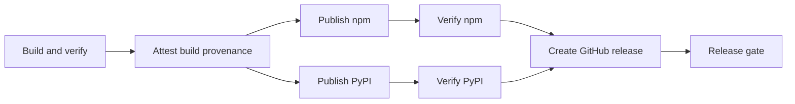

# Releasing marimo-export

One annotated `vX.Y.Z` tag publishes
[`marimo-export`](https://pypi.org/project/marimo-export/) to PyPI and
[`@marimo-team/marimo-export`](https://www.npmjs.com/package/@marimo-team/marimo-export)
to npm from the same source commit.

Validated `main` commits also publish coordinated Python and browser packages
to the rolling [`preview` GitHub prerelease](https://github.com/marimo-team/marimo-export/releases/tag/preview).
The preview channel uses GitHub download URLs for iteration and downstream CI.

```console
make check
./scripts/release.sh --dry-run
```

`make package` writes the release candidates under `dist/python` and
`dist/npm`. It installs the npm tarball through pnpm, installs the direct and
source-rebuilt Python wheels in isolated environments, and compares the two
wheel payloads. `make check` runs this package gate after source checks and
application builds.

## Coordinated version

These manifests carry the same version:

| Package                      | Version source                   |
| ---------------------------- | -------------------------------- |
| `marimo-export`              | `packages/python/pyproject.toml` |
| `@marimo-team/marimo-export` | `packages/browser/package.json`  |

The portable JSON workspace owns the shared TypeScript value contract. Vite+
bundles that implementation into the browser package, so consumers install one
npm package. The artifact verifier rejects workspace, link, file, and catalog
dependency sources in published package metadata.

Update the two public manifests, then refresh the locks:

```console
VERSION=x.y.z
uv version --package marimo-export "$VERSION"
pnpm --dir packages/browser pkg set "version=$VERSION"
uv lock
pnpm install --lockfile-only
```

## Rolling previews

`publish.yml` listens for completed push-event CI and GitHub Pages workflows on
`main`. A preview starts only after both workflows pass for the exact source
commit. Pull request runs and fork runs cannot publish. Completion notifications
queue by commit, and the resolver skips builds whose publication is complete.

The previous reachable final `vX.Y.Z` tag supplies the version base. Its next
patch version and the number of commits since that tag produce Python
`X.Y.(Z+1).devN` and npm `X.Y.(Z+1)-dev.N`. Suffixed and unrelated tags are
excluded. The calculation uses the source commit's parent when selecting the
base, so adding a release tag to that source commit later preserves its preview
version. Previews sort below the next patch release.

The build job checks out the validated commit, stamps its manifests and lock in
the disposable checkout, and runs the same `make package` gate as tagged
releases. Both Python wheels pass isolated installation checks, the direct and
source-rebuilt wheel payloads match, and the browser tarball passes a fresh pnpm
consumer install. The shared attestation job signs every published artifact.
For previews, a signed custom predicate records the packaged commit in
`buildDefinition.externalParameters.checkoutCommit` and a resolved dependency.
It records the signing workflow commit separately, because `workflow_run` can
start after `main` advances. Verify the signature with the predicate type and
signing workflow from the release notes, then inspect that predicate when
checking the preview's source; the certificate's
source digest identifies the signing workflow commit.

The `preview` job publishes these assets under one GitHub prerelease:

- `marimo_export-X.Y.Z.devN-py3-none-any.whl`
- `marimo_export-X.Y.Z.devN.tar.gz`
- `marimo-team-marimo-export-X.Y.Z-dev.N.tgz`
- `marimo-export-X.Y.Z.devN-SHA256SUMS`

The notes show the newest build's source commit and exact installation commands.
Use the URLs from those notes to install matching Python and browser packages:

```console
uv add "marimo-export @ WHEEL_URL"
pnpm add "TARBALL_URL"
```

For an isolated CLI, run `uv tool install --force "marimo-export @ WHEEL_URL"`.
Notebooks can declare the same direct Python dependency in inline script
metadata. Downstream CI should pin both versioned URLs when testing a particular
commit.
An installed preview's application scaffold uses those matching wheel and
tarball URLs, so generated applications can install the same build.

Publication serializes uploads, notes, announcements, and pruning. The
`preview` tag stays on the commit that created the release, so tag immutability
rules remain compatible. Asset URLs and attestations identify each build.
An older build completing later cannot replace the newest installation links.
The release keeps the newest 30 builds with all three matching package assets
uploaded. It removes all four assets when a build ages out, and removes
abandoned partial builds older than that window. Pin a tagged release for
longer-lived dependencies.

Retries compare existing assets with the local verified bytes before reusing
them. Empty GitHub `starter` assets left by a failed upload are removed before
retrying. The merged pull request announcement precedes pruning, so a failed
announcement preserves the older builds. The checksum manifest is uploaded
after notes, announcement, and pruning succeed; it marks completed publication.
A retry can finish interrupted publication without overwriting artifacts or duplicating
the announcement. Rerun a failed preview publication with
`gh run rerun RUN_ID --failed`. If a required upstream workflow failed, fix or
rerun that workflow first; its successful completion retries preview readiness.
An API failure fails the publication run so it can be retried; a pending or
unsuccessful upstream check simply defers publication.

Create a GitHub environment named `preview` with selected deployment branches
and tags, allowing the `main` branch only. It needs no registry credentials.
The preview job uses `contents: write` for release assets and `pull-requests:
write` for the merged pull request's installation comment. Its queued
concurrency group keeps up to GitHub's 100-run limit.

### Preview provenance v1

Preview attestations use this custom predicate type:

```text
https://github.com/marimo-team/marimo-export/blob/main/development_docs/releasing.md#preview-provenance-v1
```

GitHub's attestation API restricts build types under the standard SLSA predicate.
The preview format uses its own predicate type so it can describe the validated
checkout independently of the signing workflow. Tagged releases keep native
SLSA provenance.

This predicate describes a GitHub Actions `workflow_run` publication after CI
and GitHub Pages succeed for one `main` commit. The artifacts come from the
build job's exact checkout, stamped with coordinated preview versions and
verified by `make package`.

`buildDefinition.externalParameters.workflow` names the signing repository,
ref, and workflow path; `checkoutCommit` is the packaged source commit.
`internalParameters.github` records the event, repository and owner IDs, and
runner environment. `resolvedDependencies` contains two Git dependencies: the
signing workflow ref with its commit digest, and the packaged source commit
with its digest. Those commits can differ. `runDetails.builder.id` identifies
the signing workflow and ref; `metadata.invocationId` identifies its run and
attempt. The signed subjects bind this record to the artifact checksums.

Verify a downloaded preview with its custom type and publication workflow:

```console
gh attestation download WHEEL_FILE -R marimo-team/marimo-export
gh attestation verify WHEEL_FILE -R marimo-team/marimo-export \
  --bundle BUNDLE_FILE \
  --predicate-type "https://github.com/marimo-team/marimo-export/blob/main/development_docs/releasing.md#preview-provenance-v1" \
  --signer-workflow "marimo-team/marimo-export/.github/workflows/publish.yml"
```

Replace `BUNDLE_FILE` with the `.jsonl` filename printed by the download command.
Download without a predicate filter: GitHub rejects this custom type as an API
filter. Bundle verification enforces the predicate type locally, along with the
artifact digest and signing identity.

The CI `Preview provenance` job generates a probe using this same predicate,
persists its attestation through GitHub, and verifies it from the hosted API.
The download allows five attempts, two seconds apart, for read-back visibility.
It checks the signed checkout commit and is part of the required gate when
release contracts change. It runs on main pushes and pull requests from this
repository; fork pull requests run the local contracts without signing access.
Probe attestations name a test file and the CI workflow.

## Registry trust

The GitHub repository requires existing `npm` and `pypi` environments. The
release preflight checks both names before creating or accepting a release tag.

Make the GitHub repository public before tagging. The release preflight checks
repository visibility because npm provenance links each public package to its
public source repository.

Configure the existing PyPI project to trust:

- owner `marimo-team`
- repository `marimo-export`
- workflow `publish.yml`
- environment `pypi`

Configure the npm package with the same owner, repository, and workflow plus
environment `npm`. Allow `npm publish`. The publish job uses the Node version
declared in the root `package.json` with `id-token: write` and publishes the verified pnpm-produced tarballs. npm uses
the workflow's
[OpenID Connect](https://openid.net/developers/how-connect-works/) identity and
records provenance for each package.

Repository installs, packing, version changes, registry reads, and consumer
checks use pnpm. The final registry write uses npm CLI because npm trusted
publishing performs its OpenID Connect exchange inside `npm publish`.

npm requires a package to exist before it can accept a trusted-publisher
configuration. Reserve the package name through an authenticated maintainer
publication, then configure its trusted publisher before the first coordinated
release. The release preflight checks that the package exists.

The release preflight checks that the `npm` and `pypi` environments exist.
Required reviewers remain an optional repository policy. Apply a repository
ruleset to `v*` tags when the release process needs maintainer approval before
publication.

If restricting the `npm` and `pypi` environments, allow both `v*` tags for
ordinary publication and the `main` branch for the existing recovery workflow.
The publication jobs accept the release channel only; preview versions go to
GitHub Releases.

## Prepare the release commit

Start from a branch based on synchronized `main`. Update the coordinated
version and run:

```console
make bootstrap
make check
```

Review these artifact facts before merging:

- the wheel, source archive, and source-rebuilt wheel report the same version
- the browser tarball contains every declared export target and its bundled
  portable JSON implementation
- Python wheel entry points include the CLI and Marimo kernel lifespan
- packed manifests point to the public repository

Merge after CI and documentation checks pass for the release commit.

## Tag the verified commit

Fetch `main` and tags from a clean checkout, then run:

```console
git fetch origin main --tags
./scripts/release.sh --dry-run
./scripts/release.sh
```

The preflight requires `HEAD` to equal `origin/main`. A branch checkout and a
detached checkout at that commit are both accepted. It also requires a clean
tree, an unused final-version tag, matching public package versions, both
publishing environments, and successful push-event CI for the exact commit. The
final command creates and pushes an annotated `vX.Y.Z` tag.

The publish workflow then:

1. Rechecks that the annotated tag resolves to the workflow commit, the commit
   is on the fetched `origin/main` history, and push-event CI passed that exact
   commit.
2. Rebuilds and verifies every artifact.
3. Writes SHA-256 checksums and records GitHub build provenance.
4. Starts independent npm and PyPI publication lanes. Each lane publishes its
   artifacts, verifies the registry hashes, and installs the public package in
   a fresh consumer. The Python consumer checks the installed version, package
   contracts, and CLI in one environment.
5. Creates a GitHub Release with generated notes, distributions, and the
   checksum manifest after both lanes verify successfully.
6. Requires every publication and verification stage to pass the release gate.


```mermaid
flowchart LR
  build[Build and verify] --> attest[Attest build provenance]
  attest --> npm[Publish npm]
  attest --> pypi[Publish PyPI]
  npm --> verifyNpm[Verify npm]
  pypi --> verifyPypi[Verify PyPI]
  verifyNpm --> release[Create GitHub release]
  verifyPypi --> release
  release --> gate[Release gate]
```

Each verifier makes up to 18 attempts, with a 10-second wait between failed
attempts. Success requires both matching registry bytes and a working fresh
installation. This covers delays between release metadata, package-index
visibility, and archive availability. Permanent failures return a nonzero exit
status, and each verification job has a 10-minute timeout.

## Recover a partial release

Registry versions are immutable. The npm publisher compares an existing
version's integrity with the tagged tarball. PyPI publication compares existing
files through the simple index and skips files whose hashes match.

Before either registry accepts a package, rerun the failed job and its dependent
jobs:

```console
gh run rerun RUN_ID --failed
```

After one registry accepts a package, download the workflow artifacts and
compare the published bytes with the tagged artifacts:

```console
ARTIFACTS="$(mktemp -d)"
trap 'rm -rf "$ARTIFACTS"' EXIT
gh run download RUN_ID --name release-artifacts --dir "$ARTIFACTS"
```

When npm accepted the browser package, verify its integrity:

```console
./scripts/publish-npm.sh --verify-only \
  "$ARTIFACTS/npm/marimo-team-marimo-export-$VERSION.tgz"
```

When PyPI accepted the Python distributions, verify their SHA-256 hashes:

```console
uv run --no-project --isolated python scripts/verify_pypi_artifacts.py \
  "$VERSION" --dist "$ARTIFACTS/python"
```

After the applicable verifier passes, rerun the failed job and its dependent
jobs:

```console
gh run rerun RUN_ID --failed
```

When verification tooling needs a correction, merge the corrected workflow and
scripts into `main`, then resume the original release:

```console
gh workflow run publish.yml --ref main -f version="$VERSION" -f source_run="$RUN_ID"
```

Recovery accepts a completed tag-triggered `publish.yml` run whose commit
matches the annotated version tag. Its build and attestation must have passed,
and its `release-artifacts` payload must still be retained. The latest main CI
must pass for both the tagged commit and the recovery workflow commit before
publication can begin.

The workflow checks the original checksum manifest's signed provenance and every
archive digest, then starts both registry lanes independently. Each publisher
verifies matching existing artifacts or publishes missing artifacts. Both
verifiers must pass before the GitHub release is created.

The original artifact bytes and attestation remain the release's provenance.
Recovery requires `main` and preserves the version tag.
The `release-recovery.json` GitHub release asset records both run identities,
the signed source attempt, and the checksum-manifest digest. It remains separate
from the original signed checksum manifest. Actions retains the archive payload
and working recovery receipt for 90 days.

The isolated npm consumer uses the repository's exact pnpm pin. Its workspace
fixture uses block YAML so pnpm can update consumer installation metadata.
The fixture exempts `@marimo-team/*` releases from the package-age delay and
retains the configured age policy for other dependencies.

Advance both public packages to the next patch version when published bytes
differ or the source needs a correction.

## Verify a published release

Verify the public tag, workflow runs, release assets, attestations, registry
bytes, metadata, and fresh consumer jobs with one command:

```console
./scripts/verify-release.sh "$VERSION"
./scripts/verify-release.sh "$VERSION" --json
```

The command downloads release assets into a temporary directory and leaves the
working tree unchanged. It uses the release workflow's pnpm and Python consumer
jobs as fresh-install evidence, so local package age policy stays active.

For a recovered release, verification binds the successful main workflow and
its recovery receipt to the original tagged build, checksum manifest, and
signing attempt. The JSON result records the release and recovery commits
separately. The auxiliary `release-recovery.json` release asset preserves that
chain after workflow artifacts expire. Use `--recovery-run RUN_ID` to require
one specific recovery run.
