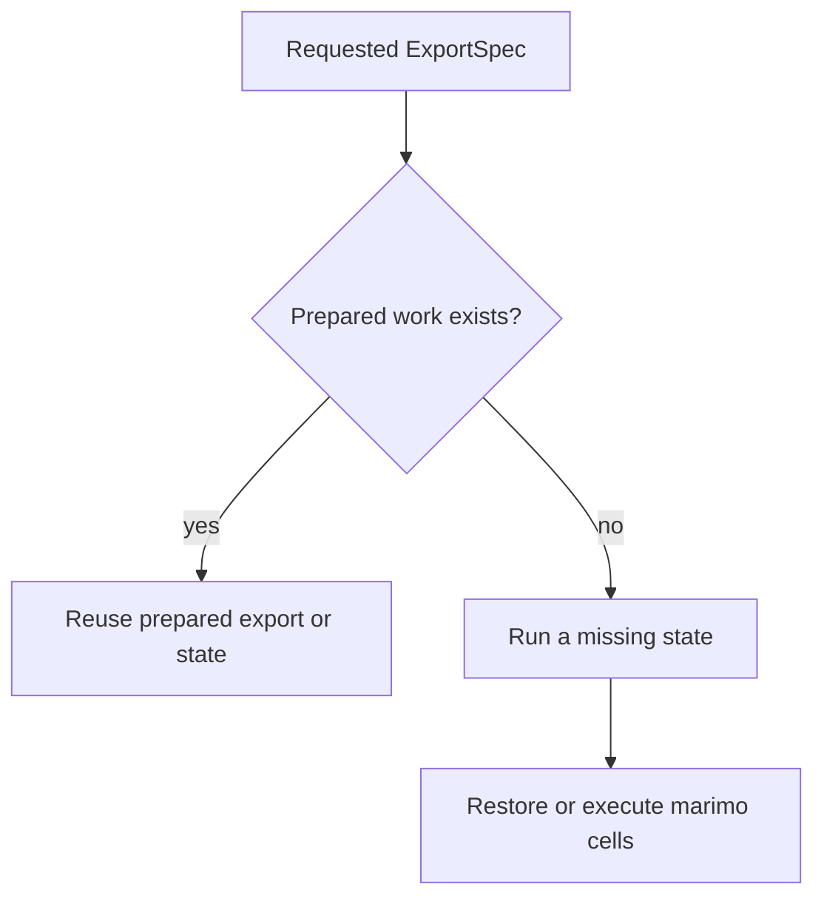

# Caching

marimo-export and [marimo](https://marimo.io/) reuse different work. The export
repository reuses finished state and output data. marimo's computation cache
reuses notebook cell results when a state still needs to run.

In the quickstart, we can see the two kinds of reuse happen at different times:

| Request                         | marimo-export                 | marimo                                            |
| ------------------------------- | ----------------------------- | ------------------------------------------------- |
| First build                     | Run `weekly` and `monthly`    | Restore compatible cells or execute them          |
| Repeat the same build           | Reuse the complete export     | Does not start                                    |
| Change only the `monthly` input | Reuse `weekly`, run `monthly` | Restore compatible cells while the new state runs |

## marimo decides whether a cell can be restored

A marimo notebook is a reactive graph. Each cell defines names and refers to
names from other cells. For automatic caching, marimo derives a cell key from
the cell's compiled behavior, tracked references, and registered side effects.

On a usable hit, marimo restores compatible definitions and skips the cell body.
On a miss, marimo executes the cell and persists the successful result.

The article [Content-Addressed Caching for Reactive
Notebooks](https://dmadisetti.github.io/scipy_proceedings_2026/) explains the
graph-derived key model. marimo's [caching
reference](https://docs.marimo.io/api/caching/) defines the authoring APIs.

## Tell marimo when external data changes

A file, network response, database row, clock read, or random draw can change
while a cell key stays the same.

Use `mo.watch.file` or `mo.watch.directory` upstream when file contents affect a
prepared result. Read the watcher value in the dependent cell. For other mutable
sources, include an application-owned freshness value that changes when the
result must run again.

An exact prepared-export hit returns before notebook execution, so a marimo
watcher is consulted only after the export repository decides that execution is
required. Change the producer inputs or output declarations when the application
requires a new producer run.

## Readers do not use either cache

| Store                    | Owns                                       | Used by            |
| ------------------------ | ------------------------------------------ | ------------------ |
| marimo computation cache | Restorable notebook cell results           | Producer execution |
| Export repository        | Prepared states and exact prepared exports | Producer reuse     |
| Notebook export          | Canonical `index.json` and declared assets | Consumers          |

A written notebook export remains readable after both producer-side stores are
removed. Its readers select exported states and verify output assets.

Related: [Publishing](exports-and-publications) covers how an application
receives newer exports. [Reuse](preparation-and-reuse) defines exact identities,
plan fields, and leases.
