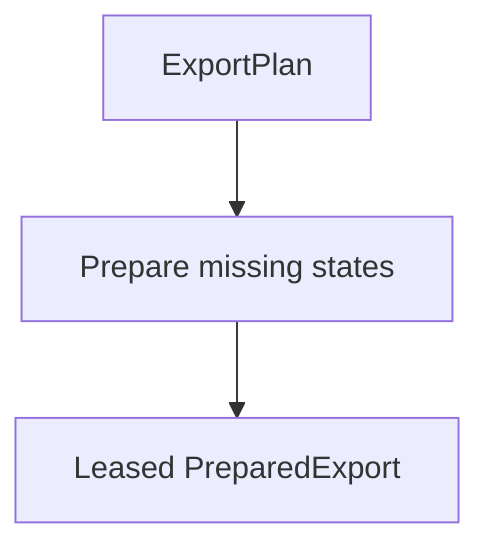

# Reuse

The first quickstart build runs `weekly` and `monthly`. Later builds can reuse
one state's outputs or the complete export when the notebook, output
declarations, and input values still match.

| Change                                         | Reused                  | New work                  |
| ---------------------------------------------- | ----------------------- | ------------------------- |
| Repeat the same `ExportSpec`                   | The complete export     | Nothing                   |
| Add another alias for `weekly`                 | Both states             | Write a new export index  |
| Change the `monthly` input                     | `weekly`                | Run the new monthly state |
| Change an output declaration                   | Nothing from that setup | Run every distinct state  |
| Change notebook source or producer environment | Nothing from that setup | Run every distinct state  |

Adding or removing a state can change every fingerprint when the edit also
changes the inferred input-name set.

## When a state can be reused

Reusing a prepared state requires three matches:

| Must match | Compared value                                            |
| ---------- | --------------------------------------------------------- |
| Producer   | Notebook source, relevant environment, and implementation |
| Outputs    | Complete authored `outputs` mapping                       |
| State      | Complete input vector                                     |

A prepared state contains the output descriptors and assets for one matching
combination. A prepared export adds the exact `ExportSpec` identity and assembles
the requested states and aliases into one immutable export generation.

## Plan before running the notebook

`plan()` resolves the `ExportSpec` against the producer and export repository.
It returns an `ExportPlan` with the complete states, default alias, outputs,
observations, identities, and reusable or missing fingerprints.

An exact repository match can supply that plan before notebook startup.
Otherwise, file planning starts the notebook, runs its initial autorun, captures
the baseline, and closes the owned session.

## Run the missing states



`prepare()` owns a temporary session for a saved notebook. `capture()` borrows a
named live [marimo](https://marimo.io/) session. Both execute missing states,
commit the complete generation, and return a leased `PreparedExport`.

Each state runs in an isolated child graph. One failed state, output, or
verification step fails the producer operation. A state that committed before a
later failure can remain reusable for the next attempt.

## Reuse cannot detect every external change

Exact reuse returns before notebook execution. Changes to the notebook or source
files included in the producer environment change producer identity and prevent
that reuse. A data file outside those source roots, network response, or database
row cannot invalidate an export that the repository already returned.

Include a freshness value in the producer inputs or change the output
declarations when a new run is required. marimo watchers and cell-cache keys
take effect after preparation reaches notebook execution.

## Close prepared exports after use

A `PreparedExport` keeps its export generation available until the handle
closes. Use it as a context manager:

```python
from marimo_export import ExportSpec, prepare

spec = ExportSpec.from_file("report.export.yaml")

with prepare("report.py", spec=spec) as prepared:
    notebook_export = prepared.open()
    prepared.write("dist/report", replace=True)
```

`PreparedExport.asset(relative)` detaches a lease handle for one file consumer or
HTTP response that can outlive the parent handle. That handle protects the
complete export generation from retention. Close it after the consumer finishes.

Related: [Caching](caching) covers the cell-level decision.
[Produce an export from Python](../reference/python/produce) defines the complete
plan, prepare, progress, result, and lease contracts.
