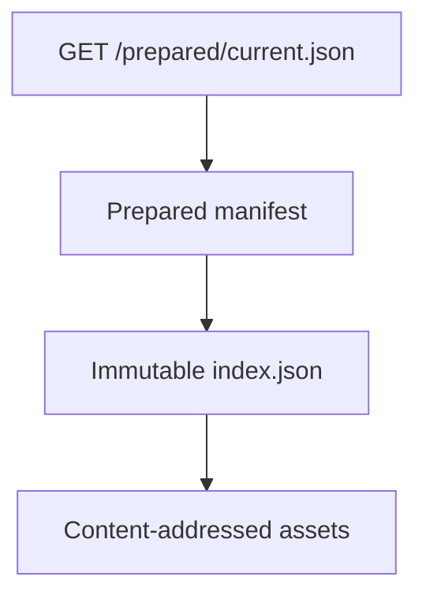

# Prepared publications

A prepared publication gives a browser one small manifest that selects an
exported state from one immutable notebook export. Start with a static manifest
and export. Add the long-running publication controller when observations or
application events must replace that export while the server stays active.



## Publish one static manifest and export

Complete the [deterministic quickstart](getting-started), then create
`publish_prepared.py` beside `report.py` and `report.export.yaml`:

```python
from pathlib import Path

from marimo_export import ExportSpec, prepare
from marimo_export.manifest import prepared_manifest_bytes

root = Path("dist/prepared")
root.mkdir(parents=True, exist_ok=True)
spec = ExportSpec.from_file("report.export.yaml")

with prepare("report.py", spec=spec) as prepared:
    instance = root / prepared.identity
    prepared.write(instance, replace=True)

    manifest = prepared.manifest(
        f"./{prepared.identity}/",
        state="monthly",
    )
    staged = root / ".current.json.tmp"
    staged.write_bytes(prepared_manifest_bytes(manifest))
    staged.replace(root / "current.json")

    print(prepared.identity)
```

Run the publication step and serve its directory:

```bash
uv run python publish_prepared.py
uv run python -m http.server 8000 --bind 127.0.0.1 --directory dist/prepared
```

The first command writes and verifies this static publication:

```text
dist/prepared/
  current.json
  <export identity>/
    index.json
    assets/
      <sha256>.output.json
      <sha256>.output.json
```

From another terminal, inspect the manifest and immutable index:

```bash
curl --fail http://127.0.0.1:8000/current.json | python -m json.tool
INSTANCE=$(uv run python -c 'import json; print(json.load(open("dist/prepared/current.json"))["instance"])')
curl --fail "http://127.0.0.1:8000/$INSTANCE/index.json" | python -m json.tool
```

`current.json` uses schema `marimo-export.prepared.v1`. It names the export
identity, `./<export identity>/` URL, complete monthly input vector, and matching
state fingerprint. The relative export URL resolves from the manifest URL.

The static manifest omits `refresh_interval_ms`, so a browser fetches it when the
application requests it. Republish and redeploy `current.json` when the selected
export changes.

## Open the static publication in a browser

The [browser application guide](browser-applications) creates a Vite application
with `summary` and `report` hosts. Copy the static publication into that
application:

```bash
mkdir -p browser/public/prepared
cp -R dist/prepared/. browser/public/prepared/
```

Use the prepared subpath to open the state selected by `current.json`:

```ts
import {
  fetchPreparedExportManifest,
  openPreparedPublication,
} from "@marimo-team/marimo-export/prepared";
import { jsonLoader } from "@marimo-team/marimo-export/loader/json";
import { marimoOutputLoader } from "@marimo-team/marimo-export/loader/marimo-output";

const manifestUrl = new URL("/prepared/current.json", location.href);
const manifest = await fetchPreparedExportManifest(manifestUrl);
const publication = await openPreparedPublication(manifest, manifestUrl);
const summary = await publication.state.output("summary").load(jsonLoader());
const report = await publication.state.output("report").load(marimoOutputLoader());

console.log(summary);
console.log(report.output?.mimetype);
```

The parser converts snake-case manifest fields into camel-case TypeScript
properties. Opening checks that the manifest identity, export URL, complete
input vector, and state fingerprint agree with the immutable export.

## Run a changing publication service

`PreparedPublicationController` retains the last successful prepared export for
an application-defined key. The preparation callback runs in a worker thread and
receives the controller's export repository plus a cancellation predicate:

```python
from contextlib import asynccontextmanager

from marimo_export import ExportSpec, prepare
from marimo_export.manifest import prepared_manifest_bytes
from marimo_export.publication import (
    PreparedPublicationCandidate,
    PreparedPublicationController,
)

spec = ExportSpec.from_file("report.export.yaml")


def prepare_report(repository, cancelled):
    prepared = prepare(
        "report.py",
        spec=spec,
        repository=repository,
        cancelled=cancelled,
    )
    return PreparedPublicationCandidate(prepared, {"report": "sales"})


@asynccontextmanager
async def report_publication():
    controller = PreparedPublicationController[str, dict[str, str]]()
    try:
        await controller.prepare("sales", prepare_report)
        yield controller
    finally:
        await controller.close()


def current_manifest(controller):
    publication = controller.poll("sales")
    if publication is None:
        raise RuntimeError("The sales publication is unavailable")
    return prepared_manifest_bytes(
        publication.manifest(
            f"./{publication.identity}/",
            state="monthly",
            refresh_interval_ms=1_000,
        )
    )
```

This fragment begins after the runnable static publication because the server
adapter is application-specific. Enter `report_publication()` from the server's
asynchronous lifespan and keep the controller on that event loop. Map these
routes:

1. Call `current_manifest(controller)` for every mutable `current` response and
   send it with revalidation or `no-store` caching.
2. Call `controller.asset("sales", instance, relative)` for an immutable instance
   request and return `404` when it yields `None`.
3. Keep the returned `PreparedAsset` open until the HTTP response finishes.
4. Send immutable cache headers for instance files.
5. Call `controller.release("sales")` when the application route closes.
6. Await `controller.close()` during server teardown.

`poll()` returns the current Python prepared publication and can schedule an
observation-driven refresh. A background refresh failure preserves the current
publication and is not reported through a controller callback. Record
preparation health in the application when operators must distinguish an
unchanged publication from a failing refresh.

### Size route grace for complete generations

Replacing a publication keeps the prior route available for
`route_grace_seconds`, which defaults to 60 seconds. A `PreparedAsset` provides
file-scoped access backed by an independently owned lease on the complete export
generation. A slow response can therefore keep every file in that generation
protected after the controller releases its parent publication.

High publication churn, a long route grace, and slow responses can retain
several complete generations and contribute to `repository_limit_exceeded`.
Choose a grace period from the longest expected response, close every
`PreparedAsset` after response completion, and monitor export repository status.

## Commit one complete browser state

`PreparedStateController` serializes state changes. The application port loads
the next publication, stages its visible values, and commits them together:

```ts
import { jsonLoader } from "@marimo-team/marimo-export/loader/json";
import {
  PreparedPublicationRefresh,
  PreparedStateController,
  type PreparedStatePort,
} from "@marimo-team/marimo-export/prepared";

const port: PreparedStatePort = {
  async apply({ next }, signal) {
    const output = await next.state.output("summary").load(jsonLoader(), {
      signal,
    });
    signal.throwIfAborted();
    console.log(output);
  },
};

const controller = new PreparedStateController(port);
const manifestUrl = new URL("/prepared/current.json", location.href);
const refresh = new PreparedPublicationRefresh(manifestUrl, controller, {
  onError(error) {
    console.error(error);
  },
});

await refresh.start();
await controller.updateInputs({ days: 30 });
```

A newer transition aborts the prior signal and removes its commit authority. A
non-cancellation application failure invokes `restore()` when the port provides
it. Polling errors call `onError`, while an explicit `refresh.refresh()` rejects
to its caller.

Dispose the browser owners in reverse construction order:

```ts
await refresh.dispose();
await controller.dispose();
```

Use the [Python delivery and publication
reference](../reference/python/delivery-and-publications) and [browser
prepared-publication reference](../reference/browser/prepared-publications) for
exact signatures, route grouping, selection preservation, failure behavior, and
disposal.
