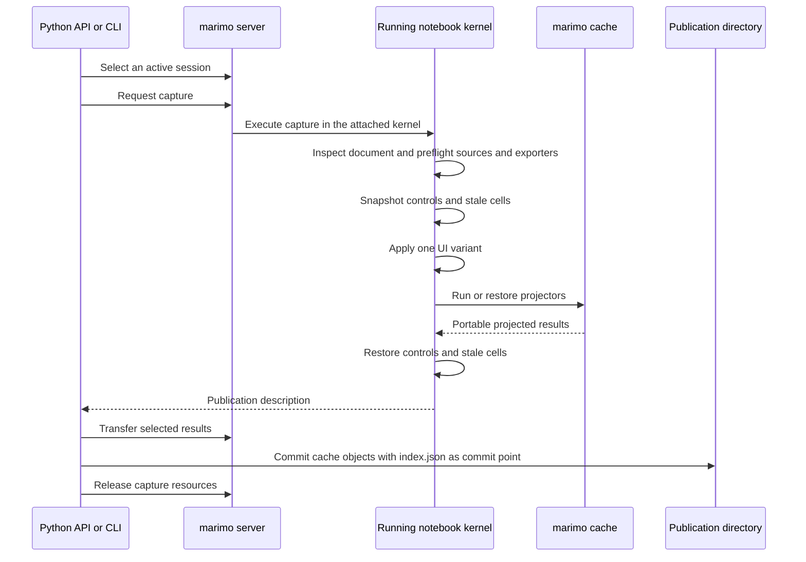

# Live capture

`Client` attaches to an active marimo edit server and borrows one running notebook session. Capture executes inside that session's kernel, then transfers selected portable results into a local publication.

```python
import os

from marimo_export import Client

with Client(
    "http://localhost:3456/",
    access_token=os.environ["MARIMO_EXPORT_TOKEN"],
) as client:
    session = client.session()
    description = session.inspect()
    result = session.capture(
        spec="finance.export.yaml",
        into="dist/finance",
    )

print(description.document_sha256)
print(result.path)
```

Closing the client releases local transport resources. A borrowed `Session` requires its owning `Client` to remain open. The marimo server owns the remote session lifecycle.



## Server requirements

Run marimo from the Python environment that already supports the notebook:

```bash
uv sync --all-extras --locked
uv run --with altair==6.0.0 marimo edit examples/_notebooks/finance.py \
  --no-sandbox \
  --host 127.0.0.1 \
  --port 3456 \
  --session-ttl 300
```

`--no-sandbox` keeps the kernel in the prepared workspace environment. Capture requires an edit-capable session. Capture executes marimo-export inside the kernel, so the running environment must contain the same `marimo-export` version as the client and every exporter requested by the specification.

The Python CLI is the capture client. When it runs on a different machine, install the same `marimo-export` version in both the client environment and the notebook environment.

The current Python dependency and lockfile pin `peter-gy/marimo` commit `0f5fd5d55b4d65d06a814842af3228f57c8ae9c8`, which supplies the required `BlobAsset` lazy-cache codec. Publishing the Python distribution requires a compatible marimo core release and a corresponding released dependency bound.

The server may run on another machine. Keep it bound to loopback and forward the port through SSH:

```bash
ssh -N -L 3456:127.0.0.1:3456 USER@HOST
```

The local capture command can then use `http://localhost:3456/` while projection still runs in the remote notebook environment.

## Session selection

`client.session()` requires exactly one active session. Pass the primary session ID when the server hosts several notebooks:

```python
for active in client.sessions():
    print(active.id, active.filename, active.path)

session = client.session("s_1234")
```

`client.sessions()` lists active sessions without running notebook inspection. Missing or ambiguous `client.session()` errors also carry these session details.

`session.inspect()` returns a `SessionDescription` with:

- Session ID, filename, and server-side path.
- Live document SHA-256.
- marimo and marimo-export versions from the attached kernel.
- Selectable global descriptors with `name` and qualified `python_type`.
- Frozen cell output descriptors.
- Existing UI control descriptors with names, types, detached values, sensitivity, and JSON domains.
- Built-in exporter names, format IDs, availability, and installation extras reported by the running kernel.

Password controls report `sensitive: true`, `value: null`, and an empty domain. Capture rejects variants that target any sensitive control before changing notebook state. Nonsensitive control domains can report options, numeric bounds, steps, selection limits, and precision.

Session discovery and inspection are read operations. `session.capture()` applies declared UI variants and runs selected exporters.

## Authentication

Pass credentials in the server URL or explicit constructor arguments:

```python
import os

from marimo_export import Client

client = Client(
    "https://notebooks.example.com/",
    access_token=os.environ["MARIMO_EXPORT_TOKEN"],
    server_token=os.environ.get("MARIMO_EXPORT_SERVER_TOKEN"),
)
```

The CLI reads `MARIMO_EXPORT_TOKEN` and `MARIMO_EXPORT_SERVER_TOKEN`. The Python API accepts the corresponding constructor arguments. A local one-off command may carry one `access_token` query value in the URL. An explicit token and URL token must agree. marimo-export removes credentials from user-visible output and publication data.

Use HTTPS across a network. An SSH tunnel provides an authenticated transport when the server remains loopback-bound.

## Live attachment

The Python client runs capture through the selected edit-capable session. Capture executes inside the active kernel and reads:

- Current Python globals.
- Rendered payload data from frozen cell outputs.
- Existing marimo UI control values.

Capture reads the notebook's current document and live values. It records the document digest before work and checks it again before returning. A changed document aborts the capture. Capture does not edit notebook source or create cells.

Before applying a variant, capture resolves every exporter and verifies that each named global and cell selector exists. Trusted expressions remain variant-time operations. A cell selector passes the rendered payload data to its exporter. Use a named global for an original Python object or live AnyWidget model.

Each capture request can run notebook code and mutate external state. A transport timeout stops the client from waiting. It cannot guarantee that already-dispatched kernel work stopped, so the client never retries a capture request automatically.

## Cache and transfer

For a cacheable source, capture invokes the exporter through marimo's persistent cache in the running notebook environment. A hit restores the complete projected result and skips exporter execution. A miss runs the exporter and persists the result through marimo.

For an unhashable source, capture invokes the exporter live and persists the resulting portable representation through marimo. Capture reports that projection's cache disposition as `skipped`.

The client transfers only the selected projected results. Before download, it bounds the serialized index, each outer cache envelope, and the index-plus-unique-envelope closure. It verifies each transferred object's recorded size and SHA-256 before local commit and releases server-side capture resources on success or failure.

A new publication commits through an atomic no-replace directory rename with `index.json` as the commit record. Replacement verifies the existing publication before remote work, revalidates it before commit, keeps the destination path stable, merges verified cache objects, retains objects referenced by an already-open reader, and atomically replaces `index.json` last. A same-key asset with different bytes fails the replacement. A cleanup failure is reported when capture and local commit otherwise succeeded.

## Variant side effects

Every variant starts from the UI vector present when capture began. Capture applies one finite vector, waits for marimo's reactive updates, projects the selected sources, then restores the starting vector and the initial stale-cell set.

State restoration changes notebook inputs again and can rerun dependent cells. It cannot reverse file writes, database transactions, service calls, imported-module state, random generator advancement, native-library state, or background work. Use idempotent notebook effects or isolated targets when capturing variants.
