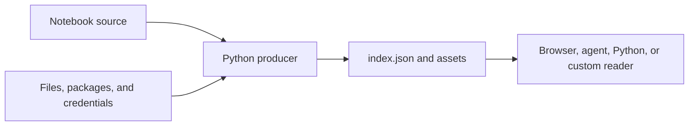

# When to use marimo-export

A [marimo](https://marimo.io/) notebook can read private data, import Python
packages, and compute interactive results. Decide where that Python work should
run before choosing an export path.

marimo-export runs a fixed set of notebook input combinations in Python and
publishes the named outputs as files. Use it when readers can choose from results
prepared in advance. Keep Python live when each request must compute a new
result.

The Python environment that runs the notebook is the **producer**. A browser
application, Python program, agent, or custom client that reads the completed
export is a **consumer**.

## Start from the interaction you need

The quickstart notebook derives a summary and a rendered report from a `days`
slider:

| State alias | Complete input | Published outputs   |
| ----------- | -------------- | ------------------- |
| `weekly`    | `{"days": 7}`  | `summary`, `report` |
| `monthly`   | `{"days": 30}` | `summary`, `report` |

The producer runs both states through marimo. The notebook export stores both
results. A browser can switch between `weekly` and `monthly` without starting a
Python runtime.

The notebook remains the source of the computation. The notebook export becomes
the source of the published outputs.

## Compare the three runtime choices

[WebAssembly](https://webassembly.org/) is a portable browser instruction
format. A marimo WebAssembly export uses it to start a browser Python runtime.

| Application need                                        | Runtime choice                | Consequence                                                            |
| ------------------------------------------------------- | ----------------------------- | ---------------------------------------------------------------------- |
| Select a declared finite set of states after production | marimo-export notebook export | Readers choose published results but cannot request a new computation  |
| Evaluate arbitrary inputs against current private data  | Python service                | Python stays in the request path and computes each accepted request    |
| Run a compatible notebook in the browser                | marimo WebAssembly export     | The browser receives notebook code and starts a browser Python runtime |

Use a notebook export when the application can name the states it intends to
serve. Common examples include:

- a report with weekly and monthly views
- a dashboard with a bounded set of regions or cohorts
- an agent that needs verified structured results and source identity
- a static site that publishes notebook charts and tables
- an application that refreshes by replacing one immutable export with another

Use a Python service when a request must:

- evaluate an input vector absent from the notebook export
- mutate notebook state and return a new computation immediately
- access current private data for every request
- call Python behavior that cannot be represented as exported data

The number and size of prepared states affect producer work and export size.
Choose the smallest state set that supports the consumer's decisions.

## What the export contains

A notebook export contains:

- complete input vectors for a finite set of exported states
- the same named outputs for every exported state
- one representation for each output name
- notebook, producer, state, output, and asset identities
- canonical `index.json` bytes and content-addressed assets

The producer retains notebook execution, private data access, credentials,
Python dependencies, and responsibility for preparing new states. The notebook
source code is not part of the notebook export.

[Build your first notebook export](guide/getting-started) when the finite
boundary fits. The quickstart creates the two states and two outputs in the
example, verifies the written files, and reads them back.
