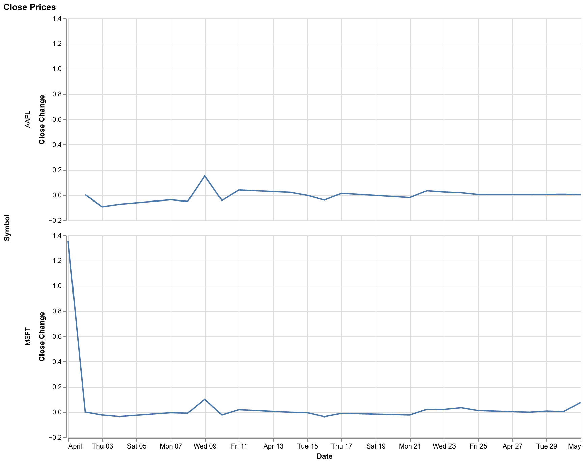

<style>
.moexport-cell-label,
.moexport-output-label {
  color: #64748b;
  font-size: 0.875rem;
  line-height: 1.4;
  margin-bottom: 0.5rem;
}

.moexport-output-label {
  margin-top: 1rem;
}

.moexport-output-frame {
  width: 100%;
  min-height: 420px;
  border: 1px solid #e2e8f0;
  border-radius: 8px;
  background: #ffffff;
}
</style>

- Notebook: `finance.py`
- Scenario: `finance-review`
- Cells: `11`
- Outputs: `5`
- Bundle: `sha256-e8cfbff216887e6b`

<details>
<summary>Scenario state</summary>

```json
{
  "symbols": ["AAPL", "MSFT", "GOOGL"],
  "interval": "1d",
  "start": "2025-04-01",
  "end": "2025-05-02",
  "chart_width": 760,
  "symbols_selector.value": ["AAPL", "MSFT"],
  "widget.widget.metric": "Close",
  "widget.widget.mode": "absolute",
  "widget.widget.selected_symbols": ["AAPL", "MSFT"]
}
```

</details>

---

<div class="moexport-cell-label">Cell 01</div>
<!-- marimo-cell: id=Hbol index=0 -->

```python
symbols = ["AAPL", "CRWV", "MSFT", "GOOGL", "AMZN"]
interval = "1d"
start = "2025-04-01"
end = "2025-05-02"
chart_width = 800
```

---

<div class="moexport-cell-label">Cell 02</div>
<!-- marimo-cell: id=MJUe index=1 -->

```python
_df = pl.from_pandas(
    yf.Tickers(symbols)
    .history(
        interval=interval,
        start=start,
        end=end,
    )
    .reset_index()
)
df = (
    _df.rename({"('Date', '')": "Date"})
    .unpivot(index="Date")
    .with_columns(
        # ('Close', 'AAPL') -> Close, AAPL
        pl.col("variable").str.extract_groups(
            r"\('(?<Metric>[^']+)',\s*'(?<Symbol>[^']+)'\)"
        )
    )
    .unnest("variable")
    .pivot(
        index=["Date", "Symbol"],
        on="Metric",
        values="value",
    )
    .select(
        "Date",
        "Symbol",
        "Open",
        pl.col("Open").pct_change().alias("Open Change"),
        "High",
        pl.col("High").pct_change().alias("High Change"),
        "Low",
        pl.col("Low").pct_change().alias("Low Change"),
        "Close",
        pl.col("Close").pct_change().alias("Close Change"),
    )
)
df
```

shape: (66, 10)

| Date                | Symbol | Open       | Open Change | High       | High Change | Low        | Low Change | Close      | Close Change |
| ------------------- | ------ | ---------- | ----------- | ---------- | ----------- | ---------- | ---------- | ---------- | ------------ |
| datetime[ms]        | str    | f64        | f64         | f64        | f64         | f64        | f64        | f64        | f64          |
| 2025-04-01 00:00:00 | "AAPL" | 218.654667 | null        | 222.504322 | null        | 217.749447 | null       | 222.016907 | null         |
| 2025-04-02 00:00:00 | "AAPL" | 220.156742 | 0.00687     | 224.006397 | 0.006751    | 219.858316 | 0.009685   | 222.713226 | 0.003136     |
| 2025-04-03 00:00:00 | "AAPL" | 204.459679 | -0.071299   | 206.399442 | -0.0786     | 200.192234 | -0.089449  | 202.12204  | -0.092456    |
| 2025-04-04 00:00:00 | "AAPL" | 192.870927 | -0.05668    | 198.829449 | -0.036676   | 186.35535  | -0.069118  | 187.389893 | -0.072887    |
| 2025-04-07 00:00:00 | "AAPL" | 176.268622 | -0.08608    | 193.129529 | -0.028667   | 173.702181 | -0.067898  | 180.506241 | -0.036734    |
| …                   | …      | …          | …           | …          | …           | …          | …          | …          | …            |
| 2025-04-25 00:00:00 | "MSFT" | 383.229745 | 0.030077    | 388.339479 | 0.009551    | 380.853133 | 0.025081   | 388.032501 | 0.011748     |
| 2025-04-28 00:00:00 | "MSFT" | 388.141407 | 0.012816    | 388.913807 | 0.001479    | 382.873259 | 0.005304   | 387.349213 | -0.001761    |
| 2025-04-29 00:00:00 | "MSFT" | 387.487845 | -0.001684   | 391.250843 | 0.006009    | 386.576825 | 0.009673   | 390.201172 | 0.007363     |
| 2025-04-30 00:00:00 | "MSFT" | 386.497632 | -0.002555   | 392.795687 | 0.003948    | 380.694735 | -0.015216  | 391.409332 | 0.003096     |
| 2025-05-01 00:00:00 | "MSFT" | 426.91004  | 0.104561    | 432.732761 | 0.101674    | 420.760547 | 0.105244   | 421.255676 | 0.076254     |

---

<div class="moexport-cell-label">Cell 03</div>
<!-- marimo-cell: id=vblA index=2 -->

```python
symbols_selector = mo.ui.multiselect(
    options=symbols,
    label="Select symbols to compare",
    value=symbols[:2],
)
```

---

<div class="moexport-cell-label">Cell 04</div>
<!-- marimo-cell: id=bkHC index=3 -->

```python
symbols_chart = (
    alt.Chart(df.filter(pl.col("Symbol").is_in(symbols_selector.value)))
    .mark_line()
    .encode(
        x="Date:T",
        y="Close Change:Q",
        tooltip=["Date:T", "Close Change:Q"],
        row="Symbol:N",
    )
    .properties(
        title="Close Prices",
        width=chart_width,
    )
)
```

---

<div class="moexport-cell-label">Cell 05 · <code>change_desc</code></div>
<!-- marimo-cell: id=lEQa index=4 -->

```python
mo.md(rf"""
## Change in Close Prices Over Time

Select from `{", ".join(symbols)}` to compare how the close prices changed between *{df["Date"].min().strftime("%Y, %B %d")}* and *{df["Date"].max().strftime("%Y, %B %d")}*.
""")
```

## Change in Close Prices Over Time

Select from `AAPL, MSFT, GOOGL` to compare how the close prices changed between _2025, April 01_ and _2025, May 01_.

---

<div class="moexport-cell-label">Cell 06</div>
<!-- marimo-cell: id=PKri index=5 -->

```python
mo.vstack(
    [
        symbols_selector,
        symbols_chart,
    ]
)
```

[Open raw HTML output](media/cell-06-output-01.html)



---

<div class="moexport-cell-label">Cell 07</div>
<!-- marimo-cell: id=Xref index=6 -->

```python
mo.md("""
## Comparative dashboard

The dashboard below is for a closer read. Switch between **Open**, **High**, **Low**, and **Close**, move between spot levels and relative changes, and narrow the comparison down to the names you want on screen.
""")
```

## Comparative dashboard

The dashboard below is for a closer read. Switch between **Open**, **High**, **Low**, and **Close**, move between spot levels and relative changes, and narrow the comparison down to the names you want on screen.

---

<div class="moexport-cell-label">Cell 08</div>
<!-- marimo-cell: id=SFPL index=7 -->

```python
widget
```

[Open HTML output](media/cell-08-output-01.html)

---

<div class="moexport-cell-label">Cell 09</div>
<!-- marimo-cell: id=BYtC index=8 -->

```python
rows = (
    df.select(
        [
            "Date",
            "Symbol",
            "Open",
            "Open Change",
            "High",
            "High Change",
            "Low",
            "Low Change",
            "Close",
            "Close Change",
        ]
    )
    .with_columns(pl.col("Date").cast(pl.String))
    .sort(["Symbol", "Date"])
    .to_dicts()
)
widget = mo.ui.anywidget(
    OhlcSwitcher(
        rows=rows,
        metric="Close",
        mode="absolute",
        selected_symbols=symbols[:3],
        title="Cross-sectional OHLC Review",
    )
)
```

---

<div class="moexport-cell-label">Cell 10</div>
<!-- marimo-cell: id=RGSE index=9 -->

```python
import anywidget
import traitlets

class OhlcSwitcher(anywidget.AnyWidget):
    _esm = r"""
    function render({ model, el }) {
      const metrics = ["Open", "High", "Low", "Close"];
      const modes = [
        ["absolute", "Absolute"],
        ["change", "Change"],
      ];
      const palette = ["#1d4ed8", "#059669", "#b91c1c", "#a16207", "#7c3aed", "#0f766e"];

      const root = document.createElement("section");
      root.className = "ohlc-widget";

      const masthead = document.createElement("div");
      masthead.className = "ohlc-masthead";
      const kicker = document.createElement("div");
      kicker.className = "ohlc-kicker";
      kicker.textContent = "Market monitor";
      const title = document.createElement("div");
      title.className = "ohlc-title";
      const subtitle = document.createElement("div");
      subtitle.className = "ohlc-subtitle";
      masthead.append(kicker, title, subtitle);

      const panels = document.createElement("div");
      panels.className = "ohlc-panels";

      const metricPanel = document.createElement("div");
      metricPanel.className = "ohlc-panel";
      const metricLabel = document.createElement("div");
      metricLabel.className = "ohlc-panel-label";
      metricLabel.textContent = "Field";
      const metricControls = document.createElement("div");
      metricControls.className = "ohlc-controls";
      const metricButtons = new Map();
      metrics.forEach((metric) => {
        const btn = document.createElement("button");
        btn.type = "button";
        btn.textContent = metric;
        btn.addEventListener("click", () => {
          model.set("metric", metric);
          model.save_changes();
        });
        metricButtons.set(metric, btn);
        metricControls.appendChild(btn);
      });
      metricPanel.append(metricLabel, metricControls);

      const modePanel = document.createElement("div");
      modePanel.className = "ohlc-panel";
      const modeLabel = document.createElement("div");
      modeLabel.className = "ohlc-panel-label";
      modeLabel.textContent = "Scale";
      const modeControls = document.createElement("div");
      modeControls.className = "ohlc-controls";
      const modeButtons = new Map();
      modes.forEach(([mode, label]) => {
        const btn = document.createElement("button");
        btn.type = "button";
        btn.textContent = label;
        btn.addEventListener("click", () => {
          model.set("mode", mode);
          model.save_changes();
        });
        modeButtons.set(mode, btn);
        modeControls.appendChild(btn);
      });
      modePanel.append(modeLabel, modeControls);

      const symbolPanel = document.createElement("div");
      symbolPanel.className = "ohlc-panel ohlc-panel-wide";
      const symbolLabel = document.createElement("div");
      symbolLabel.className = "ohlc-panel-label";
      symbolLabel.textContent = "Coverage";
      const symbolControls = document.createElement("div");
      symbolControls.className = "ohlc-symbols";
      symbolPanel.append(symbolLabel, symbolControls);

      panels.append(metricPanel, modePanel, symbolPanel);

      const summary = document.createElement("div");
      summary.className = "ohlc-summary";

      const svg = document.createElementNS("http://www.w3.org/2000/svg", "svg");
      svg.setAttribute("viewBox", "0 0 860 360");
      svg.setAttribute("role", "img");
      svg.classList.add("ohlc-chart");

      const chartBg = document.createElementNS("http://www.w3.org/2000/svg", "rect");
      chartBg.setAttribute("x", "18");
      chartBg.setAttribute("y", "12");
      chartBg.setAttribute("width", "824");
      chartBg.setAttribute("height", "304");
      chartBg.setAttribute("rx", "18");
      chartBg.setAttribute("class", "ohlc-chart-bg");

      const grid = document.createElementNS("http://www.w3.org/2000/svg", "g");
      const zeroLine = document.createElementNS("http://www.w3.org/2000/svg", "line");
      zeroLine.setAttribute("class", "ohlc-zero");
      const seriesGroup = document.createElementNS("http://www.w3.org/2000/svg", "g");
      const xLabelStart = document.createElementNS("http://www.w3.org/2000/svg", "text");
      const xLabelEnd = document.createElementNS("http://www.w3.org/2000/svg", "text");
      const yLabelTop = document.createElementNS("http://www.w3.org/2000/svg", "text");
      const yLabelBottom = document.createElementNS("http://www.w3.org/2000/svg", "text");
      [xLabelStart, xLabelEnd, yLabelTop, yLabelBottom].forEach((label) => label.setAttribute("class", "ohlc-axis"));
      xLabelStart.setAttribute("x", "40");
      xLabelStart.setAttribute("y", "340");
      xLabelEnd.setAttribute("x", "820");
      xLabelEnd.setAttribute("y", "340");
      xLabelEnd.setAttribute("text-anchor", "end");
      yLabelTop.setAttribute("x", "40");
      yLabelTop.setAttribute("y", "28");
      yLabelBottom.setAttribute("x", "40");
      yLabelBottom.setAttribute("y", "300");
      svg.append(chartBg, grid, zeroLine, seriesGroup, xLabelStart, xLabelEnd, yLabelTop, yLabelBottom);

      const legend = document.createElement("div");
      legend.className = "ohlc-legend";

      root.append(masthead, panels, summary, svg, legend);
      el.append(root);

      const number = (value) => Number(value ?? 0);
      const formatValue = (value, mode) => {
        if (!Number.isFinite(value)) return "n/a";
        if (mode === "change") return `${value >= 0 ? "+" : ""}${(value * 100).toFixed(1)}%`;
        return value.toFixed(2);
      };
      const fullDate = new Intl.DateTimeFormat(undefined, { day: "2-digit", month: "short", year: "numeric" });
      const shortDate = new Intl.DateTimeFormat(undefined, { day: "2-digit", month: "short" });
      const formatDate = (value, kind = "full") => {
        const date = new Date(value);
        if (Number.isNaN(date.valueOf())) return String(value);
        return kind === "short" ? shortDate.format(date) : fullDate.format(date);
      };

      function groupedRows(rows) {
        const map = new Map();
        rows.forEach((row) => {
          const symbol = row.Symbol;
          if (!map.has(symbol)) map.set(symbol, []);
          map.get(symbol).push(row);
        });
        for (const rows of map.values()) {
          rows.sort((a, b) => new Date(a.Date) - new Date(b.Date));
        }
        return map;
      }

      function renderChart() {
        const rows = model.get("rows") || [];
        const titleText = model.get("title") || "Cross-sectional OHLC monitor";
        const metric = model.get("metric") || "Close";
        const mode = model.get("mode") || "absolute";
        const grouped = groupedRows(rows);
        const symbols = Array.from(grouped.keys());
        const selected = model.get("selected_symbols") || symbols.slice(0, 3);
        const selectedSet = new Set(selected.filter((symbol) => symbols.includes(symbol)));
        if (!selectedSet.size && symbols.length) {
          selectedSet.add(symbols[0]);
          model.set("selected_symbols", [symbols[0]]);
          model.save_changes();
        }
        const activeSymbols = symbols.filter((symbol) => selectedSet.has(symbol));
        const valueKey = mode === "change" ? `${metric} Change` : metric;

        const allRowsByDate = rows.slice().sort((a, b) => new Date(a.Date) - new Date(b.Date));
        const firstDate = allRowsByDate[0]?.Date;
        const lastDate = allRowsByDate.at(-1)?.Date;

        title.textContent = titleText;
        subtitle.textContent = `${metric} · ${mode === "change" ? "relative move" : "spot level"} · ${activeSymbols.length || 0} names in view`;

        metricButtons.forEach((btn, name) => {
          btn.dataset.active = name === metric ? "true" : "false";
        });
        modeButtons.forEach((btn, name) => {
          btn.dataset.active = name === mode ? "true" : "false";
        });

        symbolControls.replaceChildren();
        symbols.forEach((symbol, index) => {
          const btn = document.createElement("button");
          btn.type = "button";
          btn.textContent = symbol;
          btn.dataset.active = selectedSet.has(symbol) ? "true" : "false";
          btn.style.setProperty("--accent", palette[index % palette.length]);
          btn.addEventListener("click", () => {
            const next = new Set(model.get("selected_symbols") || []);
            if (next.has(symbol)) {
              if (next.size === 1) return;
              next.delete(symbol);
            } else {
              next.add(symbol);
            }
            model.set("selected_symbols", Array.from(next));
            model.save_changes();
          });
          symbolControls.appendChild(btn);
        });

        summary.textContent = firstDate && lastDate
          ? `Coverage ${formatDate(firstDate)} → ${formatDate(lastDate)} · ${symbols.length} listed names in the series`
          : "";

        seriesGroup.replaceChildren();
        grid.replaceChildren();
        legend.replaceChildren();

        if (!activeSymbols.length) {
          subtitle.textContent = "Select at least one name";
          xLabelStart.textContent = "";
          xLabelEnd.textContent = "";
          yLabelTop.textContent = "";
          yLabelBottom.textContent = "";
          zeroLine.setAttribute("x1", "0");
          zeroLine.setAttribute("x2", "0");
          zeroLine.setAttribute("y1", "0");
          zeroLine.setAttribute("y2", "0");
          return;
        }

        const series = activeSymbols.map((symbol) => ({
          symbol,
          rows: grouped.get(symbol) || [],
        }));

        const allRows = series.flatMap((entry) => entry.rows);
        const times = allRows.map((row) => new Date(row.Date).valueOf());
        const values = allRows.map((row) => number(row[valueKey]));
        const left = 44;
        const right = 820;
        const top = 30;
        const bottom = 294;
        const width = right - left;
        const height = bottom - top;
        const minTime = Math.min(...times);
        const maxTime = Math.max(...times);
        let minValue = Math.min(...values.filter((value) => Number.isFinite(value)));
        let maxValue = Math.max(...values.filter((value) => Number.isFinite(value)));
        if (mode === "change") {
          minValue = Math.min(minValue, 0);
          maxValue = Math.max(maxValue, 0);
        }
        if (!Number.isFinite(minValue) || !Number.isFinite(maxValue)) {
          minValue = 0;
          maxValue = 1;
        }
        if (minValue === maxValue) {
          minValue -= 1;
          maxValue += 1;
        }
        const spanTime = Math.max(maxTime - minTime, 1);
        const spanValue = maxValue - minValue;
        const scaleX = (time) => left + ((time - minTime) / spanTime) * width;
        const scaleY = (value) => bottom - ((value - minValue) / spanValue) * height;

        [0, 0.5, 1].forEach((ratio) => {
          const y = top + ratio * height;
          const line = document.createElementNS("http://www.w3.org/2000/svg", "line");
          line.setAttribute("class", "ohlc-grid");
          line.setAttribute("x1", String(left));
          line.setAttribute("x2", String(right));
          line.setAttribute("y1", String(y));
          line.setAttribute("y2", String(y));
          grid.appendChild(line);
        });

        if (mode === "change") {
          const y0 = scaleY(0);
          zeroLine.setAttribute("x1", String(left));
          zeroLine.setAttribute("x2", String(right));
          zeroLine.setAttribute("y1", String(y0));
          zeroLine.setAttribute("y2", String(y0));
        } else {
          zeroLine.setAttribute("x1", "0");
          zeroLine.setAttribute("x2", "0");
          zeroLine.setAttribute("y1", "0");
          zeroLine.setAttribute("y2", "0");
        }

        xLabelStart.textContent = formatDate(firstDate || "", "short");
        xLabelEnd.textContent = formatDate(lastDate || "", "short");
        yLabelTop.textContent = formatValue(maxValue, mode);
        yLabelBottom.textContent = formatValue(minValue, mode);

        series.forEach((entry, index) => {
          const color = palette[index % palette.length];
          const path = document.createElementNS("http://www.w3.org/2000/svg", "path");
          path.setAttribute("class", "ohlc-line");
          path.setAttribute("stroke", color);
          const d = entry.rows.map((row, i) => {
            const x = scaleX(new Date(row.Date).valueOf()).toFixed(2);
            const y = scaleY(number(row[valueKey])).toFixed(2);
            return `${i ? "L" : "M"}${x} ${y}`;
          }).join(" ");
          path.setAttribute("d", d);
          seriesGroup.appendChild(path);

          const latest = number(entry.rows.at(-1)?.[valueKey]);
          const first = number(entry.rows[0]?.[valueKey]);
          const delta = latest - first;
          const item = document.createElement("div");
          item.className = "ohlc-legend-item";
          item.innerHTML = `
            <div class="ohlc-legend-head">
              <span class="ohlc-swatch" style="background:${color}"></span>
              <span class="ohlc-symbol">${entry.symbol}</span>
            </div>
            <div class="ohlc-legend-main">${formatValue(latest, mode)}</div>
            <div class="ohlc-legend-sub" data-direction="${delta >= 0 ? "up" : "down"}">${formatValue(delta, mode)} vs start</div>
          `;
          legend.appendChild(item);
        });
      }

      model.on("change:metric", renderChart);
      model.on("change:mode", renderChart);
      model.on("change:rows", renderChart);
      model.on("change:title", renderChart);
      model.on("change:selected_symbols", renderChart);
      renderChart();
    }

    export default { render };
    """
    _css = r"""
    .ohlc-widget {
      border: 1px solid color-mix(in srgb, var(--marimo-foreground, #111827) 10%, transparent);
      border-radius: 20px;
      padding: 18px;
      background: linear-gradient(180deg, rgba(255,255,255,0.96), rgba(248,250,252,0.96));
      box-shadow: 0 14px 38px rgba(15, 23, 42, 0.08);
      display: grid;
      gap: 14px;
    }
    .ohlc-masthead {
      display: grid;
      gap: 4px;
    }
    .ohlc-kicker {
      font-size: 0.68rem;
      font-weight: 700;
      letter-spacing: 0.14em;
      text-transform: uppercase;
      color: #475569;
    }
    .ohlc-title {
      font-size: 1.04rem;
      font-weight: 700;
      letter-spacing: 0.01em;
    }
    .ohlc-subtitle,
    .ohlc-summary {
      font-size: 0.84rem;
      color: #475569;
    }
    .ohlc-panels {
      display: grid;
      grid-template-columns: repeat(2, minmax(0, 1fr));
      gap: 10px;
    }
    .ohlc-panel {
      border: 1px solid rgba(15, 23, 42, 0.06);
      border-radius: 14px;
      padding: 10px 12px;
      background: rgba(255, 255, 255, 0.72);
      display: grid;
      gap: 8px;
    }
    .ohlc-panel-wide {
      grid-column: 1 / -1;
    }
    .ohlc-panel-label {
      font-size: 0.7rem;
      font-weight: 700;
      letter-spacing: 0.12em;
      text-transform: uppercase;
      color: #64748b;
    }
    .ohlc-controls,
    .ohlc-symbols {
      display: flex;
      gap: 8px;
      flex-wrap: wrap;
    }
    .ohlc-controls button,
    .ohlc-symbols button {
      border-radius: 999px;
      padding: 7px 12px;
      font: inherit;
      font-size: 0.8rem;
      cursor: pointer;
      transition: transform 120ms ease, background 120ms ease, border-color 120ms ease, color 120ms ease;
    }
    .ohlc-controls button {
      border: 1px solid rgba(15, 23, 42, 0.08);
      background: #f8fafc;
      color: #0f172a;
    }
    .ohlc-controls button[data-active="true"] {
      background: #0f172a;
      color: #f8fafc;
      border-color: #0f172a;
    }
    .ohlc-symbols button {
      border: 1px solid color-mix(in srgb, var(--accent) 30%, transparent);
      background: color-mix(in srgb, var(--accent) 8%, white);
      color: #0f172a;
    }
    .ohlc-symbols button[data-active="true"] {
      background: color-mix(in srgb, var(--accent) 92%, black 8%);
      color: white;
      border-color: transparent;
    }
    .ohlc-controls button:hover,
    .ohlc-symbols button:hover {
      transform: translateY(-1px);
    }
    .ohlc-chart {
      width: 100%;
      aspect-ratio: 43 / 18;
      overflow: visible;
    }
    .ohlc-chart-bg {
      fill: rgba(15, 23, 42, 0.02);
      stroke: rgba(15, 23, 42, 0.06);
    }
    .ohlc-grid {
      stroke: rgba(100, 116, 139, 0.18);
      stroke-dasharray: 4 6;
    }
    .ohlc-zero {
      stroke: rgba(71, 85, 105, 0.55);
      stroke-width: 1.3;
    }
    .ohlc-line {
      fill: none;
      stroke-width: 2.6;
      stroke-linecap: round;
      stroke-linejoin: round;
    }
    .ohlc-axis {
      fill: #64748b;
      font-size: 11px;
      font-variant-numeric: tabular-nums;
    }
    .ohlc-legend {
      display: grid;
      grid-template-columns: repeat(auto-fit, minmax(170px, 1fr));
      gap: 10px;
    }
    .ohlc-legend-item {
      border-radius: 14px;
      padding: 10px 12px;
      background: rgba(255, 255, 255, 0.78);
      border: 1px solid rgba(15, 23, 42, 0.06);
      display: grid;
      gap: 4px;
    }
    .ohlc-legend-head {
      display: flex;
      gap: 8px;
      align-items: center;
    }
    .ohlc-swatch {
      width: 10px;
      height: 10px;
      border-radius: 999px;
    }
    .ohlc-symbol {
      font-size: 0.78rem;
      font-weight: 700;
      letter-spacing: 0.08em;
      text-transform: uppercase;
      color: #475569;
    }
    .ohlc-legend-main {
      font-size: 1rem;
      font-weight: 700;
      font-variant-numeric: tabular-nums;
    }
    .ohlc-legend-sub {
      font-size: 0.78rem;
      font-variant-numeric: tabular-nums;
      color: #64748b;
    }
    .ohlc-legend-sub[data-direction="up"] { color: #0f9d58; }
    .ohlc-legend-sub[data-direction="down"] { color: #d93025; }
    @media (prefers-color-scheme: dark) {
      .ohlc-widget {
        background: linear-gradient(180deg, rgba(15, 23, 42, 0.96), rgba(15, 23, 42, 0.92));
        border-color: rgba(148, 163, 184, 0.16);
        box-shadow: 0 18px 40px rgba(2, 6, 23, 0.35);
      }
      .ohlc-kicker,
      .ohlc-subtitle,
      .ohlc-summary,
      .ohlc-panel-label,
      .ohlc-axis,
      .ohlc-symbol,
      .ohlc-legend-sub {
        color: #94a3b8;
      }
      .ohlc-panel,
      .ohlc-legend-item {
        background: rgba(15, 23, 42, 0.56);
        border-color: rgba(148, 163, 184, 0.12);
      }
      .ohlc-controls button {
        background: rgba(30, 41, 59, 0.9);
        color: #e2e8f0;
        border-color: rgba(148, 163, 184, 0.16);
      }
      .ohlc-controls button[data-active="true"] {
        background: #e2e8f0;
        color: #0f172a;
        border-color: #e2e8f0;
      }
      .ohlc-symbols button {
        background: color-mix(in srgb, var(--accent) 16%, #0f172a);
        color: #e2e8f0;
      }
      .ohlc-symbols button[data-active="true"] {
        color: #0f172a;
      }
      .ohlc-chart-bg {
        fill: rgba(255, 255, 255, 0.03);
        stroke: rgba(148, 163, 184, 0.12);
      }
      .ohlc-grid {
        stroke: rgba(148, 163, 184, 0.14);
      }
      .ohlc-zero {
        stroke: rgba(148, 163, 184, 0.35);
      }
    }
    """

    rows = traitlets.List(traitlets.Dict(), default_value=[]).tag(sync=True)
    metric = traitlets.Unicode("Close").tag(sync=True)
    mode = traitlets.Unicode("absolute").tag(sync=True)
    selected_symbols = traitlets.List(traitlets.Unicode(), default_value=[]).tag(
        sync=True
    )
    title = traitlets.Unicode("OHLC explorer").tag(sync=True)
```

---

<div class="moexport-cell-label">Cell 11</div>
<!-- marimo-cell: id=Kclp index=10 -->

```python
import marimo as mo
import yfinance as yf
import polars as pl
import altair as alt
```
