# Weekly Metrics Readout

_Generated from `master-metrics.py` on 2026-06-02T10:53:17+00:00._

### Molab

#### DAU/WAU & DAU/MAU Stickiness

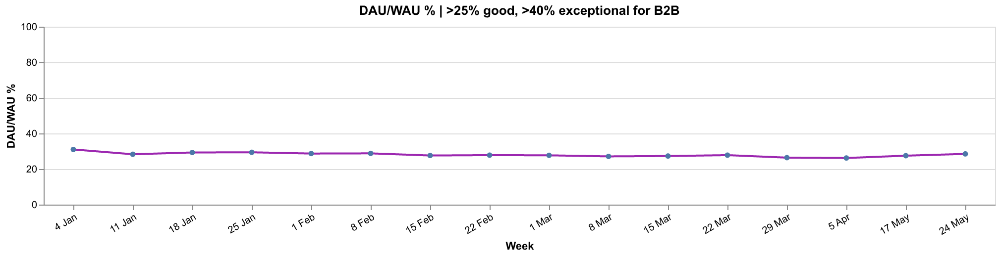
[Vega-Lite spec](assets/nWHF-chart-01.vl.json)
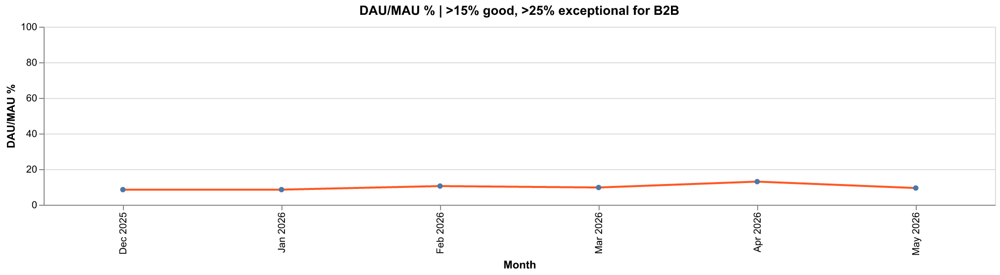
[Vega-Lite spec](assets/nWHF-chart-02.vl.json)

### OSS

#### Downloads by System (OS)

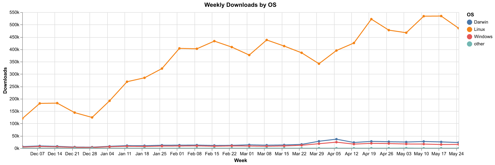
[Vega-Lite spec](assets/DnEU-chart-01.vl.json)

#### PyPI Downloads

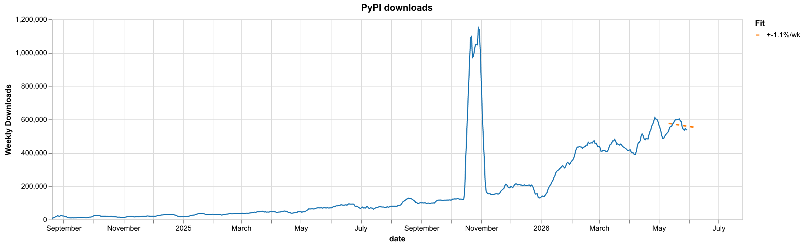
[Vega-Lite spec](assets/ZBYS-chart-01.vl.json)

#### Dependent Repositories

Stars are the best available proxy for CI/CD activity driving PyPI downloads.
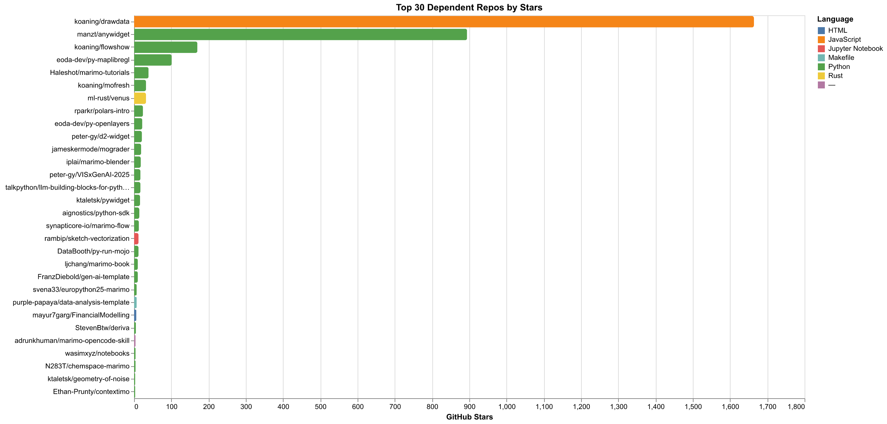
[Vega-Lite spec](assets/xXTn-chart-01.vl.json)

#### Total GitHub Forks

### Claude Skills Downloads

#### Skills Overview

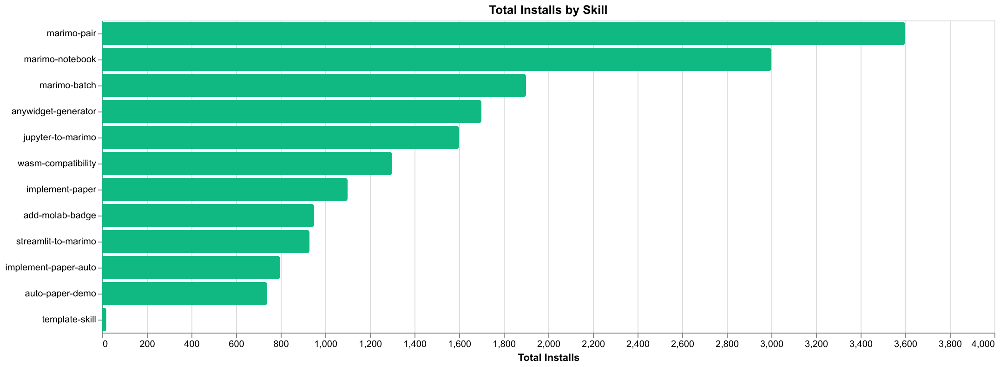
[Vega-Lite spec](assets/TRpd-chart-01.vl.json)

### VSCode Extension

#### VSCode Extension - Overview

#### New VSCode Installs

#### Rolling 7-Day WAU

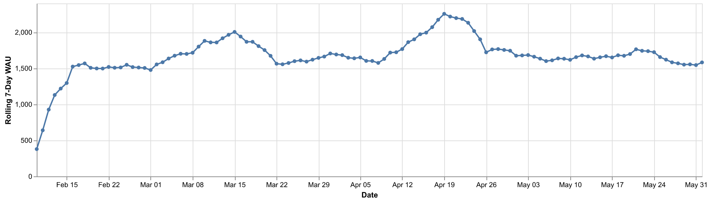
[Vega-Lite spec](assets/lgWD-chart-01.vl.json)

#### Cohort Retention Heatmap

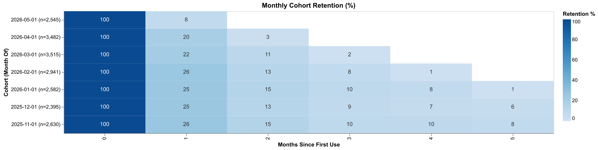
[Vega-Lite spec](assets/yOPj-chart-01.vl.json)

#### Retention Curves by Cohort

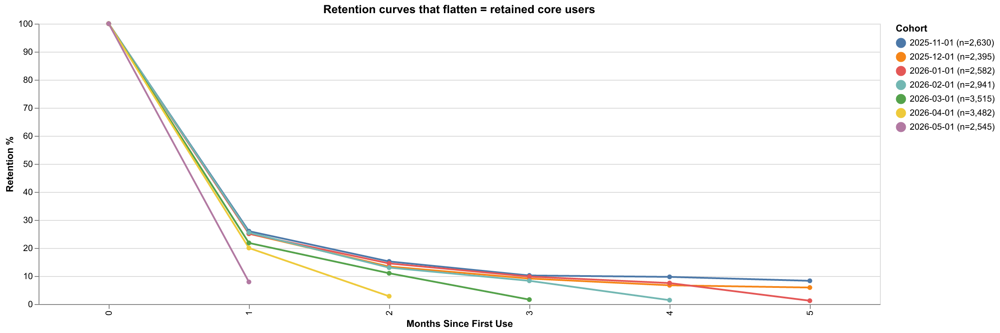
[Vega-Lite spec](assets/fwwy-chart-01.vl.json)

#### DAU/WAU, WAU/MAU & DAU/MAU Stickiness

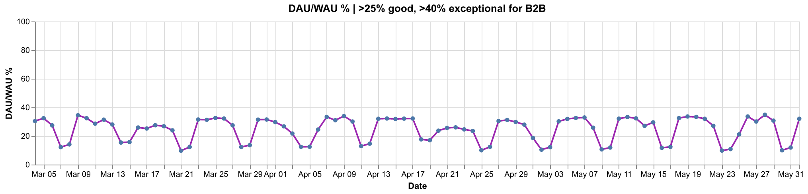
[Vega-Lite spec](assets/LJZf-chart-01.vl.json)
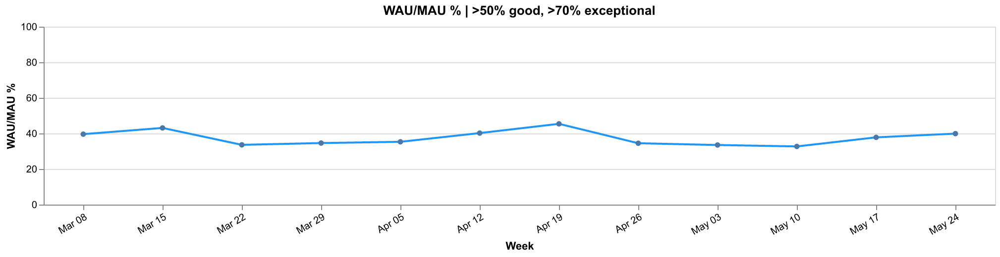
[Vega-Lite spec](assets/LJZf-chart-02.vl.json)
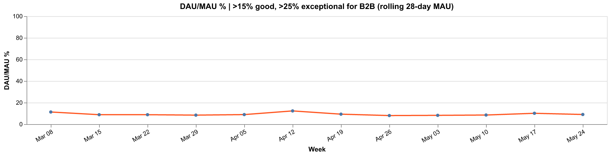
[Vega-Lite spec](assets/LJZf-chart-03.vl.json)

### Socials

#### YouTube

### Gallery

#### Gallery Clicks

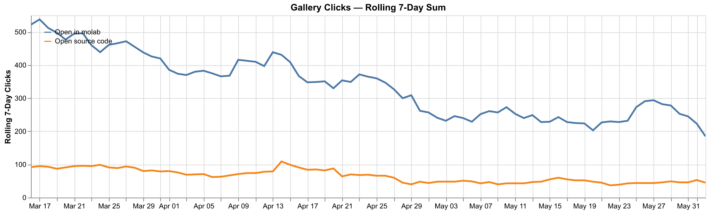
[Vega-Lite spec](assets/YWSi-chart-01.vl.json)

### Open in Molab

#### Overview (Last 30 Days)

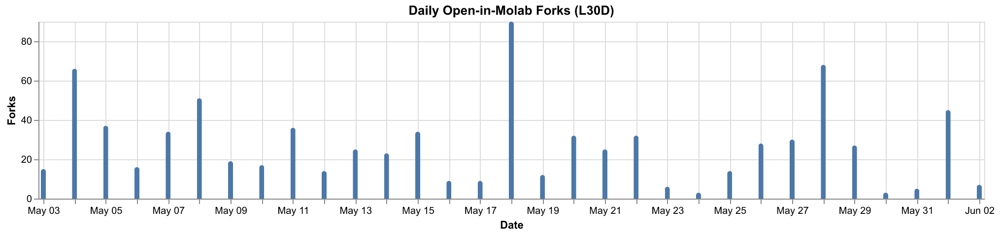
[Vega-Lite spec](assets/iXej-chart-01.vl.json)

#### Referrer Sources

Where users were before clicking 'Open in Molab'. (direct) = typed URL, bookmark, or referrer stripped.
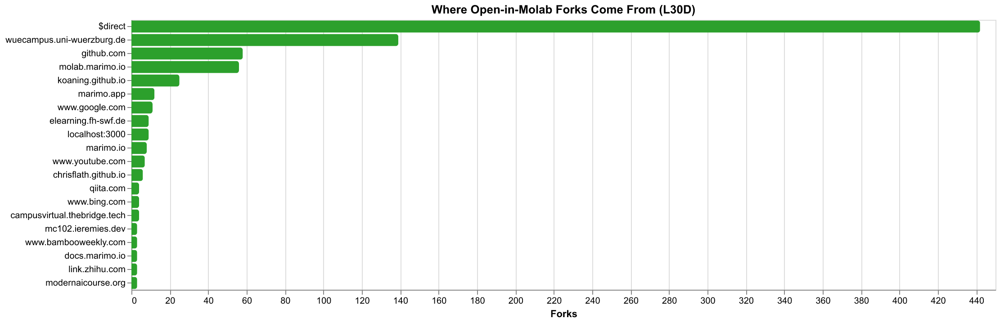
[Vega-Lite spec](assets/EJmg-chart-01.vl.json)

#### Top Forked Notebooks

Stacked by referrer - shows which notebooks are popular and where their traffic originates.
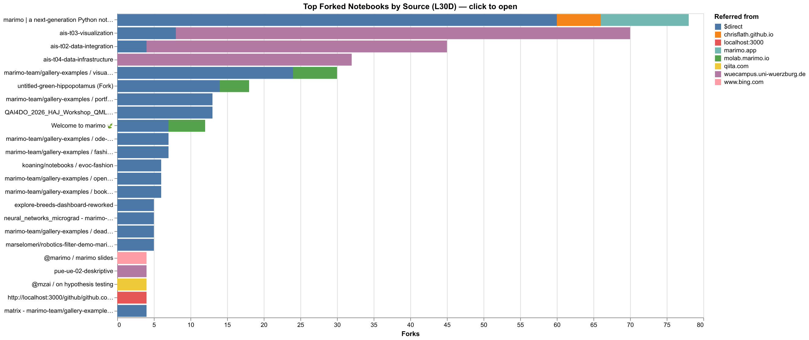
[Vega-Lite spec](assets/UmEG-chart-01.vl.json)

#### Notebooks Detail

#### Most Viewed Notebooks

Ranked by total page views on molab.marimo.io (L30D), independent of forks.

##### Detail

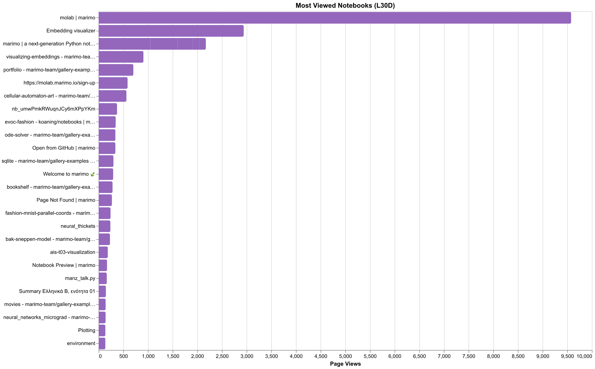
[Vega-Lite spec](assets/IpqN-chart-01.vl.json)

#### External Fork Provenance

Forks originating outside marimo-owned domains (excludes marimo.io, molab.marimo.io, docs, direct).

##### Detail

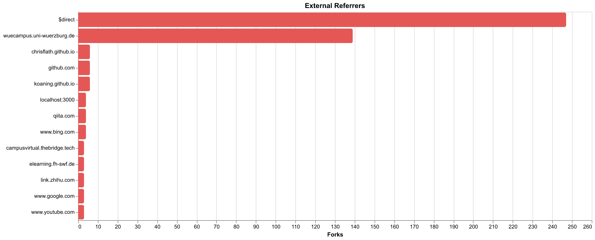
[Vega-Lite spec](assets/dxZZ-chart-01.vl.json)
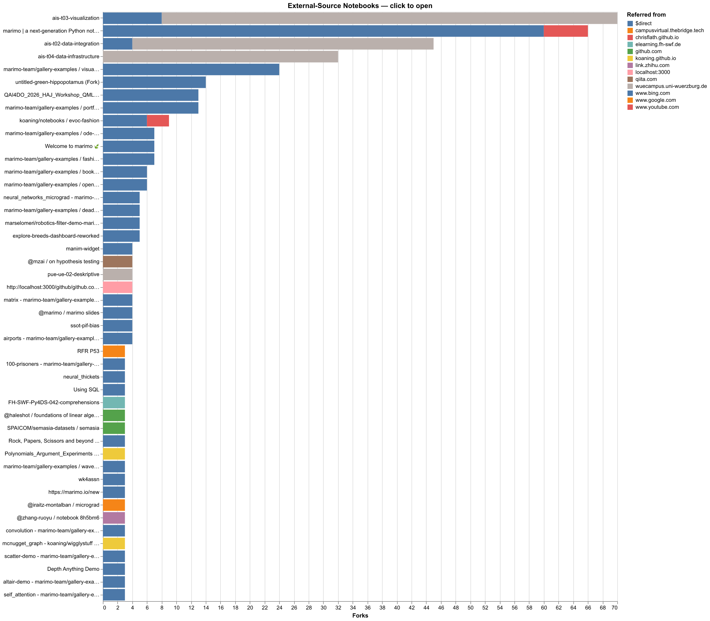
[Vega-Lite spec](assets/dxZZ-chart-02.vl.json)

## Export Notes

- Bundle manifest: `bundle/bundles/sha256-9d7f220e787856c0/manifest.json`
- Bundle schema: `metrics.readout.v1`
- Planned items: `27`
- Rendered items: `27`
- Visualization images: `19`
- Diagnostics: `0`
